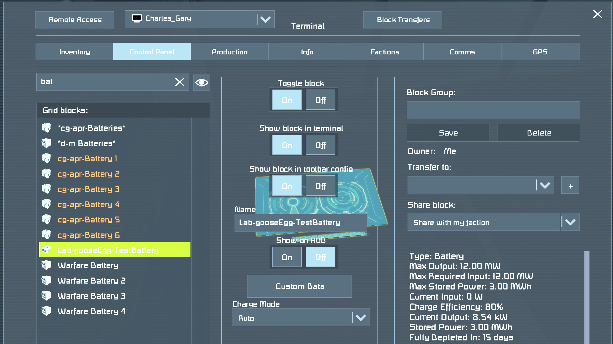
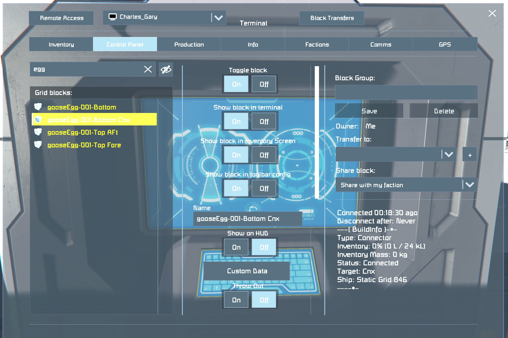

# Introduction This is a record of in-game test results for DockHand code. 

# Test Results 

## Session 001

Date: 7/16/2026 Game version: 1.209.024

### Compilation

-   Script did not compile.

### Notes Version 1 code was generated for:
    MDK-SE projects, Visual Studio projects, Standalone .cs

## Session 002

Date: 7/16/2026 Game version: 1.209.024

### Compilation

-   StationCargoController v1.0.1
    -   PASS

### Runtime Validation

-   Custom Data Parsing
    -   PASS
-   Connector Discovery
    -   PASS
-   Auto Connect
    -   PASS
-   OtherConnector
    -   PASS
-   Connected Grid Discovery
    -   PASS
-   Cargo Container Discovery
    -   PASS
-   Volume Fill Calculation
    -   PASS 

### Notes 

Station successfully connected an unconnected gooseEgg. Reported fill percentage matched the actual container fill level. Confirmed that the station can discover and inspect inventories on the connected gooseEgg grid.

## Session 003

Date: 7/16/2026 Game version: 1.209.024

### Fill Percentage Regression

A bug was introduced while adding support for the gooseEgg connector
inventory.

The cargo-container volume calculations were accidentally removed and
replaced with repeated connector inventory calculations.

Result: - Fill percentage incorrectly reported 100%.

Resolution: - Restore cargo-container calculations. - Add connector
inventory exactly once after aggregating all cargo-container
inventories.

Status: PASS after correction.

## Session 004

Date: 7/16/2026 Game version: 1.209.024

### Load Mode Validation

Tests Performed

-   Fill gooseEgg above threshold.
-   Observe threshold detection.
-   Observe disconnect timer.
-   Observe connector disconnect.
-   Leave gooseEgg physically sitting on dock.

Results

-   Threshold detection: PASS
-   Disconnect timer: PASS
-   Connector disconnect: PASS
-   WaitingForContainerRemoval latch: PASS

## Session 005

Date: 7/17/2026 Game version: 1.209.024

### Unload Script Happy Path Tests

-   The unload platform is complete. The latest version of the script,
    v1.0.6, was loaded into the PB. The INI entries were loaded and
    adjusted in the PB's Custom Data field. The INI entries were:
    \[Station\] Mode=Unload Threshold=5 DisconnectDelaySeconds=10
    ConnectorName=goosePad-Cnx
-   The unload platform's connector was renamed to goosePad-Cnx to match
    the INI entry.

Tests performed:

-   Place a gooseEgg container on the unload platform. Confirm
    White-yellow-green ring state.
-   Confirm Latch state of unload platform.
-   Confirm correct gooosEgg fill percentage is calculated.
-   Confirm inventories for gooseEgg and unload station are visible.
-   Manually move inventory to attain \<Threshold% in gooseEgg. Confirm
    Disconnect processing.
-   Confirm Waiting for removal processing.
-   Confirm Waiting for Container processing.

Result: - Script behaved as expected, including locking the connectors
and computing the correct fill percentage. - After manually moving
inventory, the script executed the disconnect and waiting for removal
code. - After gooseEgg was removed from the unload platform, the script
set the correct latch state and executed the "WaitingForContainer" code.

Status: All test PASSED.

## Session 006

Date: 07/17/26 Game version: 1.209.024

### Test 006-01 -- Empty Container Arrival

#### Objective

Verify correct behavior when a gooseEgg arrives already below the unload
threshold.

#### Setup

-   Configure station for Unload mode.
-   Prepare a gooseEgg with fill percentage below the configured
    threshold (0--4%).
-   Dock gooseEgg at the unload station.

#### Expected Results

1.  Station connector automatically locks.
2.  Script identifies connected inventories.
3.  Fill percentage is calculated correctly.
4.  Threshold is immediately recognized as satisfied.
5.  Disconnect delay begins.
6.  Connector disconnects after delay expires.
7.  WaitingForContainerRemoval state activates.
8.  Script does not reconnect while container remains present.

#### Actual Results

1.  Pass
2.  Pass
3.  Pass
4.  Pass
5.  Pass
6.  Pass
7.  Pass
8.  Pass

#### Pass / Fail

PASS

### Test 006-02 -- Conveyor Path Failure

#### Objective

Verify behavior when cargo transfer cannot occur after docking.

#### Setup

-   Configure station for Unload mode.
-   Prepare a partially loaded gooseEgg.
-   Intentionally break the conveyor path by disabling a sorter,
    disabling a conveyor block, or otherwise preventing inventory
    transfer.
-   Dock gooseEgg at the unload station.

#### Expected Results

1.  Station connector automatically locks.
2.  Script identifies connected inventories.
3.  Fill percentage is calculated correctly.
4.  Cargo transfer does not occur.
5.  Fill percentage remains above threshold.
6.  Script remains in Processing state.
7.  Disconnect delay does not begin.
8.  Connector remains connected.
9.  No error state occurs.

#### Actual Results

1.  Pass
2.  Pass
3.  Pass
4.  Pass
5.  Pass
6.  Pass
7.  Pass
8.  Pass
9.  Pass

#### Pass / Fail

PASS

### Test 006-03 -- Mid-Transfer Departure

#### Objective

Verify recovery when the container departs before unloading is complete.

#### Setup

-   Configure station for Unload mode.
-   Prepare a partially loaded gooseEgg.
-   Dock gooseEgg and allow unloading to begin.
-   Before threshold is reached, force connector separation by forcing a
    connection unlock (was: moving the transport ship away from the
    dock. This is not possible without unlock.)

#### Expected Results

1.  Cargo transfer begins normally.
2.  Connection is unexpectedly lost.
3.  Script detects disconnect.
4.  Script exits Processing state.
5.  Script returns to WaitingForContainer state.
6.  No error state occurs.
7.  No reconnect attempts occur.
8.  Script remains ready for the next docking operation.

#### Actual Results

DNF

#### Pass / Fail

FAIL

### Test 006-04 -- Recompile While Connected

#### Objective

Verify startup recovery while unloading is actively in progress.

#### Setup

-   Configure station for Unload mode.
-   Dock a partially loaded gooseEgg.
-   Allow unloading to begin.
-   While cargo transfer is active, open the PB editor and recompile the
    script.

#### Expected Results

1.  Script recompiles successfully.
2.  Startup recovery logic executes.
3.  Connected connector is rediscovered.
4.  Connected inventories are rediscovered.
5.  Fill percentage calculation resumes correctly.
6.  Processing state is reconstructed.
7.  Unloading continues normally.
8.  Threshold detection still functions.
9.  Disconnect occurs normally after threshold is reached.

#### Actual Results

1.  Pass
2.  Pass
3.  Pass
4.  Pass
5.  Pass
6.  Pass
7.  DNC
8.  DNC
9.  DNC

#### Pass / Fail

FAIL: unloading occurs too fast to hit recompile. Must retest with an
additional tester.

### Test 006-05 -- WaitingForContainerRemoval Recovery

#### Objective

Verify latch-state persistence across restart scenarios.

#### Setup

-   Complete a normal unload cycle.
-   Allow script to enter WaitingForContainerRemoval state.
-   Leave gooseEgg positioned at the dock.
-   Perform one or more of the following:
    -   Recompile PB
    -   Save and reload world
    -   Power-cycle Programmable Block

#### Expected Results

1.  Startup recovery executes.
2.  Script recognizes container is still present.
3.  WaitingForContainerRemoval state is restored.
4.  Connector remains disconnected.
5.  No reconnect attempts occur.
6.  Script refuses to process the same container again.
7.  After container departure, script returns to WaitingForContainer
    state.
8.  New containers can be processed normally.

#### Actual Results

1.  PASS
2.  PASS
3.  PASS
4.  PASS
5.  PASS
6.  PASS
7.  PASS
8.  PASS

#### Pass / Fail

PASS

### Session Summary

  Test ID   Description                           Result
  --------- ------------------------------------- --------
  006-01    Empty Container Arrival               PASS
  006-02    Conveyor Path Failure                 PASS
  006-03    Mid-Transfer Departure                FAIL
  006-04    Recompile While Connected             FAIL
  006-05    WaitingForContainerRemoval Recovery   PASS

### Overall Session Result

ALL TESTS THAT COULD BE EXECUTED PASSED. 006-3 & 006-4 REQUIRE TWO OR
MORE TESTERS TO EXECUTE.

## Session 007

Date: 7/18/26 Game version: 1.209.024 B0

### Managed Connector Identification

These tests validate the Version 1.1 connector participation contract before cargo automation.

### Test 007-01 -- Managed Connector

Setup:
```ini
[StationCargoController]
Managed=true
```
Expected: Lock, recognize participation, enter Processing, cargo automation proceeds, disconnect behavior unchanged.

Actual: Locked, recognized as participant, entered Processing. Cargo unloaded to below configured theshold. Disconnect behavior confirmed. GooseEgg disconnected. Latch state set to "WaitingForContainerRemoval."

Pass / Fail: PASS with all nominal processing completed as expected.

### Test 007-02 -- Explicit Opt-Out

Setup:
```ini
[StationCargoController]
Managed=false
```
Expected: Enter ReportAndWait, remain connected, no cargo automation. After manually disconnecting the container the state should remain as ReportAndWait. After the container becomes unconnectable (lifted from the station connector) the state should switch to WaitingForContainer.

Actual: Entered ReportAndWait, remained connected, no cargo automation. Manually unlocked the unmanaged container's connector and the PB remained in ReportAndWait (expected behavior). Unmanaged container lifted to become unconnectable and the PB latch state moved to WaitingForContainer (expected behavior).

Pass / Fail: PASS. Note: added additional Expected language to this test to cover a full container cycle.

### Test 007-03 -- No StationCargoController Section

Setup: Empty Custom Data.

Expected: Enter ReportAndWait, remain connected, no cargo automation. After manually disconnecting the container the state should remain as ReportAndWait. After the container becomes unconnectable (lifted from the station connector) the state should switch to WaitingForContainer.


Actual: Entered ReportAndWait, remained connected, no cargo automation. Manually unlocked the unmanaged container's connector and the PB remained in ReportAndWait (expected behavior). Unmanaged container lifted to become unconnectable and the PB latch state moved to WaitingForContainer (expected behavior).

Pass / Fail: PASS. Note: added additional Expected language to this test to cover a full container cycle.

### Test 007-04 -- Missing Managed Key

Setup:
```ini
[StationCargoController]
```

Expected: Treat as non-participating; ReportAndWait.

Actual: PASS. All behavior for a Unmanaged container was observed.

Pass / Fail: PASS

### Test 007-05 -- Malformed INI in OtherConnector Custom Data

Setup

The arriving **OtherConnector's** Custom Data contains a malformed INI section. The Programmable Block's Custom Data remains valid.

Expected:

1. Script reads the OtherConnector's Custom Data.
2. Malformed INI is handled gracefully.
3. Script enters `ReportAndWait`.
4. Connector remains locked.
5. Script does not enter the `Error` state.

Actual: All behavior for a Unmanaged container was observed.

Pass / Fail: PASS.

### Test 007-06 -- Unrelated Sections in OtherConnector Custom Data

Setup

The arriving **OtherConnector's** Custom Data contains valid INI sections, but none named `[StationCargoController]`. The Programmable Block's Custom Data remains valid.

Expected

1. Script reads the OtherConnector's Custom Data.
2. No participation section is found.
3. Connector is treated as non-participating.
4. Script enters `ReportAndWait`.
5. Connector remains locked.
6. No cargo automation occurs.

Actual: All behavior for a Unmanaged container was observed.

Pass / Fail: PASS

### Test 007-07 -- Undock While in ReportAndWait

Objective

Verify that a non-participating connector is forgotten immediately after departure.

Setup

- Configure the arriving connector to reach `ReportAndWait`.
- Undock the connector.

Expected

1. Connector remains locked while docked.
2. No cargo automation occurs.
3. Departure is detected.
4. Script returns to `WaitingForContainer`.
5. Next arriving connector is evaluated normally.

Actual: All behavior for a Unmanaged container was observed. Once the container has become Unconnectable the PB latch state returned to WaitingFOrContainer. The next connectable container was processed correctly.

Pass / Fail: PASS

### Test 007-08 -- Dock a ship with empty Custom Data

Objective

Verify that a non-participating connector attached to a ship is treated as an Unmanaged connector.

Setup

- Dock any ship whose connector has no data in its Custom Data.
- Confirm that the PB latch status becomes `ReportAndWait`.

Expected: The PB will treat the ship as an Unmanaged connector, setting latch state to `ReportAndWait`. PB retains that state when the ship is  manually disconnected. When the ship departs the PB returns to `WaitingForContainer`.

Actual: PB performed as expected.

Pass / Fail: PASS

### Test 007-09 -- Dock a ship with a Managed connector

Objective

Verify that a participating connector attached to a ship is treated as an Managed connector.

Setup
- Dock any ship whose connector has the correct Managed INI entries in its Custom Data.
```ini
[StationCargoController]
Managed=true
```
- Execute Test 007-01

Expected: The PB will treat the ship as an Managed connector and pass Test 007-01 validation.

Actual: Connected with proper INI and empty container on an Unload Managed connector. PB processed correctly and entered `WaitingForContainerRemoval`. Next connected with proper INI and 73% filled container(s). PB recognized, calculated fill%, entered `Processing` state. Manually reduced test ship's inventory to below 5% threshold. PB triggered unlock and entered `WaitingForContainerRemoval` state. Moved the ship. PB returned to `WaitingForContainer` state as expected.

Pass / Fail: PASS


### Session Summary

| Test ID | Description | Result |
|---|---|---|
|007-01|Managed Connector|PASS|
|007-02|Explicit Opt-Out|PASS|
|007-03|No StationCargoController Section|PASS|
|007-04|Missing Managed Key|PASS|
|007-05|Malformed INI in OtherConnector Custom Data|PASS|
|007-06|Unrelated Sections in OtherConnector Custom Data|PASS|
|007-07|Undock While in ReportAndWait|PASS|
|007-08|Dock a ship with empty Custom Data|PASS|
|007-09|Dock a ship with a Managed connector|PASS|

### Overall Session Result

ALL TESTS PASSED. Version 1.1 Connector Participation validation completed successfully.

## Session 008 

Date: 7/22/26 Game version: N/A

### Test PI-01 — Product Identity in Source Header

#### Objective

Verify that the source header consistently identifies the product as DockHand.

#### Expected Results

1. The source header was updated to identify the product as DockHand. No remaining product identifier of StationCargoController was observed in the source header.

#### Actual Results

Product named edit to say "DockHand".


#### Pass / Fail

PASS


### Test PI-02 — User-visible Product Identification

#### Objective

Verify that the running script identifies itself as DockHand.

#### Expected Results

1. PB Echo banner displays DockHand.
2. No unintended user-visible references to StationCargoController remain within the running script.

#### Actual Results

The PB Echo banner was updated to display `=== DockHand ===`.
Only the parsing helper method IsParticipatingConnector() retains reference to the string `StationCargoController` as part of the compatibility contract.
Installed this script on a PB in-game and visually confirmed the expected behavior.

#### Pass / Fail

PASS


### Test PI-03 — Repository Identity

#### Objective

Verify that repository artifacts consistently identify DockHand.


#### Expected Results

1. Every artifact modified as part of Issue #13 consistently identifies the product as DockHand.
2. No unintended references to StationCargoController remain in those artifacts.
3. Intentional compatibility references (for example, the INI section name `[StationCargoController]`) remain unchanged and are documented as compatibility contracts.

#### Actual Results

DockHand.cs modified per requirements.
DevelopmentNotes.md updated with an entry entitled, "## 2026-07 Introducing a Product name: DockHand."
Per expected results 3, only compatibilty contract references to `[StationCargoController]`remain in the fileset.

#### Pass / Fail

PASS

### Overall Session Result

Each of the test was completed. Test PI-01 was altered to remove at test that implied a change that was out of scope for this Work Item.

### Session Summary

| Test ID | Description | Result |
|---|---|---|
| PI-01 | Product Identity in Source Header | PASS |
| PI-02 | User-visible Product Identification | PASS |
| PI-03 | Repository Identity | PASS |

## Session 009 Explore verification planning driven by Canonical Proofs and Observable Evidence.
(Margin note: should "Session" be changed? Should it be aligned to a "branch" [yick] or an Opportunity [better] Unsure)

Date: 7/31/26 Game version: 1.210.012 b0

Note: Much discussion and discovery about the Creative Workflow has occurred. This session marks a experiment using a different approach to verification. The Creative Workflow question is, "Does the concept of Proofs and Observable Evidence naturally organize Step 4 and the remaining steps that follow it.

### Opportunity O-003 Permit Managed Connectors time to settle before locking (See DockHand_Opportunities.md)

### Investigation 009-001 Routine Docking

#### Canonical Proof(s)

I. Prove that the arriving managed grid settles onto the deck before the connector locks.
II. Prove that the docking process completes without requiring additional player interaction.
III. Prove that the docking process completes reliably under normal operating conditions.

#### Environment

1. Obtain control of a grid (ship) that contains a correctly configured connector (See DesignDoc.md).
2. Confirm that a grid (station) contains a correctly configured instance of DockHand-under-test running on a Programmable Block within the grid.

#### Starting Conditions

1. Confirm that the DockHand-under-test is in the `WaitingForContainer` state.
2. Position the ship outside of range of the station connector.

#### Evidence Sought

1. (I.1) A grid with a connector approaches the station with a white connector ring.
2. (I.2) The station connector displays a white connector ring.
3. (II.1) The player initiates docking normally.
4. (II.2) DockHand assumes responsibility for completing the docking process.
5. (I.3) As the grid nears, the station connector's magnetic force pulls the grid toward the connector.
6. (I.4) Both connector rings turn yellow.
7. (I.5) The grid comes to rest on the station surface.
8. (I.6) Both connector rings turn green.
9. (II.3) The player performs no additional docking actions.
10. (II.4) DockHand completes the docking process.
11. (III.1) Observe zero failures over repeated docking attempts under normal operating conditions.

#### Observations
Round 1 7/31/26
Note: Using the Lab at Derelict-Milner Refueling station. It has a grid on pistons that raise and lower it from the station connector. It is more convenient that piloting a grid/ship, but it might introduce a variance to the investigation, especially the 5. "pulls the grid" and 7. "comes to rest" evidence. I will retest with an actual ship if necessary.

1. Confirmed.
2. Confirmed.
3. I simulated by reversing the pistons which lowered the connector.
4. Confirmed. 
5. Confirmed, although the test grid was not displaced in any way.
6. Confirmed. I observe that 5. and 6. occur concurrently.
7. Denied. The connectors went from white, to yellow, then locked while there was a gap between them.
8. Confirmed.
9. Confirmed. I only used the pistons to simulate a ship bringing a connector near.
10. Confirmed. The connectors locked and the station's grid was available to the connector's grid.
11. Confirmed. I repeated this five times, same results.

#### Verdict
| Proof | Evidence | Verdict |
|---|---|---|
| I. | denied | Not Established |
| II. | provided  | Established |
| III.| provided  | Established |

_Proof = Id of Proof, Evidence = [provided,insufficient,denied], Verdict = [Established, More Observations required, Not Established]_

### Investigation 009-002 (Capability)

Can world-position telemetry distinguish "settled" from "approaching"?

#### Purpose

Determine whether DockHand can infer physical settling using only
telemetry available through the Programmable Block API.

#### Hypothesis

The PB scripting API exposes sufficient telemetry to distinguish a
managed connector that has settled onto the docking surface from one
that is merely approaching.

#### Environment

1. A DockHand development world.
2. A station connector with DockHand automation disabled for this investigation.
3. A managed connector mounted on a movable test grid.
4. A Programmable Block running a temporary telemetry probe on the movable test grid.
5. At least one means of producing controlled relative motion between the managed connector and station connector. Available test assets include:
   - the piston-controlled gooseEgg test facility,
   - player-piloted grids,
   - automated grids.
6. An automated route between two DockHand-managed stations is available for later confirmation under normal automated operating conditions.

#### Procedure

1. Install the temporary telemetry probe on the movable test grid containing the Managed Connector.
2. Dock the grid once and command the probe to calibrate the world position of the station connector.
3. Disconnect and position the Managed Connector outside Connectable range.
4. Begin telemetry logging.
5. Approach the station connector while the probe repeatedly samples:
   - Managed Connector world position,
   - distance from the Managed Connector to the calibrated station-connector position,
   - change in position between samples,
   - calculated rate of movement,
   - Managed Connector status.
6. Continue observation through White and Yellow connector states without commanding a lock.
7. Allow the test grid to settle naturally while continuing to collect telemetry.
8. Determine whether the telemetry exhibits a distinguishable stabilization condition after becoming Connectable.
9. After the settling observation has been captured, manually lock the connectors if required for calibration or confirmation.
10. Repeat the investigation several times using the piston-controlled test facility.
11. If stabilization appears distinguishable, repeat using a player-piloted grid.
12. If still supported, observe an automated grid docking under normal operating conditions.

#### Evidence Sought

1. Managed Connector world position can be sampled repeatedly while approaching the station.
2. Distance between the Managed Connector and a known station-connector position can be computed repeatedly before connection.
3. Position and distance measurements change detectably during approach.
4. The telemetry exhibits a distinguishable stabilization condition before connector lock.
5. The stabilization condition can be distinguished from ordinary slow approach.
6. The same stabilization condition is repeatable across multiple docking attempts.
7. The stabilization condition consistently precedes connector locking.
8. The stabilization condition remains observable when docking is performed by a normally operated piloted or automated grid.

#### Observations

Pass 1: Pistons set to maximum height (10m). Velocity set very slow (0.1m/s). Probe generated log entries overflowed the Echo() window, was unable to scroll through entries.
Pass 2: Reduced piston height to (7m). Increased velocity to 0.5m/s. Probe generated 79 entries. The ApproxSpeed tended towards 0.00024 while in `Connectable` state and before state become `connected`.
Pass 3. Observed that "Distance" was set to 2.5034m after calibration and before unlock. After unlock the "Distance" changed between 2.5033 and 2.5037. It "wiggled" slightly. Set pistons to 5m maximum height, increased velocity to 0.7m. Set LOG_EVERY_N_SAMPLES to 6 (1 per second). 30 samples were gathered. The state became `Connectable` at log entry 6 (Distance=2.5195, DeltaPos=0.001585, ApproxSpeed=0.0095).  I manually locked the connectors at time=22 seconds, log entry 22. Log entry 21 had (Distance=2.5196, DeltaPos=0.000131, ApproxSpeed=0.0008). The "settled and locked" distance was 2.5194m. I observe this was the DeltaPos recorded at log entry 6 also. From log entry 22 to 30 the state was `Connected` and the entries were identical: (2.5194, 0.0, 0.0)
Pass 4. Installed version of probe that writes log entries to PB's Custom Data upon command=stop. Distance at command=calibrate was 2.533441m. I failed to lock the connector once the pistons were fully retracted. The log files is below.

Sample,TimeSeconds,Status,DistanceMeters,DeltaPositionMeters,ApproxSpeedMetersPerSecond,PositionX,PositionY,PositionZ
1,0.167,Unconnected,5.151770,0.000000,0.000000,20754.902494,-57827.052092,4284.585719
2,0.333,Unconnected,5.151264,0.000827,0.004965,20754.902963,-57827.051410,4284.585718
3,0.500,Unconnected,5.151777,0.001267,0.007604,20754.902016,-57827.052253,4284.585719
4,0.667,Unconnected,5.151812,0.000541,0.003244,20754.901919,-57827.052324,4284.585192
5,0.833,Unconnected,5.151412,0.000700,0.004201,20754.901479,-57827.052048,4284.584722
6,1.000,Unconnected,5.151865,0.002601,0.015604,20754.900036,-57827.052975,4284.586677
7,1.167,Unconnected,5.151956,0.003294,0.019766,20754.898594,-57827.053549,4284.583772
8,1.333,Unconnected,5.151633,0.000694,0.004164,20754.898116,-57827.053365,4284.583304
9,1.500,Unconnected,5.151872,0.000773,0.004636,20754.897644,-57827.053770,4284.582845
10,1.667,Unconnected,5.151839,0.001109,0.006654,20754.898176,-57827.053571,4284.581892
11,1.833,Unconnected,5.152273,0.000447,0.002684,20754.898202,-57827.054017,4284.581896
12,2.000,Unconnected,5.151897,0.002082,0.012495,20754.897638,-57827.053813,4284.579902
13,2.167,Unconnected,5.151990,0.001109,0.006656,20754.897091,-57827.054081,4284.580830
14,2.333,Unconnected,5.152430,0.001098,0.006589,20754.897094,-57827.054547,4284.579835
15,2.500,Unconnected,5.063788,0.088797,0.532781,20754.867674,-57826.970910,4284.574911
16,2.667,Unconnected,4.923853,0.140874,0.845246,20754.826055,-57826.837337,4284.558429
17,2.833,Unconnected,4.802236,0.121681,0.730083,20754.787289,-57826.722049,4284.554973
18,3.000,Unconnected,4.676683,0.126081,0.756488,20754.743485,-57826.604218,4284.545297
19,3.167,Unconnected,4.551835,0.125257,0.751542,20754.700935,-57826.486705,4284.536960
20,3.333,Unconnected,4.427184,0.125023,0.750137,20754.659928,-57826.368888,4284.528693
21,3.500,Unconnected,4.302540,0.125194,0.751162,20754.616971,-57826.251660,4284.519433
22,3.667,Unconnected,4.178614,0.124495,0.746968,20754.575512,-57826.134677,4284.509685
23,3.833,Unconnected,4.053813,0.125468,0.752810,20754.533458,-57826.016916,4284.499377
24,4.000,Unconnected,3.929077,0.125308,0.751847,20754.490496,-57825.899496,4284.491079
25,4.167,Unconnected,3.804659,0.124927,0.749564,20754.448928,-57825.781950,4284.483216
26,4.333,Unconnected,3.680256,0.125005,0.750031,20754.407931,-57825.664186,4284.474434
27,4.500,Unconnected,3.555702,0.125318,0.751906,20754.366391,-57825.546359,4284.464647
28,4.667,Unconnected,3.431730,0.124647,0.747884,20754.324900,-57825.429114,4284.456343
29,4.833,Unconnected,3.307388,0.125264,0.751584,20754.283450,-57825.311349,4284.446124
30,5.000,Unconnected,3.183216,0.125066,0.750399,20754.241884,-57825.193759,4284.436831
31,5.167,Unconnected,3.059403,0.124801,0.748803,20754.199960,-57825.076575,4284.427580
32,5.333,Unconnected,2.935113,0.125269,0.751613,20754.157493,-57824.959014,4284.419315
33,5.500,Unconnected,2.810690,0.125400,0.752402,20754.116493,-57824.840795,4284.411038
34,5.667,Unconnected,2.686702,0.125006,0.750038,20754.075495,-57824.722962,4284.403222
35,5.833,Unconnected,2.591578,0.096392,0.578352,20754.042876,-57824.632660,4284.394676
36,6.000,Connectable,2.528721,0.063515,0.381088,20754.024349,-57824.572113,4284.389686
37,6.167,Connectable,2.528720,0.000976,0.005857,20754.023411,-57824.572382,4284.389686
38,6.333,Connectable,2.528748,0.000471,0.002829,20754.023871,-57824.572279,4284.389685
39,6.500,Connectable,2.528687,0.000072,0.000435,20754.023890,-57824.572210,4284.389689
40,6.667,Connectable,2.528707,0.000503,0.003020,20754.023412,-57824.572368,4284.389690
41,6.833,Connectable,2.528716,0.000010,0.000057,20754.023414,-57824.572377,4284.389690
42,7.000,Connectable,2.528730,0.000048,0.000289,20754.023453,-57824.572383,4284.389718
43,7.167,Connectable,2.528477,0.000261,0.001564,20754.023439,-57824.572123,4284.389710
44,7.333,Connectable,2.528678,0.000212,0.001274,20754.023429,-57824.572335,4284.389710
45,7.500,Connectable,2.528638,0.000041,0.000247,20754.023424,-57824.572294,4284.389713
46,7.667,Connectable,2.528712,0.000093,0.000561,20754.023485,-57824.572356,4284.389747
47,7.833,Connectable,2.528693,0.000019,0.000113,20754.023477,-57824.572339,4284.389745
48,8.000,Connectable,2.528527,0.000169,0.001016,20754.023461,-57824.572170,4284.389743
49,8.167,Connectable,2.528572,0.000044,0.000266,20754.023471,-57824.572214,4284.389741
50,8.333,Connectable,2.528780,0.000484,0.002907,20754.023949,-57824.572294,4284.389741
51,8.500,Connectable,2.528653,0.000484,0.002904,20754.023465,-57824.572300,4284.389743
52,8.667,Connectable,2.528815,0.000165,0.000992,20754.023480,-57824.572464,4284.389723
53,8.833,Connectable,2.528790,0.000028,0.000171,20754.023483,-57824.572437,4284.389730
54,9.000,Connectable,2.528695,0.000096,0.000574,20754.023451,-57824.572347,4284.389724
55,9.167,Connectable,2.528698,0.000003,0.000016,20754.023452,-57824.572349,4284.389724
56,9.333,Connectable,2.528687,0.000011,0.000066,20754.023449,-57824.572339,4284.389723
57,9.500,Connectable,2.528699,0.000012,0.000072,20754.023452,-57824.572350,4284.389724
58,9.667,Connectable,2.528704,0.000005,0.000032,20754.023454,-57824.572355,4284.389725
59,9.833,Connectable,2.528700,0.000003,0.000021,20754.023453,-57824.572352,4284.389724
60,10.000,Connectable,2.528563,0.000141,0.000848,20754.023446,-57824.572211,4284.389723
61,10.167,Connectable,2.528723,0.000163,0.000979,20754.023461,-57824.572373,4284.389726
62,10.333,Connectable,2.528723,0.000000,0.000002,20754.023460,-57824.572373,4284.389726
63,10.500,Connectable,2.528746,0.000023,0.000140,20754.023468,-57824.572395,4284.389727
64,10.667,Connectable,2.528714,0.000032,0.000194,20754.023458,-57824.572365,4284.389726
65,10.833,Connectable,2.528673,0.000042,0.000250,20754.023443,-57824.572326,4284.389722
66,11.000,Connectable,2.528674,0.000001,0.000008,20754.023444,-57824.572327,4284.389722
67,11.167,Connectable,2.528691,0.000017,0.000099,20754.023449,-57824.572343,4284.389723
68,11.333,Connectable,2.528777,0.000093,0.000561,20754.023439,-57824.572436,4284.389721
69,11.500,Connectable,2.528896,0.000483,0.002900,20754.023922,-57824.572421,4284.389720
70,11.667,Connectable,2.528717,0.000467,0.002802,20754.023458,-57824.572367,4284.389725
71,11.833,Connectable,2.528676,0.000501,0.003005,20754.023927,-57824.572191,4284.389721
72,12.000,Connectable,2.528708,0.000500,0.003003,20754.023456,-57824.572359,4284.389725
73,12.167,Connectable,2.528622,0.000086,0.000519,20754.023426,-57824.572278,4284.389719
74,12.333,Connectable,2.528642,0.000020,0.000121,20754.023433,-57824.572297,4284.389720
75,12.500,Connectable,2.528713,0.000072,0.000429,20754.023457,-57824.572364,4284.389725
76,12.667,Connectable,2.528692,0.000021,0.000129,20754.023450,-57824.572344,4284.389723
77,12.833,Connectable,2.528688,0.000502,0.003012,20754.023931,-57824.572201,4284.389722
78,13.000,Connectable,2.528689,0.000502,0.003011,20754.023449,-57824.572341,4284.389724
79,13.167,Connectable,2.528672,0.000017,0.000099,20754.023444,-57824.572325,4284.389723
80,13.333,Connectable,2.528671,0.000001,0.000008,20754.023443,-57824.572324,4284.389723
81,13.500,Connectable,2.528712,0.000041,0.000247,20754.023457,-57824.572362,4284.389725
82,13.667,Connectable,2.528702,0.000010,0.000060,20754.023454,-57824.572353,4284.389724
83,13.833,Connectable,2.528726,0.000025,0.000147,20754.023462,-57824.572376,4284.389726
84,14.000,Connectable,2.528685,0.000042,0.000249,20754.023447,-57824.572337,4284.389723
85,14.167,Connectable,2.528695,0.000010,0.000058,20754.023451,-57824.572346,4284.389724
86,14.333,Connectable,2.528706,0.000011,0.000068,20754.023454,-57824.572357,4284.389724
87,14.500,Connectable,2.528686,0.000020,0.000119,20754.023448,-57824.572338,4284.389723
88,14.667,Connectable,2.528682,0.000004,0.000026,20754.023446,-57824.572334,4284.389722
89,14.833,Connectable,2.528678,0.000004,0.000024,20754.023444,-57824.572331,4284.389722
90,15.000,Connectable,2.528556,0.000127,0.000761,20754.023443,-57824.572204,4284.389722
91,15.167,Connectable,2.528775,0.000222,0.001329,20754.023477,-57824.572423,4284.389728
92,15.333,Connectable,2.528638,0.000138,0.000830,20754.023431,-57824.572293,4284.389719
93,15.500,Connectable,2.528788,0.000154,0.000925,20754.023442,-57824.572446,4284.389722
94,15.667,Connectable,2.528707,0.000089,0.000533,20754.023454,-57824.572358,4284.389724
95,15.833,Connectable,2.528439,0.000277,0.001659,20754.023442,-57824.572082,4284.389721
96,16.000,Connectable,2.528684,0.000255,0.001528,20754.023447,-57824.572337,4284.389722
97,16.167,Connectable,2.528696,0.000012,0.000071,20754.023450,-57824.572348,4284.389723
98,16.333,Connectable,2.528755,0.000070,0.000417,20754.023431,-57824.572415,4284.389719
99,16.500,Connectable,2.528755,0.000001,0.000003,20754.023431,-57824.572415,4284.389719
100,16.667,Connectable,2.528677,0.000086,0.000516,20754.023444,-57824.572330,4284.389722
101,16.833,Connectable,2.528679,0.000002,0.000013,20754.023444,-57824.572332,4284.389722
102,17.000,Connectable,2.528459,0.000231,0.001383,20754.023449,-57824.572102,4284.389722
103,17.167,Connectable,2.528734,0.000283,0.001696,20754.023463,-57824.572384,4284.389726
104,17.333,Connectable,2.528541,0.000195,0.001171,20754.023437,-57824.572190,4284.389720
105,17.500,Connectable,2.528802,0.000269,0.001615,20754.023447,-57824.572459,4284.389722
106,17.667,Connectable,2.528707,0.000101,0.000607,20754.023454,-57824.572358,4284.389724
107,17.833,Connectable,2.528693,0.000014,0.000084,20754.023450,-57824.572345,4284.389724
108,18.000,Connectable,2.528691,0.000003,0.000015,20754.023449,-57824.572343,4284.389723
109,18.167,Connectable,2.528729,0.000039,0.000232,20754.023462,-57824.572379,4284.389726
110,18.333,Connectable,2.528770,0.000042,0.000250,20754.023476,-57824.572418,4284.389729
111,18.500,Connectable,2.528681,0.000090,0.000538,20754.023446,-57824.572334,4284.389723
112,18.667,Connectable,2.528688,0.000007,0.000043,20754.023448,-57824.572341,4284.389722
113,18.833,Connectable,2.528707,0.000019,0.000113,20754.023454,-57824.572358,4284.389724
114,19.000,Connectable,2.528676,0.000031,0.000187,20754.023444,-57824.572329,4284.389722
115,19.167,Connectable,2.528720,0.000045,0.000268,20754.023459,-57824.572371,4284.389725
116,19.333,Connectable,2.528689,0.000032,0.000191,20754.023448,-57824.572341,4284.389723
117,19.500,Connectable,2.528903,0.000484,0.002904,20754.023924,-57824.572428,4284.389720
118,19.667,Connectable,2.528787,0.000443,0.002659,20754.023481,-57824.572434,4284.389730
119,19.833,Connectable,2.528451,0.000343,0.002056,20754.023446,-57824.572093,4284.389722
120,20.000,Connectable,2.528773,0.000339,0.002035,20754.023436,-57824.572432,4284.389720
121,20.167,Connectable,2.528666,0.000113,0.000677,20754.023440,-57824.572319,4284.389721
122,20.333,Connectable,2.528669,0.000003,0.000016,20754.023441,-57824.572322,4284.389721
123,20.500,Connectable,2.528706,0.000037,0.000225,20754.023453,-57824.572357,4284.389723
124,20.667,Connectable,2.528761,0.000056,0.000337,20754.023472,-57824.572410,4284.389727
125,20.833,Connectable,2.528702,0.000060,0.000362,20754.023453,-57824.572353,4284.389724
126,21.000,Connectable,2.528647,0.000055,0.000330,20754.023434,-57824.572302,4284.389720
127,21.167,Connectable,2.528709,0.000063,0.000376,20754.023454,-57824.572361,4284.389724
128,21.333,Connectable,2.528703,0.000007,0.000040,20754.023453,-57824.572354,4284.389724
129,21.500,Connectable,2.528796,0.000100,0.000602,20754.023444,-57824.572454,4284.389722
130,21.667,Connectable,2.528536,0.000269,0.001616,20754.023436,-57824.572185,4284.389720
131,21.833,Connectable,2.528816,0.000521,0.003124,20754.023935,-57824.572334,4284.389723
132,22.000,Connectable,2.528681,0.000489,0.002931,20754.023446,-57824.572334,4284.389722
133,22.167,Connectable,2.528672,0.000010,0.000059,20754.023442,-57824.572325,4284.389721
134,22.333,Connectable,2.528792,0.000125,0.000750,20754.023444,-57824.572450,4284.389722
135,22.500,Connectable,2.528678,0.000119,0.000715,20754.023444,-57824.572330,4284.389722
136,22.667,Connectable,2.528593,0.000092,0.000550,20754.023456,-57824.572239,4284.389725
137,22.833,Connectable,2.528764,0.000185,0.001113,20754.023435,-57824.572424,4284.389721
138,23.000,Connectable,2.528715,0.000063,0.000376,20754.023457,-57824.572365,4284.389725
139,23.167,Connectable,2.528646,0.000069,0.000417,20754.023434,-57824.572300,4284.389720
140,23.333,Connectable,2.528759,0.000118,0.000708,20754.023432,-57824.572418,4284.389720
141,23.500,Connectable,2.528765,0.000006,0.000036,20754.023435,-57824.572424,4284.389721
142,23.667,Connectable,2.528704,0.000071,0.000429,20754.023454,-57824.572355,4284.389724
143,23.833,Connectable,2.528681,0.000023,0.000139,20754.023446,-57824.572333,4284.389723
144,24.000,Connectable,2.528784,0.000109,0.000653,20754.023442,-57824.572442,4284.389722
145,24.167,Connectable,2.528750,0.000051,0.000309,20754.023469,-57824.572399,4284.389727
146,24.333,Connectable,2.528683,0.000067,0.000401,20754.023447,-57824.572336,4284.389723
147,24.500,Connectable,2.528709,0.000026,0.000157,20754.023456,-57824.572361,4284.389724
148,24.667,Connectable,2.528667,0.000043,0.000256,20754.023442,-57824.572320,4284.389722
149,24.833,Connectable,2.528793,0.000127,0.000762,20754.023484,-57824.572440,4284.389730
150,25.000,Connectable,2.528760,0.000056,0.000338,20754.023432,-57824.572419,4284.389720

---

Pass 5. Cleared Probe and recalibrated. Distance = 2.528730m at calibration. 96 entries captured.

Sample,TimeSeconds,Status,DistanceMeters,DeltaPositionMeters,ApproxSpeedMetersPerSecond,PositionX,PositionY,PositionZ
1,0.167,Unconnected,5.155633,0.000000,0.000000,20754.857519,-57827.070434,4284.552982
2,0.333,Unconnected,5.155995,0.001521,0.009127,20754.856564,-57827.071108,4284.552009
3,0.500,Unconnected,5.155783,0.001079,0.006471,20754.855626,-57827.071178,4284.552538
4,0.667,Unconnected,5.155909,0.000767,0.004602,20754.855101,-57827.071473,4284.553011
5,0.833,Unconnected,5.155796,0.000495,0.002973,20754.855112,-57827.071352,4284.552531
6,1.000,Unconnected,5.155492,0.001290,0.007738,20754.856141,-57827.070713,4284.552089
7,1.167,Unconnected,5.155696,0.002202,0.013213,20754.857157,-57827.070609,4284.550138
8,1.333,Unconnected,5.156171,0.001056,0.006336,20754.856580,-57827.071285,4284.549569
9,1.500,Unconnected,5.156064,0.001048,0.006286,20754.855553,-57827.071492,4284.549562
10,1.667,Unconnected,5.155829,0.000673,0.004041,20754.855106,-57827.071385,4284.550054
11,1.833,Unconnected,5.156303,0.000501,0.003005,20754.855094,-57827.071886,4284.550067
12,2.000,Unconnected,5.156028,0.001110,0.006658,20754.854557,-57827.071765,4284.551031
13,2.167,Unconnected,5.115169,0.041056,0.246334,20754.841622,-57827.032991,4284.547184
14,2.333,Unconnected,4.976434,0.139679,0.838071,20754.788455,-57826.904178,4284.537672
15,2.500,Unconnected,4.844676,0.133015,0.798087,20754.737013,-57826.782061,4284.526089
16,2.667,Unconnected,4.718022,0.126843,0.761055,20754.696688,-57826.661902,4284.521119
17,2.833,Unconnected,4.593530,0.124851,0.749106,20754.655632,-57826.544194,4284.514258
18,3.000,Unconnected,4.469031,0.125127,0.750764,20754.613219,-57826.426838,4284.505017
19,3.167,Unconnected,4.344635,0.125165,0.750988,20754.568778,-57826.310161,4284.496194
20,3.333,Unconnected,4.221607,0.124042,0.744254,20754.524488,-57826.194789,4284.485515
21,3.500,Unconnected,4.096721,0.125515,0.753089,20754.481447,-57826.077116,4284.478135
22,3.667,Unconnected,3.971892,0.125368,0.752210,20754.440432,-57825.958872,4284.470828
23,3.833,Unconnected,3.848103,0.124725,0.748351,20754.397533,-57825.842160,4284.461118
24,4.000,Unconnected,3.723756,0.125062,0.750370,20754.355946,-57825.724478,4284.453243
25,4.167,Unconnected,3.599325,0.125384,0.752305,20754.313522,-57825.606852,4284.443999
26,4.333,Unconnected,3.475909,0.124460,0.746758,20754.271108,-57825.490208,4284.434761
27,4.500,Unconnected,3.351388,0.125752,0.754509,20754.227093,-57825.372779,4284.425455
28,4.667,Unconnected,3.228242,0.124318,0.745910,20754.186084,-57825.255827,4284.415671
29,4.833,Unconnected,3.104010,0.125525,0.753152,20754.143576,-57825.138086,4284.406362
30,5.000,Unconnected,2.980133,0.124911,0.749464,20754.103574,-57825.020009,4284.398585
31,5.167,Unconnected,2.855925,0.125322,0.751932,20754.062946,-57824.901687,4284.391191
32,5.333,Unconnected,2.732599,0.124834,0.749004,20754.021926,-57824.784151,4284.381906
33,5.500,Unconnected,2.624264,0.109713,0.658280,20753.983913,-57824.681426,4284.375603
34,5.667,Unconnected,2.541383,0.083749,0.502493,20753.957336,-57824.602136,4284.371067
35,5.833,Connectable,2.536834,0.004798,0.028787,20753.957590,-57824.597348,4284.370888
36,6.000,Connectable,2.536863,0.000028,0.000170,20753.957598,-57824.597375,4284.370889
37,6.167,Connectable,2.536844,0.000018,0.000110,20753.957592,-57824.597358,4284.370889
38,6.333,Connectable,2.536877,0.000033,0.000198,20753.957604,-57824.597388,4284.370892
39,6.500,Connectable,2.536844,0.000034,0.000204,20753.957591,-57824.597357,4284.370888
40,6.667,Connectable,2.536831,0.000028,0.000167,20753.957608,-57824.597341,4284.370904
41,6.833,Connectable,2.536833,0.000003,0.000016,20753.957607,-57824.597343,4284.370902
42,7.000,Connectable,2.536881,0.000048,0.000287,20753.957621,-57824.597389,4284.370904
43,7.167,Connectable,2.536854,0.000027,0.000162,20753.957612,-57824.597363,4284.370902
44,7.333,Connectable,2.536843,0.000017,0.000103,20753.957599,-57824.597355,4284.370895
45,7.500,Connectable,2.536842,0.000006,0.000039,20753.957594,-57824.597355,4284.370891
46,7.667,Connectable,2.536850,0.000010,0.000059,20753.957600,-57824.597362,4284.370894
47,7.833,Connectable,2.536884,0.000034,0.000203,20753.957608,-57824.597395,4284.370893
48,8.000,Connectable,2.536867,0.000018,0.000108,20753.957601,-57824.597379,4284.370891
49,8.167,Connectable,2.536815,0.000053,0.000318,20753.957583,-57824.597329,4284.370887
50,8.333,Connectable,2.537050,0.000529,0.003175,20753.957631,-57824.597523,4284.370397
51,8.500,Connectable,2.536930,0.000531,0.003188,20753.957568,-57824.597377,4284.369890
52,8.667,Connectable,2.537021,0.000096,0.000573,20753.957563,-57824.597472,4284.369891
53,8.833,Connectable,2.537036,0.000015,0.000087,20753.957568,-57824.597486,4284.369892
54,9.000,Connectable,2.537047,0.000012,0.000072,20753.957572,-57824.597497,4284.369894
55,9.167,Connectable,2.537089,0.000042,0.000251,20753.957586,-57824.597537,4284.369896
56,9.333,Connectable,2.537105,0.000016,0.000097,20753.957592,-57824.597552,4284.369898
57,9.500,Connectable,2.537087,0.000018,0.000110,20753.957586,-57824.597535,4284.369896
58,9.667,Connected,2.537008,0.000079,0.000476,20753.957560,-57824.597460,4284.369891
59,9.833,Connected,2.537008,0.000000,0.000000,20753.957560,-57824.597460,4284.369891
60,10.000,Connected,2.537008,0.000000,0.000000,20753.957560,-57824.597460,4284.369891
61,10.167,Connected,2.537008,0.000000,0.000000,20753.957560,-57824.597460,4284.369891
62,10.333,Connected,2.537008,0.000000,0.000000,20753.957560,-57824.597460,4284.369891
63,10.500,Connected,2.537008,0.000000,0.000000,20753.957560,-57824.597460,4284.369891
64,10.667,Connected,2.537008,0.000000,0.000000,20753.957560,-57824.597460,4284.369891
65,10.833,Connected,2.537008,0.000000,0.000000,20753.957560,-57824.597460,4284.369891
66,11.000,Connected,2.537008,0.000000,0.000000,20753.957560,-57824.597460,4284.369891
67,11.167,Connected,2.537008,0.000000,0.000000,20753.957560,-57824.597460,4284.369891
68,11.333,Connected,2.537008,0.000000,0.000000,20753.957560,-57824.597460,4284.369891
69,11.500,Connected,2.537008,0.000000,0.000000,20753.957560,-57824.597460,4284.369891
70,11.667,Connected,2.537008,0.000000,0.000000,20753.957560,-57824.597460,4284.369891
71,11.833,Connected,2.537008,0.000000,0.000000,20753.957560,-57824.597460,4284.369891
72,12.000,Connected,2.537008,0.000000,0.000000,20753.957560,-57824.597460,4284.369891
73,12.167,Connected,2.537008,0.000000,0.000000,20753.957560,-57824.597460,4284.369891
74,12.333,Connected,2.537008,0.000000,0.000000,20753.957560,-57824.597460,4284.369891
75,12.500,Connected,2.537008,0.000000,0.000000,20753.957560,-57824.597460,4284.369891
76,12.667,Connected,2.537008,0.000000,0.000000,20753.957560,-57824.597460,4284.369891
77,12.833,Connected,2.537008,0.000000,0.000000,20753.957560,-57824.597460,4284.369891
78,13.000,Connected,2.537008,0.000000,0.000000,20753.957560,-57824.597460,4284.369891
79,13.167,Connected,2.537008,0.000000,0.000000,20753.957560,-57824.597460,4284.369891
80,13.333,Connected,2.537008,0.000000,0.000000,20753.957560,-57824.597460,4284.369891
81,13.500,Connected,2.537008,0.000000,0.000000,20753.957560,-57824.597460,4284.369891
82,13.667,Connected,2.537008,0.000000,0.000000,20753.957560,-57824.597460,4284.369891
83,13.833,Connected,2.537008,0.000000,0.000000,20753.957560,-57824.597460,4284.369891
84,14.000,Connected,2.537008,0.000000,0.000000,20753.957560,-57824.597460,4284.369891
85,14.167,Connected,2.537008,0.000000,0.000000,20753.957560,-57824.597460,4284.369891
86,14.333,Connected,2.537008,0.000000,0.000000,20753.957560,-57824.597460,4284.369891
87,14.500,Connected,2.537008,0.000000,0.000000,20753.957560,-57824.597460,4284.369891
88,14.667,Connected,2.537008,0.000000,0.000000,20753.957560,-57824.597460,4284.369891
89,14.833,Connected,2.537008,0.000000,0.000000,20753.957560,-57824.597460,4284.369891
90,15.000,Connected,2.537008,0.000000,0.000000,20753.957560,-57824.597460,4284.369891
91,15.167,Connected,2.537008,0.000000,0.000000,20753.957560,-57824.597460,4284.369891
92,15.333,Connected,2.537008,0.000000,0.000000,20753.957560,-57824.597460,4284.369891
93,15.500,Connected,2.537008,0.000000,0.000000,20753.957560,-57824.597460,4284.369891
94,15.667,Connected,2.537008,0.000000,0.000000,20753.957560,-57824.597460,4284.369891
95,15.833,Connected,2.537008,0.000000,0.000000,20753.957560,-57824.597460,4284.369891
96,16.000,Connected,2.537008,0.000000,0.000000,20753.957560,-57824.597460,4284.369891

---

Pass 6. I cloned the pilotable drone and added a PB with the Probe Script. This pass was exectuted at a different location. Therefore, different grid / ship (Did not reuse the Lab gooseEgg) and different station connector. After calibration Distance = 1.881702 m, steady. Piloted to a distance directly overhead to 15.575045 m. Use hotkeys on the pilot's toolbar sent `start` to Probe. Descended, observed white to yellow transition. Settled and locked. Sent `stop` to Probe. But no log entries were recorded.

Pass 7. I confirmed that the Probe script was present. Toggled the power on the PB. Recalibrated, distance = 1.873485 m. Using the in-game terminal instead of hotkeys, unlocked and ascended to 18.586094 m. Sent `start` to Probe. Logging began. Descended, settled, locked. Confirmed white, yellow, green rings. Sent `stop` to probe. Captured 194 log entries. Copy/pasted logs below. NOTE: the Probe reset to `NOT CALIBRATED`.

Sample,TimeSeconds,Status,DistanceMeters,DeltaPositionMeters,ApproxSpeedMetersPerSecond,PositionX,PositionY,PositionZ
1,0.167,Unconnected,18.586094,0.000000,0.000000,9147.838225,-60343.957532,8711.215037
2,0.333,Unconnected,18.586094,0.000000,0.000000,9147.838225,-60343.957532,8711.215037
3,0.500,Unconnected,18.586094,0.000000,0.000000,9147.838225,-60343.957532,8711.215037
4,0.667,Unconnected,18.586094,0.000000,0.000000,9147.838225,-60343.957532,8711.215037
5,0.833,Unconnected,18.586094,0.000000,0.000000,9147.838225,-60343.957532,8711.215037
6,1.000,Unconnected,18.586094,0.000000,0.000000,9147.838225,-60343.957532,8711.215037
7,1.167,Unconnected,18.586094,0.000000,0.000000,9147.838225,-60343.957532,8711.215037
8,1.333,Unconnected,18.586094,0.000000,0.000000,9147.838225,-60343.957532,8711.215037
9,1.500,Unconnected,18.586094,0.000000,0.000000,9147.838225,-60343.957532,8711.215037
10,1.667,Unconnected,18.586094,0.000000,0.000000,9147.838225,-60343.957532,8711.215037
11,1.833,Unconnected,18.586094,0.000000,0.000000,9147.838225,-60343.957532,8711.215037
12,2.000,Unconnected,18.586094,0.000000,0.000000,9147.838225,-60343.957532,8711.215037
13,2.167,Unconnected,18.586094,0.000000,0.000000,9147.838225,-60343.957532,8711.215037
14,2.333,Unconnected,18.586094,0.000000,0.000000,9147.838225,-60343.957532,8711.215037
15,2.500,Unconnected,18.586094,0.000000,0.000000,9147.838225,-60343.957532,8711.215037
16,2.667,Unconnected,18.586094,0.000000,0.000000,9147.838225,-60343.957532,8711.215037
17,2.833,Unconnected,18.586094,0.000000,0.000000,9147.838225,-60343.957532,8711.215037
18,3.000,Unconnected,18.586094,0.000000,0.000000,9147.838225,-60343.957532,8711.215037
19,3.167,Unconnected,18.586039,0.001196,0.007177,9147.838992,-60343.957198,8711.215891
20,3.333,Unconnected,18.585876,0.001919,0.011514,9147.840478,-60343.956594,8711.216945
21,3.500,Unconnected,18.585876,0.000000,0.000000,9147.840478,-60343.956594,8711.216945
22,3.667,Unconnected,18.585876,0.000000,0.000000,9147.840478,-60343.956594,8711.216945
23,3.833,Unconnected,18.585876,0.000000,0.000000,9147.840478,-60343.956594,8711.216945
24,4.000,Unconnected,18.585876,0.000000,0.000000,9147.840478,-60343.956594,8711.216945
25,4.167,Unconnected,18.304711,0.281167,1.686999,9147.794089,-60343.683271,8711.170066
26,4.333,Unconnected,17.993006,0.311707,1.870240,9147.742573,-60343.380408,8711.117329
27,4.500,Unconnected,17.771092,0.221915,1.331490,9147.705951,-60343.164705,8711.080218
28,4.667,Unconnected,17.574439,0.196670,1.180019,9147.673723,-60342.973906,8711.045060
29,4.833,Unconnected,17.132228,0.442215,2.653288,9147.600477,-60342.544332,8710.969861
30,5.000,Unconnected,16.800921,0.331309,1.987854,9147.546031,-60342.222303,8710.914194
31,5.167,Unconnected,16.564548,0.236374,1.418247,9147.506723,-60341.992685,8710.874153
32,5.333,Unconnected,16.389920,0.174633,1.047798,9147.477913,-60341.823126,8710.843879
33,5.500,Unconnected,15.856570,0.533370,3.200218,9147.390019,-60341.305294,8710.751101
34,5.667,Unconnected,14.983522,0.873055,5.238333,9147.245480,-60340.457009,8710.603632
35,5.833,Unconnected,14.341580,0.641953,3.851720,9147.139763,-60339.833340,8710.494252
36,6.000,Unconnected,13.884365,0.457226,2.743356,9147.064808,-60339.389118,8710.416123
37,6.167,Unconnected,13.558245,0.326126,1.956759,9147.010851,-60339.072340,8710.360457
38,6.333,Unconnected,13.185994,0.372256,2.233534,9146.950058,-60338.710272,8710.298930
39,6.500,Unconnected,12.555823,0.630177,3.781064,9146.846293,-60338.097711,8710.193456
40,6.667,Unconnected,12.100830,0.455003,2.730018,9146.771583,-60337.655564,8710.116304
41,6.833,Unconnected,11.776455,0.324386,1.946313,9146.718114,-60337.340495,8710.060638
42,7.000,Unconnected,11.545475,0.230985,1.385911,9146.680272,-60337.116005,8710.021573
43,7.167,Unconnected,11.200196,0.345283,2.071698,9146.623385,-60336.780184,8709.964930
44,7.333,Unconnected,10.638502,0.561708,3.370248,9146.530607,-60336.234520,8709.869223
45,7.500,Unconnected,10.238326,0.400191,2.401149,9146.464931,-60335.845719,8709.800861
46,7.667,Unconnected,9.952927,0.285409,1.712454,9146.417811,-60335.568494,8709.752032
47,7.833,Unconnected,9.749949,0.202983,1.217895,9146.384363,-60335.371226,8709.717850
48,8.000,Unconnected,9.324179,0.425784,2.554701,9146.314662,-60334.957341,8709.646206
49,8.167,Unconnected,8.808020,0.516193,3.097157,9146.227393,-60334.456621,8709.556101
50,8.333,Unconnected,8.440463,0.367567,2.205404,9146.165009,-60334.099828,8709.493553
51,8.500,Unconnected,8.178421,0.262050,1.572300,9146.120882,-60333.845384,8709.449038
52,8.667,Unconnected,7.991525,0.186919,1.121515,9146.089605,-60333.664107,8709.415886
53,8.833,Unconnected,7.795339,0.196189,1.177133,9146.056878,-60333.473172,8709.384855
54,9.000,Unconnected,7.316377,0.479012,2.874072,9145.976293,-60333.008555,8709.300657
55,9.167,Unconnected,6.958784,0.357614,2.145681,9145.915652,-60332.661500,8709.239317
56,9.333,Unconnected,6.703979,0.254822,1.528934,9145.872578,-60332.414183,8709.195572
57,9.500,Unconnected,6.522529,0.181462,1.088769,9145.841946,-60332.238039,8709.164536
58,9.667,Unconnected,6.393245,0.129294,0.775764,9145.820093,-60332.112560,8709.142301
59,9.833,Unconnected,6.300998,0.092262,0.553572,9145.804577,-60332.023096,8709.125938
60,10.000,Unconnected,6.199047,0.101956,0.611738,9145.787587,-60331.923748,8709.110564
61,10.167,Unconnected,5.790353,0.408726,2.452354,9145.717851,-60331.527155,8709.040511
62,10.333,Unconnected,5.466985,0.323397,1.940380,9145.663487,-60331.213210,8708.985118
63,10.500,Unconnected,5.236101,0.230926,1.385555,9145.624006,-60330.989359,8708.944387
64,10.667,Unconnected,5.071762,0.164372,0.986231,9145.596237,-60330.829967,8708.915387
65,10.833,Unconnected,4.823214,0.248550,1.491303,9145.553862,-60330.588330,8708.875471
66,11.000,Unconnected,4.360865,0.462428,2.774569,9145.475949,-60330.139637,8708.795198
67,11.167,Unconnected,4.030960,0.329996,1.979976,9145.420232,-60329.819644,8708.736911
68,11.333,Unconnected,3.796072,0.234961,1.409764,9145.380471,-60329.591815,8708.695442
69,11.500,Unconnected,3.628532,0.167604,1.005626,9145.352265,-60329.429313,8708.665629
70,11.667,Unconnected,3.509363,0.119178,0.715069,9145.332036,-60329.313457,8708.646351
71,11.833,Unconnected,3.424380,0.084999,0.509995,9145.317590,-60329.230928,8708.632029
72,12.000,Unconnected,3.363714,0.060682,0.364095,9145.307040,-60329.172083,8708.621623
73,12.167,Unconnected,3.314365,0.049447,0.296683,9145.298676,-60329.124470,8708.611228
74,12.333,Unconnected,3.081630,0.232828,1.396970,9145.259294,-60328.898627,8708.570567
75,12.500,Unconnected,2.901134,0.180589,1.083533,9145.228446,-60328.723568,8708.538706
76,12.667,Unconnected,2.772520,0.128643,0.771858,9145.206622,-60328.598560,8708.517598
77,12.833,Unconnected,2.680821,0.091796,0.550778,9145.191377,-60328.509685,8708.500407
78,13.000,Unconnected,2.616052,0.064769,0.388612,9145.180272,-60328.446567,8708.491039
79,13.167,Unconnected,2.569370,0.046768,0.280608,9145.172575,-60328.401396,8708.481681
80,13.333,Unconnected,2.535317,0.034518,0.207108,9145.167066,-60328.368922,8708.471357
81,13.500,Unconnected,2.422068,0.113279,0.679674,9145.147630,-60328.258806,8708.453226
82,13.667,Unconnected,2.156051,0.266212,1.597273,9145.102549,-60328.000494,8708.407271
83,13.833,Unconnected,1.966357,0.189889,1.139337,9145.070643,-60327.816281,8708.374021
84,14.000,Connectable,1.929723,0.037797,0.226782,9145.060832,-60327.782207,8708.360933
85,14.167,Connectable,1.906597,0.024992,0.149950,9145.053280,-60327.761300,8708.349511
86,14.333,Connectable,1.891088,0.015937,0.095622,9145.048539,-60327.746849,8708.344750
87,14.500,Connectable,1.883113,0.009172,0.055030,9145.045531,-60327.739825,8708.339677
88,14.667,Connectable,1.882776,0.000469,0.002814,9145.045663,-60327.739432,8708.339897
89,14.833,Connectable,1.882776,0.000000,0.000000,9145.045663,-60327.739432,8708.339897
90,15.000,Connectable,1.882776,0.000000,0.000000,9145.045663,-60327.739432,8708.339897
91,15.167,Connectable,1.882709,0.000422,0.002531,9145.045479,-60327.739440,8708.339517
92,15.333,Connectable,1.882709,0.000000,0.000000,9145.045479,-60327.739440,8708.339517
93,15.500,Connectable,1.882709,0.000000,0.000000,9145.045479,-60327.739440,8708.339517
94,15.667,Connectable,1.882709,0.000000,0.000000,9145.045479,-60327.739440,8708.339517
95,15.833,Connectable,1.882709,0.000000,0.000000,9145.045479,-60327.739440,8708.339517
96,16.000,Connectable,1.882709,0.000000,0.000000,9145.045479,-60327.739440,8708.339517
97,16.167,Connectable,1.882709,0.000000,0.000000,9145.045479,-60327.739440,8708.339517
98,16.333,Connectable,1.882709,0.000000,0.000000,9145.045479,-60327.739440,8708.339517
99,16.500,Connectable,1.882709,0.000000,0.000000,9145.045479,-60327.739440,8708.339517
100,16.667,Connectable,1.882709,0.000000,0.000000,9145.045479,-60327.739440,8708.339517
101,16.833,Connectable,1.882709,0.000000,0.000000,9145.045479,-60327.739440,8708.339517
102,17.000,Connectable,1.882709,0.000000,0.000000,9145.045479,-60327.739440,8708.339517
103,17.167,Connectable,1.882709,0.000000,0.000000,9145.045479,-60327.739440,8708.339517
104,17.333,Connectable,1.882709,0.000000,0.000000,9145.045479,-60327.739440,8708.339517
105,17.500,Connectable,1.882709,0.000000,0.000000,9145.045479,-60327.739440,8708.339517
106,17.667,Connectable,1.882709,0.000000,0.000000,9145.045479,-60327.739440,8708.339517
107,17.833,Connectable,1.882709,0.000000,0.000000,9145.045479,-60327.739440,8708.339517
108,18.000,Connectable,1.882709,0.000000,0.000000,9145.045479,-60327.739440,8708.339517
109,18.167,Connectable,1.882709,0.000000,0.000000,9145.045479,-60327.739440,8708.339517
110,18.333,Connectable,1.882709,0.000000,0.000000,9145.045479,-60327.739440,8708.339517
111,18.500,Connectable,1.882709,0.000000,0.000000,9145.045479,-60327.739440,8708.339517
112,18.667,Connectable,1.882709,0.000000,0.000000,9145.045479,-60327.739440,8708.339517
113,18.833,Connectable,1.882709,0.000000,0.000000,9145.045479,-60327.739440,8708.339517
114,19.000,Connectable,1.882709,0.000000,0.000000,9145.045479,-60327.739440,8708.339517
115,19.167,Connectable,1.882709,0.000000,0.000000,9145.045479,-60327.739440,8708.339517
116,19.333,Connectable,1.882709,0.000000,0.000000,9145.045479,-60327.739440,8708.339517
117,19.500,Connectable,1.882709,0.000000,0.000000,9145.045479,-60327.739440,8708.339517
118,19.667,Connectable,1.882709,0.000000,0.000000,9145.045479,-60327.739440,8708.339517
119,19.833,Connectable,1.882709,0.000000,0.000000,9145.045479,-60327.739440,8708.339517
120,20.000,Connectable,1.882709,0.000000,0.000000,9145.045479,-60327.739440,8708.339517
121,20.167,Connectable,1.882709,0.000000,0.000000,9145.045479,-60327.739440,8708.339517
122,20.333,Connectable,1.882709,0.000000,0.000000,9145.045479,-60327.739440,8708.339517
123,20.500,Connectable,1.882709,0.000000,0.000000,9145.045479,-60327.739440,8708.339517
124,20.667,Connectable,1.882709,0.000000,0.000000,9145.045479,-60327.739440,8708.339517
125,20.833,Connectable,1.882709,0.000000,0.000000,9145.045479,-60327.739440,8708.339517
126,21.000,Connectable,1.882709,0.000000,0.000000,9145.045479,-60327.739440,8708.339517
127,21.167,Connectable,1.882709,0.000000,0.000000,9145.045479,-60327.739440,8708.339517
128,21.333,Connectable,1.882709,0.000000,0.000000,9145.045479,-60327.739440,8708.339517
129,21.500,Connectable,1.882709,0.000000,0.000000,9145.045479,-60327.739440,8708.339517
130,21.667,Connectable,1.882709,0.000000,0.000000,9145.045479,-60327.739440,8708.339517
131,21.833,Connectable,1.882709,0.000000,0.000000,9145.045479,-60327.739440,8708.339517
132,22.000,Connectable,1.882709,0.000000,0.000000,9145.045479,-60327.739440,8708.339517
133,22.167,Connectable,1.882709,0.000000,0.000000,9145.045479,-60327.739440,8708.339517
134,22.333,Connectable,1.882709,0.000000,0.000000,9145.045479,-60327.739440,8708.339517
135,22.500,Connectable,1.882709,0.000000,0.000000,9145.045479,-60327.739440,8708.339517
136,22.667,Connectable,1.882709,0.000000,0.000000,9145.045479,-60327.739440,8708.339517
137,22.833,Connectable,1.882709,0.000000,0.000000,9145.045479,-60327.739440,8708.339517
138,23.000,Connectable,1.882709,0.000000,0.000000,9145.045479,-60327.739440,8708.339517
139,23.167,Connectable,1.882709,0.000000,0.000000,9145.045479,-60327.739440,8708.339517
140,23.333,Connectable,1.882709,0.000000,0.000000,9145.045479,-60327.739440,8708.339517
141,23.500,Connectable,1.882709,0.000000,0.000000,9145.045479,-60327.739440,8708.339517
142,23.667,Connectable,1.882709,0.000000,0.000000,9145.045479,-60327.739440,8708.339517
143,23.833,Connectable,1.882709,0.000000,0.000000,9145.045479,-60327.739440,8708.339517
144,24.000,Connectable,1.882709,0.000000,0.000000,9145.045479,-60327.739440,8708.339517
145,24.167,Connectable,1.882709,0.000000,0.000000,9145.045479,-60327.739440,8708.339517
146,24.333,Connectable,1.882709,0.000000,0.000000,9145.045479,-60327.739440,8708.339517
147,24.500,Connectable,1.882709,0.000000,0.000000,9145.045479,-60327.739440,8708.339517
148,24.667,Connectable,1.882709,0.000000,0.000000,9145.045479,-60327.739440,8708.339517
149,24.833,Connectable,1.882709,0.000000,0.000000,9145.045479,-60327.739440,8708.339517
150,25.000,Connectable,1.882709,0.000000,0.000000,9145.045479,-60327.739440,8708.339517
151,25.167,Connectable,1.882709,0.000000,0.000000,9145.045479,-60327.739440,8708.339517
152,25.333,Connectable,1.882709,0.000000,0.000000,9145.045479,-60327.739440,8708.339517
153,25.500,Connected,1.882807,0.000546,0.003275,9145.045723,-60327.739440,8708.340005
154,25.667,Connected,1.882807,0.000000,0.000000,9145.045723,-60327.739440,8708.340005
155,25.833,Connected,1.882807,0.000000,0.000000,9145.045723,-60327.739440,8708.340005
156,26.000,Connected,1.882807,0.000000,0.000000,9145.045723,-60327.739440,8708.340005
157,26.167,Connected,1.882807,0.000000,0.000000,9145.045723,-60327.739440,8708.340005
158,26.333,Connected,1.882807,0.000000,0.000000,9145.045723,-60327.739440,8708.340005
159,26.500,Connected,1.882807,0.000000,0.000000,9145.045723,-60327.739440,8708.340005
160,26.667,Connected,1.882807,0.000000,0.000000,9145.045723,-60327.739440,8708.340005
161,26.833,Connected,1.882807,0.000000,0.000000,9145.045723,-60327.739440,8708.340005
162,27.000,Connected,1.882807,0.000000,0.000000,9145.045723,-60327.739440,8708.340005
163,27.167,Connected,1.882807,0.000000,0.000000,9145.045723,-60327.739440,8708.340005
164,27.333,Connected,1.882807,0.000000,0.000000,9145.045723,-60327.739440,8708.340005
165,27.500,Connected,1.882807,0.000000,0.000000,9145.045723,-60327.739440,8708.340005
166,27.667,Connected,1.882807,0.000000,0.000000,9145.045723,-60327.739440,8708.340005
167,27.833,Connected,1.882807,0.000000,0.000000,9145.045723,-60327.739440,8708.340005
168,28.000,Connected,1.882807,0.000000,0.000000,9145.045723,-60327.739440,8708.340005
169,28.167,Connected,1.882807,0.000000,0.000000,9145.045723,-60327.739440,8708.340005
170,28.333,Connected,1.882807,0.000000,0.000000,9145.045723,-60327.739440,8708.340005
171,28.500,Connected,1.882807,0.000000,0.000000,9145.045723,-60327.739440,8708.340005
172,28.667,Connected,1.882807,0.000000,0.000000,9145.045723,-60327.739440,8708.340005
173,28.833,Connected,1.882807,0.000000,0.000000,9145.045723,-60327.739440,8708.340005
174,29.000,Connected,1.882807,0.000000,0.000000,9145.045723,-60327.739440,8708.340005
175,29.167,Connected,1.882807,0.000000,0.000000,9145.045723,-60327.739440,8708.340005
176,29.333,Connected,1.882807,0.000000,0.000000,9145.045723,-60327.739440,8708.340005
177,29.500,Connected,1.882807,0.000000,0.000000,9145.045723,-60327.739440,8708.340005
178,29.667,Connected,1.882807,0.000000,0.000000,9145.045723,-60327.739440,8708.340005
179,29.833,Connected,1.882807,0.000000,0.000000,9145.045723,-60327.739440,8708.340005
180,30.000,Connected,1.882807,0.000000,0.000000,9145.045723,-60327.739440,8708.340005
181,30.167,Connected,1.882807,0.000000,0.000000,9145.045723,-60327.739440,8708.340005
182,30.333,Connected,1.882807,0.000000,0.000000,9145.045723,-60327.739440,8708.340005
183,30.500,Connected,1.882807,0.000000,0.000000,9145.045723,-60327.739440,8708.340005
184,30.667,Connected,1.882807,0.000000,0.000000,9145.045723,-60327.739440,8708.340005
185,30.833,Connected,1.882807,0.000000,0.000000,9145.045723,-60327.739440,8708.340005
186,31.000,Connected,1.882807,0.000000,0.000000,9145.045723,-60327.739440,8708.340005
187,31.167,Connected,1.882807,0.000000,0.000000,9145.045723,-60327.739440,8708.340005
188,31.333,Connected,1.882807,0.000000,0.000000,9145.045723,-60327.739440,8708.340005
189,31.500,Connected,1.882807,0.000000,0.000000,9145.045723,-60327.739440,8708.340005
190,31.667,Connected,1.882807,0.000000,0.000000,9145.045723,-60327.739440,8708.340005
191,31.833,Connected,1.882807,0.000000,0.000000,9145.045723,-60327.739440,8708.340005
192,32.000,Connected,1.882807,0.000000,0.000000,9145.045723,-60327.739440,8708.340005
193,32.167,Connected,1.882807,0.000000,0.000000,9145.045723,-60327.739440,8708.340005
194,32.333,Connected,1.882807,0.000000,0.000000,9145.045723,-60327.739440,8708.340005

---

Pass 8. Recalibrated, Distance = 1.882807 m. Unlocked and maneuvered forward and upwards to a distance of 53.320569 m. Using just the in-game terminal, sent `start` to Probe. Maneuvered the grid and landed on the station connector. Confirmed the white, yellow, green rings. NOTE: the grid "bounced" slightly as I made contact with the station connector on descent. I reappled downward thrust to settle onto the deck. I sent `stop` to Probe. 288 log entries captured. Final distance at connection was 1.914880. NOTE 2: The mobile grid's connector's magnetic attraction value was disabled, therefore the station connector did not "pull" the mobile grid onto it.

Sample,TimeSeconds,Status,DistanceMeters,DeltaPositionMeters,ApproxSpeedMetersPerSecond,PositionX,PositionY,PositionZ
1,0.167,Unconnected,53.320569,0.000000,0.000000,9180.487846,-60325.287875,8747.668495
2,0.333,Unconnected,53.320569,0.000000,0.000000,9180.487846,-60325.287875,8747.668495
3,0.500,Unconnected,53.320569,0.000000,0.000000,9180.487846,-60325.287875,8747.668495
4,0.667,Unconnected,53.320569,0.000000,0.000000,9180.487846,-60325.287875,8747.668495
5,0.833,Unconnected,53.320569,0.000000,0.000000,9180.487846,-60325.287875,8747.668495
6,1.000,Unconnected,53.320569,0.000000,0.000000,9180.487846,-60325.287875,8747.668495
7,1.167,Unconnected,53.320569,0.000000,0.000000,9180.487846,-60325.287875,8747.668495
8,1.333,Unconnected,53.320569,0.000000,0.000000,9180.487846,-60325.287875,8747.668495
9,1.500,Unconnected,53.320569,0.000000,0.000000,9180.487846,-60325.287875,8747.668495
10,1.667,Unconnected,53.320569,0.000000,0.000000,9180.487846,-60325.287875,8747.668495
11,1.833,Unconnected,53.320569,0.000000,0.000000,9180.487846,-60325.287875,8747.668495
12,2.000,Unconnected,53.320569,0.000000,0.000000,9180.487846,-60325.287875,8747.668495
13,2.167,Unconnected,53.321241,0.000683,0.004096,9180.488207,-60325.287880,8747.669074
14,2.333,Unconnected,53.324053,0.002879,0.017272,9180.489692,-60325.287553,8747.671518
15,2.500,Unconnected,53.191454,0.133943,0.803660,9180.407499,-60325.305735,8747.567333
16,2.667,Unconnected,52.445878,0.753140,4.518842,9179.946494,-60325.406124,8746.980293
17,2.833,Unconnected,51.050573,1.409662,8.457973,9179.081818,-60325.592072,8745.882611
18,3.000,Unconnected,49.523361,1.543531,9.261184,9178.132827,-60325.794605,8744.682243
19,3.167,Unconnected,48.290273,1.246915,7.481487,9177.365716,-60325.957670,8743.712838
20,3.333,Unconnected,47.352052,0.949142,5.694854,9176.781147,-60326.081576,8742.975411
21,3.500,Unconnected,46.678322,0.681902,4.091411,9176.361646,-60326.170653,8742.445246
22,3.667,Unconnected,46.026880,0.659321,3.955924,9175.954223,-60326.256183,8741.933979
23,3.833,Unconnected,45.195537,0.841493,5.048958,9175.432361,-60326.364857,8741.282856
24,4.000,Unconnected,44.594876,0.608245,3.649468,9175.055246,-60326.443418,8740.812140
25,4.167,Unconnected,43.843555,0.761095,4.566570,9174.581239,-60326.543064,8740.225067
26,4.333,Unconnected,43.266986,0.584248,3.505490,9174.217246,-60326.619250,8739.774456
27,4.500,Unconnected,42.857410,0.415155,2.490927,9173.958128,-60326.673652,8739.454688
28,4.667,Unconnected,42.565007,0.296482,1.778892,9173.773600,-60326.712368,8739.225882
29,4.833,Unconnected,42.356806,0.210937,1.265619,9173.639854,-60326.739955,8739.065117
30,5.000,Unconnected,42.208603,0.150151,0.900904,9173.544616,-60326.759506,8738.950694
31,5.167,Unconnected,42.102168,0.107686,0.646119,9173.470713,-60326.773615,8738.873651
32,5.333,Unconnected,41.783880,0.322377,1.934263,9173.262128,-60326.816301,8738.631582
33,5.500,Unconnected,40.918460,0.877905,5.267431,9172.707817,-60326.933151,8737.960909
34,5.667,Unconnected,40.189567,0.739937,4.439624,9172.242424,-60327.031296,8737.394090
35,5.833,Unconnected,39.212045,0.993109,5.958657,9171.617720,-60327.163785,8736.633525
36,6.000,Unconnected,38.106086,1.124686,6.748114,9170.911139,-60327.313944,8735.771485
37,6.167,Unconnected,37.277900,0.842902,5.057415,9170.381881,-60327.425999,8735.125099
38,6.333,Unconnected,36.685467,0.603357,3.620141,9170.002775,-60327.506228,8734.662626
39,6.500,Unconnected,36.222794,0.471610,2.829659,9169.705109,-60327.570513,8734.302518
40,6.667,Unconnected,35.318009,0.925786,5.554715,9169.125165,-60327.709301,8733.594364
41,6.833,Unconnected,34.452792,0.886679,5.320071,9168.567911,-60327.844650,8732.918089
42,7.000,Unconnected,33.835845,0.633008,3.798049,9168.170290,-60327.941469,8732.435157
43,7.167,Unconnected,33.393950,0.453759,2.722555,9167.885735,-60328.010546,8732.088525
44,7.333,Unconnected,33.081126,0.321367,1.928202,9167.683453,-60328.059582,8731.843669
45,7.500,Unconnected,32.857351,0.229982,1.379892,9167.539079,-60328.094441,8731.668077
46,7.667,Unconnected,32.699320,0.162497,0.974979,9167.436631,-60328.119424,8731.544443
47,7.833,Unconnected,32.587297,0.115287,0.691721,9167.365071,-60328.136894,8731.455757
48,8.000,Unconnected,32.214548,0.384207,2.305245,9167.124327,-60328.198205,8731.162673
49,8.167,Unconnected,31.214002,1.032152,6.192913,9166.472122,-60328.363053,8730.379863
50,8.333,Unconnected,30.001692,1.253179,7.519071,9165.680788,-60328.561346,8729.428586
51,8.500,Unconnected,29.087691,0.947120,5.682718,9165.082758,-60328.710914,8728.709542
52,8.667,Unconnected,28.432683,0.680202,4.081211,9164.653988,-60328.818285,8728.192529
53,8.833,Unconnected,27.957818,0.493834,2.963001,9164.341876,-60328.896312,8727.817869
54,9.000,Unconnected,27.221510,0.762039,4.572237,9163.831963,-60329.007465,8727.262588
55,9.167,Unconnected,26.596770,0.647331,3.883986,9163.395367,-60329.101022,8726.793900
56,9.333,Unconnected,26.152859,0.460605,2.763629,9163.083872,-60329.167557,8726.461183
57,9.500,Unconnected,25.762888,0.404841,2.429044,9162.808170,-60329.225264,8726.170400
58,9.667,Unconnected,25.031796,0.758953,4.553720,9162.279305,-60329.329800,8725.636187
59,9.833,Unconnected,24.245999,0.817395,4.904368,9161.707918,-60329.441284,8725.062408
60,10.000,Unconnected,23.606710,0.666677,4.000061,9161.240294,-60329.532319,8724.596040
61,10.167,Unconnected,22.519148,1.137455,6.824731,9160.438895,-60329.685946,8723.803599
62,10.333,Unconnected,21.530271,1.038890,6.233342,9159.705808,-60329.826033,8723.080929
63,10.500,Unconnected,20.816233,0.753398,4.520390,9159.173696,-60329.927743,8722.557364
64,10.667,Unconnected,20.286856,0.560570,3.363418,9158.777267,-60330.003577,8722.168350
65,10.833,Unconnected,19.414440,0.927563,5.565380,9158.121249,-60330.128164,8721.524539
66,11.000,Unconnected,18.635993,0.832618,4.995709,9157.531305,-60330.240313,8720.947789
67,11.167,Unconnected,18.083281,0.594299,3.565791,9157.110291,-60330.320282,8720.536032
68,11.333,Unconnected,17.691809,0.422718,2.536307,9156.810602,-60330.377217,8720.243397
69,11.500,Unconnected,17.308683,0.415219,2.491315,9156.516369,-60330.433073,8719.955797
70,11.667,Unconnected,16.631434,0.737933,4.427598,9155.992562,-60330.531922,8719.445503
71,11.833,Unconnected,16.134101,0.545665,3.273989,9155.605043,-60330.605090,8719.068375
72,12.000,Unconnected,15.780350,0.390131,2.340788,9155.328437,-60330.657116,8718.798217
73,12.167,Unconnected,15.530204,0.277136,1.662816,9155.131764,-60330.694266,8718.606531
74,12.333,Unconnected,15.351973,0.198078,1.188467,9154.991587,-60330.720810,8718.469124
75,12.500,Unconnected,15.136103,0.248889,1.493333,9154.872736,-60330.536060,8718.352130
76,12.667,Unconnected,14.904839,0.347696,2.086173,9154.770377,-60330.219268,8718.251843
77,12.833,Unconnected,14.649585,0.293737,1.762424,9154.625287,-60330.007153,8718.109582
78,13.000,Unconnected,13.911040,0.753045,4.518273,9154.089614,-60329.936839,8717.584999
79,13.167,Unconnected,13.204653,0.732951,4.397708,9153.565865,-60329.913197,8717.072802
80,13.333,Unconnected,12.702897,0.522569,3.135416,9153.192222,-60329.896447,8716.707851
81,13.500,Unconnected,12.325403,0.395528,2.373170,9152.910001,-60329.887616,8716.430875
82,13.667,Unconnected,11.619376,0.772960,4.637760,9152.358757,-60329.946355,8715.892221
83,13.833,Unconnected,10.989864,0.701822,4.210934,9151.859012,-60330.007994,8715.403335
84,14.000,Unconnected,10.534899,0.513741,3.082446,9151.493637,-60330.053246,8715.045029
85,14.167,Unconnected,10.207889,0.373398,2.240390,9151.228235,-60330.086486,8714.784485
86,14.333,Unconnected,9.981177,0.261020,1.566121,9151.042442,-60330.109600,8714.602611
87,14.500,Unconnected,9.502741,0.577000,3.462000,9150.636216,-60330.190546,8714.200918
88,14.667,Unconnected,8.861881,0.804275,4.825649,9150.071467,-60330.313617,8713.641659
89,14.833,Unconnected,8.422853,0.572407,3.434439,9149.669378,-60330.401170,8713.243779
90,15.000,Unconnected,8.120936,0.406916,2.441493,9149.382704,-60330.463480,8712.961794
91,15.167,Unconnected,7.910468,0.291157,1.746942,9149.178719,-60330.507808,8712.758822
92,15.333,Unconnected,7.765151,0.205805,1.234828,9149.033596,-60330.539523,8712.616383
93,15.500,Unconnected,7.662759,0.147244,0.883464,9148.930233,-60330.562066,8712.513969
94,15.667,Unconnected,7.589513,0.106314,0.637885,9148.855682,-60330.578030,8712.439874
95,15.833,Unconnected,7.538248,0.075256,0.451533,9148.803108,-60330.589482,8712.387260
96,16.000,Unconnected,7.502487,0.053128,0.318766,9148.764942,-60330.597755,8712.351240
97,16.167,Unconnected,7.472015,0.045407,0.272443,9148.733618,-60330.604792,8712.319129
98,16.333,Unconnected,7.186693,0.445171,2.671028,9148.421471,-60330.680039,8712.010778
99,16.500,Unconnected,6.858821,0.548583,3.291497,9148.036927,-60330.773094,8711.630766
100,16.667,Unconnected,6.642817,0.391056,2.346333,9147.762510,-60330.839320,8711.360148
101,16.833,Unconnected,6.499173,0.278334,1.670001,9147.566942,-60330.886590,8711.167826
102,17.000,Unconnected,6.402551,0.197778,1.186668,9147.427735,-60330.920226,8711.031421
103,17.167,Unconnected,6.336040,0.141877,0.851261,9147.328307,-60330.944269,8710.933109
104,17.333,Unconnected,6.290091,0.101240,0.607442,9147.257468,-60330.961414,8710.862843
105,17.500,Unconnected,6.257731,0.072885,0.437308,9147.206630,-60330.973670,8710.812074
106,17.667,Unconnected,6.235780,0.050820,0.304919,9147.170753,-60330.982422,8710.777161
107,17.833,Unconnected,6.219517,0.037348,0.224091,9147.144859,-60330.988497,8710.750941
108,18.000,Unconnected,6.207970,0.026867,0.161205,9147.126701,-60330.992921,8710.731639
109,18.167,Unconnected,6.201976,0.015081,0.090487,9147.115293,-60330.995802,8710.722205
110,18.333,Unconnected,6.199355,0.006156,0.036938,9147.110921,-60330.996807,8710.717989
111,18.500,Unconnected,6.199357,0.000006,0.000039,9147.110924,-60330.996810,8710.717985
112,18.667,Unconnected,6.199357,0.000000,0.000000,9147.110924,-60330.996810,8710.717985
113,18.833,Unconnected,6.199302,0.000211,0.001264,9147.110772,-60330.996747,8710.718117
114,19.000,Unconnected,6.196055,0.007062,0.042372,9147.106236,-60330.997634,8710.712777
115,19.167,Unconnected,6.186888,0.020519,0.123116,9147.091778,-60331.000461,8710.698494
116,19.333,Unconnected,6.175435,0.027748,0.166489,9147.072505,-60331.005228,8710.679109
117,19.500,Unconnected,6.044117,0.376424,2.258543,9146.813690,-60331.084093,8710.417402
118,19.667,Unconnected,5.931258,0.388581,2.331487,9146.547054,-60331.166173,8710.146916
119,19.833,Unconnected,5.865989,0.274725,1.648348,9146.357968,-60331.224466,8709.956332
120,20.000,Unconnected,5.826754,0.195709,1.174255,9146.223543,-60331.265806,8709.820232
121,20.167,Unconnected,5.803216,0.138251,0.829503,9146.127739,-60331.295333,8709.725033
122,20.333,Unconnected,5.788420,0.098251,0.589505,9146.060059,-60331.316314,8709.656971
123,20.500,Unconnected,5.778740,0.070149,0.420893,9146.011823,-60331.331185,8709.608257
124,20.667,Unconnected,5.772544,0.049158,0.294950,9145.977949,-60331.341691,8709.574218
125,20.833,Unconnected,5.768557,0.033726,0.202358,9145.954289,-60331.348906,8709.551292
126,21.000,Unconnected,5.765530,0.024660,0.147959,9145.937483,-60331.353971,8709.533971
127,21.167,Unconnected,5.764017,0.014553,0.087321,9145.926830,-60331.357144,8709.524577
128,21.333,Unconnected,5.763495,0.005463,0.032777,9145.923066,-60331.358383,8709.520816
129,21.500,Unconnected,5.763574,0.000660,0.003960,9145.923257,-60331.358265,8709.521436
130,21.667,Unconnected,5.763687,0.001901,0.011405,9145.922294,-60331.358176,8709.523072
131,21.833,Unconnected,5.764697,0.006286,0.037714,9145.923465,-60331.357410,8709.529200
132,22.000,Unconnected,5.765013,0.002433,0.014597,9145.924342,-60331.356977,8709.531428
133,22.167,Unconnected,5.765187,0.001060,0.006361,9145.925217,-60331.356820,8709.532005
134,22.333,Unconnected,5.765465,0.002886,0.017317,9145.927966,-60331.356323,8709.532730
135,22.500,Unconnected,5.765742,0.001464,0.008784,9145.929401,-60331.356229,8709.533005
136,22.667,Unconnected,5.765822,0.000768,0.004605,9145.929853,-60331.356059,8709.533602
137,22.833,Unconnected,5.765730,0.000791,0.004748,9145.930058,-60331.356114,8709.532839
138,23.000,Unconnected,5.765730,0.000000,0.000000,9145.930058,-60331.356114,8709.532839
139,23.167,Unconnected,5.765730,0.000000,0.000000,9145.930058,-60331.356114,8709.532839
140,23.333,Unconnected,5.765730,0.000000,0.000000,9145.930058,-60331.356114,8709.532839
141,23.500,Unconnected,5.765730,0.000000,0.000000,9145.930058,-60331.356114,8709.532839
142,23.667,Unconnected,5.765730,0.000000,0.000000,9145.930058,-60331.356114,8709.532839
143,23.833,Unconnected,5.765730,0.000000,0.000000,9145.930058,-60331.356114,8709.532839
144,24.000,Unconnected,5.765687,0.000348,0.002090,9145.929781,-60331.356182,8709.532640
145,24.167,Unconnected,5.757929,0.070999,0.425995,9145.884539,-60331.371096,8709.479993
146,24.333,Unconnected,5.744767,0.143898,0.863388,9145.792664,-60331.401227,8709.373421
147,24.500,Unconnected,5.737228,0.105771,0.634624,9145.724844,-60331.423231,8709.295294
148,24.667,Unconnected,5.733041,0.075275,0.451650,9145.676520,-60331.438885,8709.239742
149,24.833,Unconnected,5.730603,0.054314,0.325882,9145.642319,-60331.450154,8709.199082
150,25.000,Unconnected,5.729212,0.039043,0.234255,9145.616947,-60331.458294,8709.170546
151,25.167,Unconnected,5.727456,0.040246,0.241478,9145.591203,-60331.466099,8709.140611
152,25.333,Unconnected,5.726232,0.033478,0.200867,9145.569359,-60331.472611,8709.116091
153,25.500,Unconnected,5.725828,0.019031,0.114188,9145.557157,-60331.476515,8709.102018
154,25.667,Unconnected,5.725602,0.006982,0.041889,9145.552897,-60331.477854,8709.096651
155,25.833,Unconnected,5.725555,0.000053,0.000320,9145.552876,-60331.477807,8709.096664
156,26.000,Unconnected,5.725555,0.000000,0.000000,9145.552876,-60331.477807,8709.096664
157,26.167,Unconnected,5.725555,0.000000,0.000000,9145.552876,-60331.477807,8709.096664
158,26.333,Unconnected,5.725555,0.000000,0.000000,9145.552876,-60331.477807,8709.096664
159,26.500,Unconnected,5.725555,0.000000,0.000000,9145.552876,-60331.477807,8709.096664
160,26.667,Unconnected,5.725555,0.000000,0.000000,9145.552876,-60331.477807,8709.096664
161,26.833,Unconnected,5.725555,0.000000,0.000000,9145.552876,-60331.477807,8709.096664
162,27.000,Unconnected,5.725555,0.000000,0.000000,9145.552876,-60331.477807,8709.096664
163,27.167,Unconnected,5.725555,0.000000,0.000000,9145.552876,-60331.477807,8709.096664
164,27.333,Unconnected,5.725555,0.000000,0.000000,9145.552876,-60331.477807,8709.096664
165,27.500,Unconnected,5.725555,0.000000,0.000000,9145.552876,-60331.477807,8709.096664
166,27.667,Unconnected,5.725555,0.000000,0.000000,9145.552876,-60331.477807,8709.096664
167,27.833,Unconnected,5.725555,0.000000,0.000000,9145.552876,-60331.477807,8709.096664
168,28.000,Unconnected,5.725555,0.000000,0.000000,9145.552876,-60331.477807,8709.096664
169,28.167,Unconnected,5.725555,0.000000,0.000000,9145.552876,-60331.477807,8709.096664
170,28.333,Unconnected,5.725555,0.000000,0.000000,9145.552876,-60331.477807,8709.096664
171,28.500,Unconnected,5.690156,0.035408,0.212449,9145.547017,-60331.443382,8709.090805
172,28.667,Unconnected,5.433132,0.257081,1.542489,9145.505025,-60331.193253,8709.048814
173,28.833,Unconnected,5.245007,0.188169,1.129016,9145.474264,-60331.010265,8709.017563
174,29.000,Unconnected,5.111134,0.133907,0.803444,9145.452535,-60330.879890,8708.996079
175,29.167,Unconnected,5.015862,0.095293,0.571757,9145.437173,-60330.787175,8708.980310
176,29.333,Unconnected,4.947876,0.068012,0.408073,9145.426275,-60330.720836,8708.970014
177,29.500,Unconnected,4.899137,0.048777,0.292664,9145.418487,-60330.673740,8708.959988
178,29.667,Unconnected,4.716577,0.182599,1.095597,9145.389173,-60330.496332,8708.928211
179,29.833,Unconnected,4.457072,0.259573,1.557439,9145.347229,-60330.243806,8708.885204
180,30.000,Unconnected,4.272410,0.184720,1.108322,9145.317305,-60330.064035,8708.855061
181,30.167,Unconnected,4.140609,0.131849,0.791091,9145.295896,-60329.935695,8708.833745
182,30.333,Unconnected,4.046829,0.093824,0.562944,9145.280357,-60329.844433,8708.818488
183,30.500,Unconnected,3.979973,0.066905,0.401430,9145.269450,-60329.779142,8708.808769
184,30.667,Unconnected,3.783351,0.196666,1.179996,9145.239135,-60329.587488,8708.776721
185,30.833,Unconnected,3.513001,0.270448,1.622685,9145.197274,-60329.323670,8708.734418
186,31.000,Unconnected,3.320412,0.192676,1.156054,9145.167068,-60329.135796,8708.704167
187,31.167,Unconnected,3.182995,0.137505,0.825028,9145.144952,-60329.001780,8708.682767
188,31.333,Unconnected,3.085143,0.097911,0.587468,9145.128954,-60328.906562,8708.666513
189,31.500,Unconnected,3.016061,0.069193,0.415161,9145.117733,-60328.838887,8708.657459
190,31.667,Unconnected,2.815867,0.200310,1.201861,9145.086034,-60328.643793,8708.624937
191,31.833,Unconnected,2.603135,0.212893,1.277357,9145.051905,-60328.436503,8708.590450
192,32.000,Unconnected,2.451889,0.151378,0.908269,9145.028043,-60328.288916,8708.566697
193,32.167,Unconnected,2.343421,0.108537,0.651223,9145.011028,-60328.183577,8708.546837
194,32.333,Unconnected,2.267300,0.076331,0.457988,9144.998906,-60328.108769,8708.537711
195,32.500,Unconnected,2.212383,0.054961,0.329764,9144.990211,-60328.055452,8708.527595
196,32.667,Connectable,2.172444,0.040004,0.240026,9144.984260,-60328.016971,8708.518421
197,32.833,Connectable,2.142627,0.029844,0.179062,9144.979778,-60327.987836,8708.513766
198,33.000,Connectable,2.120624,0.022597,0.135585,9144.977817,-60327.965344,8708.514722
199,33.167,Connectable,2.103001,0.017914,0.107486,9144.975993,-60327.947523,8708.514583
200,33.333,Connectable,2.090397,0.012819,0.076911,9144.975169,-60327.934732,8708.514404
201,33.500,Connectable,2.082431,0.008233,0.049399,9144.975768,-60327.926523,8708.514227
202,33.667,Connectable,2.044571,0.037890,0.227342,9144.970334,-60327.889500,8708.508274
203,33.833,Connectable,1.934090,0.110733,0.664398,9144.950944,-60327.783197,8708.484076
204,34.000,Connectable,1.928746,0.021076,0.126456,9144.942228,-60327.782321,8708.464907
205,34.167,Connectable,1.924228,0.020651,0.123907,9144.934319,-60327.781964,8708.445833
206,34.333,Connectable,1.920560,0.017279,0.103672,9144.927873,-60327.781606,8708.429806
207,34.500,Connectable,1.917607,0.012889,0.077333,9144.923044,-60327.781020,8708.417870
208,34.667,Connectable,1.915056,0.008122,0.048732,9144.921132,-60327.779834,8708.410066
209,34.833,Connectable,1.915151,0.000131,0.000787,9144.921196,-60327.779932,8708.410009
210,35.000,Connectable,1.915151,0.000000,0.000000,9144.921196,-60327.779932,8708.410009
211,35.167,Connectable,1.915151,0.000000,0.000000,9144.921196,-60327.779932,8708.410009
212,35.333,Connectable,1.915151,0.000000,0.000000,9144.921196,-60327.779932,8708.410009
213,35.500,Connectable,1.915027,0.000395,0.002372,9144.920861,-60327.779871,8708.409809
214,35.667,Connectable,1.915027,0.000000,0.000000,9144.920861,-60327.779871,8708.409809
215,35.833,Connectable,1.915027,0.000000,0.000000,9144.920861,-60327.779871,8708.409809
216,36.000,Connectable,1.915027,0.000000,0.000000,9144.920861,-60327.779871,8708.409809
217,36.167,Connectable,1.915027,0.000000,0.000000,9144.920861,-60327.779871,8708.409809
218,36.333,Connected,1.914880,0.000977,0.005859,9144.920861,-60327.779871,8708.408832
219,36.500,Connected,1.914880,0.000000,0.000000,9144.920861,-60327.779871,8708.408832
220,36.667,Connected,1.914880,0.000000,0.000000,9144.920861,-60327.779871,8708.408832
221,36.833,Connected,1.914880,0.000000,0.000000,9144.920861,-60327.779871,8708.408832
222,37.000,Connected,1.914880,0.000000,0.000000,9144.920861,-60327.779871,8708.408832
223,37.167,Connected,1.914880,0.000000,0.000000,9144.920861,-60327.779871,8708.408832
224,37.333,Connected,1.914880,0.000000,0.000000,9144.920861,-60327.779871,8708.408832
225,37.500,Connected,1.914880,0.000000,0.000000,9144.920861,-60327.779871,8708.408832
226,37.667,Connected,1.914880,0.000000,0.000000,9144.920861,-60327.779871,8708.408832
227,37.833,Connected,1.914880,0.000000,0.000000,9144.920861,-60327.779871,8708.408832
228,38.000,Connected,1.914880,0.000000,0.000000,9144.920861,-60327.779871,8708.408832
229,38.167,Connected,1.914880,0.000000,0.000000,9144.920861,-60327.779871,8708.408832
230,38.333,Connected,1.914880,0.000000,0.000000,9144.920861,-60327.779871,8708.408832
231,38.500,Connected,1.914880,0.000000,0.000000,9144.920861,-60327.779871,8708.408832
232,38.667,Connected,1.914880,0.000000,0.000000,9144.920861,-60327.779871,8708.408832
233,38.833,Connected,1.914880,0.000000,0.000000,9144.920861,-60327.779871,8708.408832
234,39.000,Connected,1.914880,0.000000,0.000000,9144.920861,-60327.779871,8708.408832
235,39.167,Connected,1.914880,0.000000,0.000000,9144.920861,-60327.779871,8708.408832
236,39.333,Connected,1.914880,0.000000,0.000000,9144.920861,-60327.779871,8708.408832
237,39.500,Connected,1.914880,0.000000,0.000000,9144.920861,-60327.779871,8708.408832
238,39.667,Connected,1.914880,0.000000,0.000000,9144.920861,-60327.779871,8708.408832
239,39.833,Connected,1.914880,0.000000,0.000000,9144.920861,-60327.779871,8708.408832
240,40.000,Connected,1.914880,0.000000,0.000000,9144.920861,-60327.779871,8708.408832
241,40.167,Connected,1.914880,0.000000,0.000000,9144.920861,-60327.779871,8708.408832
242,40.333,Connected,1.914880,0.000000,0.000000,9144.920861,-60327.779871,8708.408832
243,40.500,Connected,1.914880,0.000000,0.000000,9144.920861,-60327.779871,8708.408832
244,40.667,Connected,1.914880,0.000000,0.000000,9144.920861,-60327.779871,8708.408832
245,40.833,Connected,1.914880,0.000000,0.000000,9144.920861,-60327.779871,8708.408832
246,41.000,Connected,1.914880,0.000000,0.000000,9144.920861,-60327.779871,8708.408832
247,41.167,Connected,1.914880,0.000000,0.000000,9144.920861,-60327.779871,8708.408832
248,41.333,Connected,1.914880,0.000000,0.000000,9144.920861,-60327.779871,8708.408832
249,41.500,Connected,1.914880,0.000000,0.000000,9144.920861,-60327.779871,8708.408832
250,41.667,Connected,1.914880,0.000000,0.000000,9144.920861,-60327.779871,8708.408832
251,41.833,Connected,1.914880,0.000000,0.000000,9144.920861,-60327.779871,8708.408832
252,42.000,Connected,1.914880,0.000000,0.000000,9144.920861,-60327.779871,8708.408832
253,42.167,Connected,1.914880,0.000000,0.000000,9144.920861,-60327.779871,8708.408832
254,42.333,Connected,1.914880,0.000000,0.000000,9144.920861,-60327.779871,8708.408832
255,42.500,Connected,1.914880,0.000000,0.000000,9144.920861,-60327.779871,8708.408832
256,42.667,Connected,1.914880,0.000000,0.000000,9144.920861,-60327.779871,8708.408832
257,42.833,Connected,1.914880,0.000000,0.000000,9144.920861,-60327.779871,8708.408832
258,43.000,Connected,1.914880,0.000000,0.000000,9144.920861,-60327.779871,8708.408832
259,43.167,Connected,1.914880,0.000000,0.000000,9144.920861,-60327.779871,8708.408832
260,43.333,Connected,1.914880,0.000000,0.000000,9144.920861,-60327.779871,8708.408832
261,43.500,Connected,1.914880,0.000000,0.000000,9144.920861,-60327.779871,8708.408832
262,43.667,Connected,1.914880,0.000000,0.000000,9144.920861,-60327.779871,8708.408832
263,43.833,Connected,1.914880,0.000000,0.000000,9144.920861,-60327.779871,8708.408832
264,44.000,Connected,1.914880,0.000000,0.000000,9144.920861,-60327.779871,8708.408832
265,44.167,Connected,1.914880,0.000000,0.000000,9144.920861,-60327.779871,8708.408832
266,44.333,Connected,1.914880,0.000000,0.000000,9144.920861,-60327.779871,8708.408832
267,44.500,Connected,1.914880,0.000000,0.000000,9144.920861,-60327.779871,8708.408832
268,44.667,Connected,1.914880,0.000000,0.000000,9144.920861,-60327.779871,8708.408832
269,44.833,Connected,1.914880,0.000000,0.000000,9144.920861,-60327.779871,8708.408832
270,45.000,Connected,1.914880,0.000000,0.000000,9144.920861,-60327.779871,8708.408832
271,45.167,Connected,1.914880,0.000000,0.000000,9144.920861,-60327.779871,8708.408832
272,45.333,Connected,1.914880,0.000000,0.000000,9144.920861,-60327.779871,8708.408832
273,45.500,Connected,1.914880,0.000000,0.000000,9144.920861,-60327.779871,8708.408832
274,45.667,Connected,1.914880,0.000000,0.000000,9144.920861,-60327.779871,8708.408832
275,45.833,Connected,1.914880,0.000000,0.000000,9144.920861,-60327.779871,8708.408832
276,46.000,Connected,1.914880,0.000000,0.000000,9144.920861,-60327.779871,8708.408832
277,46.167,Connected,1.914880,0.000000,0.000000,9144.920861,-60327.779871,8708.408832
278,46.333,Connected,1.914880,0.000000,0.000000,9144.920861,-60327.779871,8708.408832
279,46.500,Connected,1.914880,0.000000,0.000000,9144.920861,-60327.779871,8708.408832
280,46.667,Connected,1.914880,0.000000,0.000000,9144.920861,-60327.779871,8708.408832
281,46.833,Connected,1.914880,0.000000,0.000000,9144.920861,-60327.779871,8708.408832
282,47.000,Connected,1.914880,0.000000,0.000000,9144.920861,-60327.779871,8708.408832
283,47.167,Connected,1.914880,0.000000,0.000000,9144.920861,-60327.779871,8708.408832
284,47.333,Connected,1.914880,0.000000,0.000000,9144.920861,-60327.779871,8708.408832
285,47.500,Connected,1.914880,0.000000,0.000000,9144.920861,-60327.779871,8708.408832
286,47.667,Connected,1.914880,0.000000,0.000000,9144.920861,-60327.779871,8708.408832
287,47.833,Connected,1.914880,0.000000,0.000000,9144.920861,-60327.779871,8708.408832
288,48.000,Connected,1.914880,0.000000,0.000000,9144.920861,-60327.779871,8708.408832

---

Pass 9. The Probe DID NOT loose calibration after Pass 8. I piloted to a distance 694.291609 m. I piloted a circuitous route back to the staton, changing roll, pitch, and yaw slightly. I approached the station in a reverse, landed and locked. Confirmed the white, yellow, green rings again. Captured 636 log entries.

Sample,TimeSeconds,Status,DistanceMeters,DeltaPositionMeters,ApproxSpeedMetersPerSecond,PositionX,PositionY,PositionZ
1,0.167,Unconnected,694.291609,0.000000,0.000000,8944.376897,-60433.413440,9364.124698
2,0.333,Unconnected,694.291609,0.000000,0.000000,8944.376897,-60433.413440,9364.124698
3,0.500,Unconnected,694.291609,0.000000,0.000000,8944.376897,-60433.413440,9364.124698
4,0.667,Unconnected,694.291609,0.000000,0.000000,8944.376897,-60433.413440,9364.124698
5,0.833,Unconnected,694.291609,0.000000,0.000000,8944.376897,-60433.413440,9364.124698
6,1.000,Unconnected,694.291609,0.000000,0.000000,8944.376897,-60433.413440,9364.124698
7,1.167,Unconnected,694.291609,0.000000,0.000000,8944.376897,-60433.413440,9364.124698
8,1.333,Unconnected,694.291609,0.000000,0.000000,8944.376897,-60433.413440,9364.124698
9,1.500,Unconnected,694.291609,0.000000,0.000000,8944.376897,-60433.413440,9364.124698
10,1.667,Unconnected,694.291609,0.000000,0.000000,8944.376897,-60433.413440,9364.124698
11,1.833,Unconnected,694.291609,0.000000,0.000000,8944.376897,-60433.413440,9364.124698
12,2.000,Unconnected,694.291609,0.000000,0.000000,8944.376897,-60433.413440,9364.124698
13,2.167,Unconnected,694.291609,0.000000,0.000000,8944.376897,-60433.413440,9364.124698
14,2.333,Unconnected,694.291609,0.000000,0.000000,8944.376897,-60433.413440,9364.124698
15,2.500,Unconnected,694.291921,0.000465,0.002793,8944.376480,-60433.413527,9364.124887
16,2.667,Unconnected,694.292881,0.002663,0.015976,8944.378512,-60433.413200,9364.126577
17,2.833,Unconnected,694.303801,0.018520,0.111122,8944.389026,-60433.411138,9364.141683
18,3.000,Unconnected,694.323796,0.030973,0.185837,8944.404842,-60433.408221,9364.168154
19,3.167,Unconnected,694.339523,0.018917,0.113501,8944.409591,-60433.407106,9364.186431
20,3.333,Unconnected,694.352290,0.013091,0.078548,8944.407482,-60433.406807,9364.199348
21,3.500,Unconnected,694.363327,0.011550,0.069302,8944.401315,-60433.407009,9364.209111
22,3.667,Unconnected,694.370442,0.010482,0.062892,8944.391894,-60433.407587,9364.213671
23,3.833,Unconnected,694.371742,0.006385,0.038311,8944.385557,-60433.408047,9364.213036
24,4.000,Unconnected,694.372432,0.002778,0.016666,8944.382798,-60433.408324,9364.212879
25,4.167,Unconnected,694.373215,0.001364,0.008186,8944.381505,-60433.408469,9364.213289
26,4.333,Unconnected,694.373841,0.000762,0.004571,8944.380915,-60433.408467,9364.213772
27,4.500,Unconnected,694.311190,0.064807,0.388845,8944.389835,-60433.411681,9364.149661
28,4.667,Unconnected,693.715828,0.615530,3.693182,8944.476089,-60433.441769,9363.540947
29,4.833,Unconnected,692.495758,1.261613,7.569676,8944.652208,-60433.503393,9362.293209
30,5.000,Unconnected,690.650204,1.908627,11.451760,8944.918886,-60433.596506,9360.405600
31,5.167,Unconnected,688.206638,2.527343,15.164059,8945.272703,-60433.719003,9357.906146
32,5.333,Unconnected,685.787352,2.502787,15.016721,8945.622900,-60433.839870,9355.430929
33,5.500,Unconnected,683.324777,2.547807,15.286840,8945.980971,-60433.962214,9352.911379
34,5.667,Unconnected,680.244386,3.186773,19.120637,8946.432858,-60434.112902,9349.760408
35,5.833,Unconnected,676.536865,3.835834,23.015002,8946.980680,-60434.292173,9345.968130
36,6.000,Unconnected,672.340158,4.342865,26.057193,8947.604339,-60434.493600,9341.675001
37,6.167,Unconnected,668.145293,4.342249,26.053496,8948.230153,-60434.693704,9337.382747
38,6.333,Unconnected,663.379149,4.935242,29.611454,8948.943091,-60434.918945,9332.504469
39,6.500,Unconnected,657.988030,5.585257,33.511541,8949.748177,-60435.171381,9326.983309
40,6.667,Unconnected,651.978278,6.231465,37.388791,8950.637218,-60435.451944,9320.821974
41,6.833,Unconnected,645.355209,6.883009,41.298056,8951.561527,-60435.764069,9314.008454
42,7.000,Unconnected,638.198989,7.471369,44.828216,8952.433039,-60436.115394,9306.596410
43,7.167,Unconnected,631.170455,7.372901,44.237407,8953.177744,-60436.475979,9299.270083
44,7.333,Unconnected,624.453351,7.078806,42.472838,8953.796325,-60436.834070,9292.227454
45,7.500,Unconnected,617.857144,6.983080,41.898480,8954.322030,-60437.198534,9285.273735
46,7.667,Unconnected,610.737323,7.574247,45.445480,8954.800818,-60437.604945,9277.725570
47,7.833,Unconnected,603.043087,8.223217,49.339301,8955.238587,-60438.053659,9269.526282
48,8.000,Unconnected,594.831245,8.817472,52.904834,8955.631034,-60438.542020,9260.731096
49,8.167,Unconnected,586.739051,8.728114,52.368681,8955.958079,-60439.032363,9252.022906
50,8.333,Unconnected,578.958465,8.433479,50.600873,8956.211101,-60439.515615,9243.607087
51,8.500,Unconnected,571.481245,8.146648,48.879889,8956.393371,-60439.991029,9235.476365
52,8.667,Unconnected,564.323678,7.852504,47.115024,8956.477457,-60440.460859,9227.638380
53,8.833,Unconnected,557.488860,7.558352,45.350111,8956.456725,-60440.924541,9220.094293
54,9.000,Unconnected,550.968552,7.273309,43.639855,8956.334224,-60441.381721,9212.836400
55,9.167,Unconnected,544.248834,7.579720,45.478319,8956.068077,-60441.871730,9205.277220
56,9.333,Unconnected,537.038061,8.224319,49.345912,8955.648633,-60442.415596,9197.081630
57,9.500,Unconnected,529.357372,8.845058,53.070347,8955.102544,-60443.009186,9188.273424
58,9.667,Unconnected,521.755362,8.824604,52.947625,8954.503528,-60443.605661,9179.489403
59,9.833,Unconnected,514.457821,8.533091,51.198548,8953.889119,-60444.185670,9170.998246
60,10.000,Unconnected,507.456777,8.242660,49.455962,8953.271081,-60444.748087,9162.798053
61,10.167,Unconnected,500.742574,7.957619,47.745716,8952.655759,-60445.292540,9154.882963
62,10.333,Unconnected,494.292046,7.694752,46.168514,8952.047057,-60445.820591,9147.230522
63,10.500,Unconnected,487.559865,8.084656,48.507937,8951.395141,-60446.377122,9139.191433
64,10.667,Unconnected,480.344419,8.727793,52.366759,8950.680712,-60446.979144,9130.513787
65,10.833,Unconnected,473.143473,8.776508,52.659047,8949.956043,-60447.585646,9121.788302
66,11.000,Unconnected,466.231975,8.489160,50.934958,8949.250687,-60448.172727,9113.348892
67,11.167,Unconnected,459.608835,8.198743,49.192460,8948.566352,-60448.740265,9105.198494
68,11.333,Unconnected,452.997222,8.251104,49.506625,8947.874460,-60449.311904,9096.996346
69,11.500,Unconnected,446.007951,8.799437,52.796621,8947.133974,-60449.922035,9088.249375
70,11.667,Unconnected,439.151139,8.653262,51.919569,8946.391797,-60450.359310,9079.639096
71,11.833,Unconnected,432.411853,8.394468,50.366809,8945.628160,-60450.212575,9071.280722
72,12.000,Unconnected,425.775987,8.179825,49.078949,8944.842248,-60449.464364,9063.173191
73,12.167,Unconnected,419.395394,7.903636,47.421819,8944.077629,-60448.629593,9055.351044
74,12.333,Unconnected,413.384470,7.566951,45.401706,8943.376118,-60448.124339,9047.833640
75,12.500,Unconnected,407.699301,7.252900,43.517400,8942.728451,-60447.804781,9040.616787
76,12.667,Unconnected,402.130803,7.028345,42.170068,8942.086697,-60447.008396,9033.663259
77,12.833,Unconnected,396.628902,6.871700,41.230200,8941.451380,-60445.611708,9026.965058
78,13.000,Unconnected,391.183356,6.773984,40.643904,8940.833883,-60443.615250,9020.521479
79,13.167,Unconnected,385.741833,6.780050,40.680298,8940.255438,-60441.362552,9014.152819
80,13.333,Unconnected,379.966105,7.218097,43.308583,8939.730087,-60439.451226,9007.212231
81,13.500,Unconnected,373.836059,7.734246,46.405477,8939.252105,-60437.891482,8999.651987
82,13.667,Unconnected,367.353729,8.286729,49.720375,8938.833845,-60436.677812,8991.465294
83,13.833,Unconnected,360.531056,8.859271,53.155627,8938.489645,-60435.800432,8982.656297
84,14.000,Unconnected,353.678269,9.046218,54.277305,8938.230591,-60435.216196,8973.632683
85,14.167,Unconnected,347.147159,8.746509,52.479055,8938.063011,-60434.833935,8964.896139
86,14.333,Unconnected,340.907167,8.459834,50.759005,8937.980422,-60434.572804,8956.440739
87,14.500,Unconnected,334.939643,8.180003,49.080021,8937.970612,-60434.376004,8948.263109
88,14.667,Unconnected,329.226338,7.911750,47.470500,8938.023523,-60434.208440,8940.353311
89,14.833,Unconnected,323.302164,8.239592,49.437554,8938.194783,-60434.035509,8932.117314
90,15.000,Unconnected,316.924484,8.905731,53.434384,8938.518691,-60433.838542,8923.219655
91,15.167,Unconnected,310.317700,9.307182,55.843089,8938.968543,-60433.620782,8913.925902
92,15.333,Unconnected,303.978502,9.058721,54.352328,8939.471491,-60433.400603,8904.883834
93,15.500,Unconnected,297.854920,8.876749,53.260494,8940.034001,-60433.176565,8896.027759
94,15.667,Unconnected,291.487692,9.346651,56.079908,8940.730854,-60432.929686,8886.710392
95,15.833,Unconnected,285.286532,9.264803,55.588820,8941.493823,-60432.674944,8877.480572
96,16.000,Unconnected,279.398801,8.989208,53.935247,8942.275011,-60432.412702,8868.529213
97,16.167,Unconnected,273.808720,8.710613,52.263677,8943.086155,-60432.135877,8859.860869
98,16.333,Unconnected,268.507563,8.432298,50.593787,8943.927215,-60431.843593,8851.475713
99,16.500,Unconnected,263.501064,8.151846,48.911073,8944.781864,-60431.541482,8843.374424
100,16.667,Unconnected,258.797146,7.875204,47.251222,8945.627561,-60431.237120,8835.550679
101,16.833,Unconnected,254.390164,7.595680,45.574082,8946.467312,-60430.940755,8828.007380
102,17.000,Unconnected,250.259874,7.317596,43.905576,8947.320141,-60430.662723,8820.744971
103,17.167,Unconnected,246.367842,7.017105,42.102631,8948.234660,-60430.399847,8813.792682
104,17.333,Unconnected,242.702711,6.732950,40.397697,8949.197389,-60430.150327,8807.133591
105,17.500,Unconnected,238.840746,7.034653,42.207916,8950.417760,-60429.856454,8800.211837
106,17.667,Unconnected,234.567564,7.660404,45.962426,8952.032269,-60429.487679,8792.732588
107,17.833,Unconnected,230.279836,7.785468,46.712807,8953.827078,-60429.092849,8785.167122
108,18.000,Unconnected,226.285685,7.489732,44.938394,8955.613180,-60428.712620,8777.903421
109,18.167,Unconnected,222.215856,7.707158,46.242948,8957.623281,-60428.285940,8770.475250
110,18.333,Unconnected,217.810560,8.344817,50.068904,8960.047563,-60427.762169,8762.507534
111,18.500,Unconnected,213.452599,8.476013,50.856076,8962.646705,-60427.193310,8754.459947
112,18.667,Unconnected,209.419916,8.192540,49.155240,8965.220102,-60426.618601,8746.703334
113,18.833,Unconnected,205.705106,7.909129,47.454776,8967.759095,-60426.038467,8739.235317
114,19.000,Unconnected,202.309902,7.618352,45.710111,8970.248173,-60425.460577,8732.058283
115,19.167,Unconnected,199.246099,7.337135,44.022811,8972.660364,-60424.899517,8725.151757
116,19.333,Unconnected,196.497402,7.046401,42.278403,8975.001917,-60424.364240,8718.527380
117,19.500,Unconnected,193.818792,7.063804,42.382822,8977.497443,-60423.799275,8711.943271
118,19.667,Unconnected,190.828125,7.645253,45.871518,8980.541117,-60423.097199,8704.965232
119,19.833,Unconnected,187.570052,8.242420,49.454522,8984.145461,-60422.255123,8697.600648
120,20.000,Unconnected,184.233184,8.661981,51.971889,8988.176257,-60421.314667,8689.991565
121,20.167,Unconnected,181.298395,8.426871,50.561228,8992.138012,-60420.418372,8682.608251
122,20.333,Unconnected,178.802802,8.133656,48.801936,8995.977945,-60419.591185,8675.485960
123,20.500,Unconnected,176.753706,7.837616,47.025696,8999.672280,-60418.846850,8668.613837
124,20.667,Unconnected,175.145691,7.548153,45.288919,9003.209841,-60418.196528,8661.977771
125,20.833,Unconnected,173.950498,7.254700,43.528200,9006.594844,-60417.645248,8655.584923
126,21.000,Unconnected,172.766536,7.446202,44.677212,9010.335936,-60417.066773,8649.172784
127,21.167,Unconnected,171.401293,7.932287,47.593722,9014.731977,-60416.378972,8642.605979
128,21.333,Unconnected,169.946325,8.390203,50.341216,9019.730821,-60415.582457,8635.914744
129,21.500,Unconnected,168.865816,8.263003,49.578016,9024.705187,-60414.817526,8629.361289
130,21.667,Unconnected,168.254428,7.964703,47.788221,9029.471654,-60414.117738,8623.018766
131,21.833,Unconnected,168.076624,7.674192,46.045153,9034.029703,-60413.476426,8616.878234
132,22.000,Unconnected,168.307709,7.381200,44.287199,9038.367192,-60412.898711,8610.933947
133,22.167,Unconnected,168.928578,7.089574,42.537444,9042.467995,-60412.391121,8605.173060
134,22.333,Unconnected,169.914859,6.811239,40.867436,9046.325082,-60411.953461,8599.576247
135,22.500,Unconnected,171.255286,6.550290,39.301738,9049.923604,-60411.587856,8594.115179
136,22.667,Unconnected,172.807549,6.412216,38.473295,9053.443888,-60411.243229,8588.766782
137,22.833,Unconnected,174.124215,6.672275,40.033648,9057.549743,-60410.730033,8583.532488
138,23.000,Unconnected,175.195012,6.995110,41.970657,9062.289193,-60410.030954,8578.435385
139,23.167,Unconnected,176.052250,7.346606,44.079634,9067.655824,-60409.145872,8573.496912
140,23.333,Unconnected,176.895471,7.539281,45.235686,9073.388916,-60408.148115,8568.703489
141,23.500,Unconnected,178.142290,7.301198,43.807186,9078.861327,-60407.221076,8563.959988
142,23.667,Unconnected,179.655249,7.174699,43.048196,9084.236076,-60406.315364,8559.294362
143,23.833,Unconnected,181.004897,7.485998,44.915986,9090.165722,-60405.236467,8554.854154
144,24.000,Unconnected,182.252085,7.785580,46.713483,9096.601923,-60404.011072,8550.648327
145,24.167,Unconnected,183.857285,7.621170,45.727022,9102.872981,-60402.852257,8546.475412
146,24.333,Unconnected,185.885468,7.377203,44.263218,9108.846554,-60401.799823,8542.276372
147,24.500,Unconnected,188.308703,7.152507,42.915041,9114.525676,-60400.849806,8538.033332
148,24.667,Unconnected,191.099691,6.947005,41.682031,9119.911557,-60399.995452,8533.729468
149,24.833,Unconnected,194.004454,6.873780,41.242682,9125.286541,-60399.142767,8529.530500
150,25.000,Unconnected,196.618798,7.020721,42.124325,9131.122556,-60398.134060,8525.760359
151,25.167,Unconnected,198.942352,7.187628,43.125766,9137.396763,-60396.969780,8522.452675
152,25.333,Unconnected,201.129519,7.285884,43.715301,9143.934639,-60395.704166,8519.496582
153,25.500,Unconnected,203.699317,7.138817,42.832902,9150.257555,-60394.509495,8516.405270
154,25.667,Unconnected,206.640330,7.014248,42.085487,9156.373110,-60393.384089,8513.159794
155,25.833,Unconnected,209.392270,6.964856,41.789139,9162.609817,-60392.178726,8510.303254
156,26.000,Unconnected,211.758043,6.972605,41.835628,9169.069172,-60390.841535,8508.043637
157,26.167,Unconnected,213.750152,7.032383,42.194296,9175.743804,-60389.374626,8506.384761
158,26.333,Unconnected,215.387254,7.147151,42.882905,9182.630603,-60387.781968,8505.327782
159,26.500,Unconnected,216.704289,7.307520,43.845120,9189.720386,-60386.074255,8504.860294
160,26.667,Unconnected,218.188922,7.246398,43.478387,9196.753817,-60384.377917,8504.455857
161,26.833,Unconnected,220.085730,7.051525,42.309151,9203.588138,-60382.762260,8503.818899
162,27.000,Unconnected,221.918405,7.090361,42.542164,9210.473374,-60381.103117,8503.481297
163,27.167,Unconnected,223.439051,7.297405,43.784431,9217.546618,-60379.328602,8503.750435
164,27.333,Unconnected,224.863015,7.410409,44.462456,9224.697365,-60377.492604,8504.390830
165,27.500,Unconnected,226.676113,7.209378,43.256271,9231.675400,-60375.728043,8504.801311
166,27.667,Unconnected,228.881303,7.010431,42.062584,9238.478333,-60374.041371,8504.947502
167,27.833,Unconnected,231.466224,6.829237,40.975421,9245.114123,-60372.432919,8504.814636
168,28.000,Unconnected,234.437637,6.670336,40.022017,9251.621364,-60371.023884,8504.409895
169,28.167,Unconnected,237.816313,6.551332,39.307992,9258.063826,-60370.028437,8503.758955
170,28.333,Unconnected,241.493677,6.482738,38.896425,9264.466115,-60369.393749,8502.962874
171,28.500,Unconnected,245.248238,6.384712,38.308273,9270.752727,-60368.661436,8502.122172
172,28.667,Unconnected,248.993837,6.284308,37.705851,9276.917924,-60367.755568,8501.308362
173,28.833,Unconnected,252.748126,6.209539,37.257234,9283.038926,-60366.984068,8500.603744
174,29.000,Unconnected,256.539039,6.168789,37.012732,9289.168620,-60366.570486,8500.047184
175,29.167,Unconnected,260.370060,6.151736,36.910418,9295.305904,-60366.516185,8499.629254
176,29.333,Unconnected,264.246697,6.158668,36.952007,9301.450174,-60366.821929,8499.340030
177,29.500,Unconnected,268.135058,6.155304,36.931823,9307.576782,-60367.394850,8499.184452
178,29.667,Unconnected,271.789929,5.939023,35.634140,9313.513712,-60367.551174,8499.204866
179,29.833,Unconnected,274.904753,5.754285,34.525712,9319.231926,-60367.235847,8499.765582
180,30.000,Unconnected,277.488039,5.674946,34.049673,9324.750649,-60366.570866,8500.908606
181,30.167,Unconnected,279.567404,5.686028,34.116165,9330.085448,-60365.645182,8502.644675
182,30.333,Unconnected,281.170411,5.777271,34.663625,9335.249158,-60364.521793,8504.979402
183,30.500,Unconnected,282.365496,5.915802,35.494812,9340.256230,-60363.250869,8507.862230
184,30.667,Unconnected,283.707021,5.784567,34.707399,9345.175006,-60361.933493,8510.606566
185,30.833,Unconnected,285.340156,5.579205,33.475227,9350.029437,-60360.612130,8513.018208
186,31.000,Unconnected,287.247327,5.384894,32.309363,9354.819460,-60359.303398,8515.101470
187,31.167,Unconnected,289.400301,5.195276,31.171654,9359.534897,-60358.022151,8516.866109
188,31.333,Unconnected,291.767661,5.006392,30.038353,9364.161266,-60356.781232,8518.322405
189,31.500,Unconnected,294.328894,4.816369,28.898212,9368.686133,-60355.592489,8519.466903
190,31.667,Unconnected,297.075703,4.627261,27.763564,9373.099470,-60354.464152,8520.279830
191,31.833,Unconnected,299.986765,4.452215,26.713290,9377.393996,-60353.394440,8520.764574
192,32.000,Unconnected,302.946441,4.338033,26.028196,9381.594370,-60352.369607,8521.118271
193,32.167,Unconnected,305.601054,4.412781,26.476685,9385.791864,-60351.352890,8522.023794
194,32.333,Unconnected,308.002711,4.507982,27.047891,9389.968137,-60350.347575,8523.391267
195,32.500,Unconnected,310.521565,4.338471,26.030825,9394.045851,-60349.376741,8524.510223
196,32.667,Unconnected,313.155537,4.181824,25.090946,9398.028298,-60348.435608,8525.371639
197,32.833,Unconnected,315.476228,4.206645,25.239873,9401.910620,-60347.500937,8526.694450
198,33.000,Unconnected,317.369259,4.298936,25.793615,9405.639459,-60346.565019,8528.618163
199,33.167,Unconnected,318.801723,4.418750,26.512500,9409.151442,-60345.628860,8531.131116
200,33.333,Unconnected,319.765936,4.584960,27.509762,9412.411333,-60344.696158,8534.217382
201,33.500,Unconnected,320.593749,4.589473,27.536840,9415.530444,-60343.773812,8537.455235
202,33.667,Unconnected,321.684646,4.355241,26.131447,9418.666117,-60342.867266,8540.338610
203,33.833,Unconnected,323.029557,4.147395,24.884373,9421.825243,-60341.976008,8542.873658
204,34.000,Unconnected,324.610520,3.978363,23.870180,9425.013920,-60341.098943,8545.085100
205,34.167,Unconnected,326.310093,3.861120,23.166722,9428.185823,-60340.236032,8547.110604
206,34.333,Unconnected,328.018493,3.759168,22.555008,9431.284719,-60339.390580,8549.063395
207,34.500,Unconnected,329.683390,3.657377,21.944261,9434.281135,-60338.566076,8550.991631
208,34.667,Unconnected,331.295031,3.555210,21.331261,9437.170385,-60337.763750,8552.901612
209,34.833,Unconnected,332.850884,3.452944,20.717662,9439.952219,-60336.984810,8554.793033
210,35.000,Unconnected,334.162424,3.348011,20.088064,9442.501348,-60336.237987,8556.831014
211,35.167,Unconnected,334.910815,3.316428,19.898565,9444.602374,-60335.539121,8559.300017
212,35.333,Unconnected,335.096138,3.399707,20.398241,9446.250853,-60334.888095,8562.201169
213,35.500,Unconnected,334.722833,3.592638,21.555827,9447.446195,-60334.285130,8565.535031
214,35.667,Unconnected,333.880878,3.816849,22.901093,9448.245886,-60333.725676,8569.224996
215,35.833,Unconnected,333.205091,3.617020,21.702120,9449.086225,-60333.180017,8572.700470
216,36.000,Unconnected,332.815182,3.341601,20.049605,9450.056563,-60332.641200,8575.852361
217,36.167,Unconnected,332.708591,3.086128,18.516771,9451.162996,-60332.106909,8578.683356
218,36.333,Unconnected,332.874001,2.864480,17.186878,9452.406635,-60331.575661,8581.208506
219,36.500,Unconnected,333.053120,2.753232,16.519395,9453.599131,-60331.062665,8583.636484
220,36.667,Unconnected,332.673861,2.906198,17.437191,9454.305461,-60330.604365,8586.418038
221,36.833,Unconnected,331.714390,3.179773,19.078640,9454.503319,-60330.203962,8589.566290
222,37.000,Unconnected,330.175272,3.539581,21.237488,9454.186417,-60329.862953,8593.075125
223,37.167,Unconnected,328.059216,3.961814,23.770887,9453.350069,-60329.582709,8596.937502
224,37.333,Unconnected,325.762428,4.064024,24.384143,9452.305477,-60329.335704,8600.857210
225,37.500,Unconnected,323.761276,3.732917,22.397501,9451.435653,-60329.087035,8604.478844
226,37.667,Unconnected,321.868794,3.567050,21.402300,9450.594113,-60328.849763,8607.937075
227,37.833,Unconnected,319.450568,3.993086,23.958514,9449.266723,-60328.670845,8611.698824
228,38.000,Unconnected,316.460151,4.503031,27.018185,9447.410828,-60328.553675,8615.799947
229,38.167,Unconnected,313.087032,4.849264,29.095582,9445.177430,-60328.483589,8620.103711
230,38.333,Unconnected,309.955049,4.558899,27.353391,9443.081984,-60328.411095,8624.151847
231,38.500,Unconnected,307.105259,4.219070,25.314420,9441.163111,-60328.328286,8627.908391
232,38.667,Unconnected,304.538186,3.875961,23.255766,9439.427632,-60328.234473,8631.372837
233,38.833,Unconnected,302.234125,3.550278,21.301670,9437.864858,-60328.129585,8634.558933
234,39.000,Unconnected,299.647893,3.773360,22.640163,9436.010551,-60328.045908,8637.844172
235,39.167,Unconnected,296.473479,4.330217,25.981302,9433.597886,-60328.003660,8641.439731
236,39.333,Unconnected,292.742301,4.879678,29.278066,9430.648794,-60328.003846,8645.327418
237,39.500,Unconnected,289.049273,4.800313,28.801880,9427.679469,-60328.015986,8649.099150
238,39.667,Unconnected,285.629671,4.463468,26.780809,9424.900045,-60328.028136,8652.591600
239,39.833,Unconnected,282.452699,4.153745,24.922468,9422.288481,-60328.043091,8655.821631
240,40.000,Unconnected,278.983173,4.432535,26.595208,9419.372701,-60328.092562,8659.159767
241,40.167,Unconnected,275.600895,4.293699,25.762194,9416.491093,-60328.156356,8662.342236
242,40.333,Unconnected,272.478279,3.957704,23.746222,9413.801951,-60328.224056,8665.245227
243,40.500,Unconnected,269.610463,3.622781,21.736684,9411.306450,-60328.295663,8667.870466
244,40.667,Unconnected,266.994092,3.287418,19.724506,9409.006732,-60328.370443,8670.218407
245,40.833,Unconnected,264.598847,2.983409,17.900454,9406.880026,-60328.448932,8672.309266
246,41.000,Unconnected,261.847458,3.333401,20.000405,9404.398712,-60328.566274,8674.532073
247,41.167,Unconnected,258.512989,3.956233,23.737400,9401.351435,-60328.736428,8677.049399
248,41.333,Unconnected,254.663128,4.525511,27.153069,9397.798135,-60328.952272,8679.843630
249,41.500,Unconnected,250.914104,4.403883,26.423298,9394.311994,-60329.171408,8682.525604
250,41.667,Unconnected,247.444883,4.080451,24.482705,9391.064807,-60329.379972,8684.987789
251,41.833,Unconnected,244.226771,3.785697,22.714180,9388.033465,-60329.579280,8687.246713
252,42.000,Unconnected,240.673585,4.148637,24.891825,9384.660089,-60329.812244,8689.650306
253,42.167,Unconnected,236.542504,4.775704,28.654222,9380.704306,-60330.102410,8692.310180
254,42.333,Unconnected,232.016804,5.203022,31.218131,9376.335861,-60330.436917,8695.116641
255,42.500,Unconnected,227.717080,4.935770,29.614622,9372.155646,-60330.764438,8697.720555
256,42.667,Unconnected,223.694418,4.608959,27.653752,9368.218677,-60331.077895,8700.096375
257,42.833,Unconnected,219.939182,4.287861,25.727167,9364.520770,-60331.374155,8702.246600
258,43.000,Unconnected,216.452262,3.965642,23.793853,9361.068118,-60331.651106,8704.177613
259,43.167,Unconnected,213.229405,3.646534,21.879204,9357.861353,-60331.907089,8705.894685
260,43.333,Unconnected,210.025468,3.596211,21.577264,9354.659457,-60332.160673,8707.512180
261,43.500,Unconnected,206.253937,4.194903,25.169420,9350.874513,-60332.457701,8709.296330
262,43.667,Unconnected,202.449043,4.222719,25.336312,9347.040024,-60332.757391,8711.039381
263,43.833,Unconnected,198.927162,3.908682,23.452093,9343.476420,-60333.035076,8712.620969
264,44.000,Unconnected,195.687765,3.595050,21.570299,9340.186490,-60333.291288,8714.047538
265,44.167,Unconnected,192.731706,3.281651,19.689904,9337.174058,-60333.526213,8715.327886
266,44.333,Unconnected,190.059329,2.968261,17.809566,9334.442185,-60333.739659,8716.468888
267,44.500,Unconnected,187.540804,2.797980,16.787878,9331.860218,-60333.941502,8717.527848
268,44.667,Unconnected,184.583050,3.285961,19.715764,9328.818904,-60334.179688,8718.749000
269,44.833,Unconnected,181.732745,3.173145,19.038868,9325.877860,-60334.409843,8719.917819
270,45.000,Unconnected,179.170323,2.861053,17.166320,9323.224569,-60334.617902,8720.967765
271,45.167,Unconnected,176.893847,2.548582,15.291494,9320.859702,-60334.803134,8721.899626
272,45.333,Unconnected,174.869193,2.241740,13.450438,9318.761787,-60334.804457,8722.689654
273,45.500,Unconnected,173.030158,2.030148,12.180886,9316.887261,-60334.304996,8723.288146
274,45.667,Unconnected,171.491075,1.703743,10.222457,9315.315823,-60333.875867,8723.787315
275,45.833,Unconnected,170.234239,1.407149,8.442897,9314.036595,-60333.433034,8724.171431
276,46.000,Unconnected,169.156206,1.463768,8.782605,9312.975800,-60332.442562,8724.361941
277,46.167,Unconnected,168.217288,1.355151,8.130909,9312.053985,-60331.458790,8724.499359
278,46.333,Unconnected,166.842541,1.585077,9.510460,9310.655029,-60330.813418,8724.872032
279,46.500,Unconnected,164.935194,2.103914,12.623482,9308.683122,-60330.428812,8725.496623
280,46.667,Unconnected,162.485327,2.703246,16.219476,9306.128275,-60330.242350,8726.360062
281,46.833,Unconnected,159.493625,3.328638,19.971828,9302.986545,-60330.208914,8727.459265
282,47.000,Unconnected,156.196769,3.700899,22.205397,9299.501311,-60330.275322,8728.702401
283,47.167,Unconnected,153.174714,3.418335,20.510011,9296.286474,-60330.374493,8729.859987
284,47.333,Unconnected,150.213176,3.373200,20.239202,9293.116512,-60330.507643,8731.005454
285,47.500,Unconnected,146.736065,3.986777,23.920660,9289.369754,-60330.709899,8732.352778
286,47.667,Unconnected,142.748305,4.601118,27.606708,9285.040148,-60330.975664,8733.887109
287,47.833,Unconnected,138.829628,4.557768,27.346606,9280.747461,-60331.254067,8735.393288
288,48.000,Unconnected,135.208645,4.247851,25.487106,9276.743600,-60331.521911,8736.786697
289,48.167,Unconnected,131.813936,3.952337,23.714024,9272.987441,-60331.455824,8738.014653
290,48.333,Unconnected,128.596916,3.729378,22.376271,9269.454276,-60330.847989,8739.042050
291,48.500,Unconnected,125.671921,3.404377,20.426262,9266.218736,-60330.325746,8739.963096
292,48.667,Unconnected,123.052380,3.055654,18.333922,9263.294518,-60330.000733,8740.787922
293,48.833,Unconnected,120.665396,2.767936,16.607616,9260.642538,-60329.560480,8741.447199
294,49.000,Unconnected,118.461566,2.585051,15.510307,9258.236063,-60328.732819,8741.901451
295,49.167,Unconnected,116.553395,2.203874,13.223242,9256.146405,-60328.133562,8742.263774
296,49.333,Unconnected,114.444545,2.344584,14.067505,9253.849040,-60327.779095,8742.569623
297,49.500,Unconnected,111.731453,2.949668,17.698007,9250.914737,-60327.645346,8742.838915
298,49.667,Unconnected,108.506898,3.487209,20.923257,9247.435694,-60327.677408,8743.075264
299,49.833,Unconnected,105.440929,3.321134,19.926805,9244.121610,-60327.777065,8743.267225
300,50.000,Unconnected,102.667016,3.013240,18.079437,9241.115125,-60327.907572,8743.420943
301,50.167,Unconnected,100.180364,2.709416,16.256496,9238.412353,-60328.051809,8743.544050
302,50.333,Unconnected,97.978555,2.406066,14.436397,9236.012684,-60328.197641,8743.641383
303,50.500,Unconnected,95.928869,2.246240,13.477440,9233.773028,-60328.349644,8743.721572
304,50.667,Unconnected,93.378300,2.802915,16.817493,9230.979693,-60328.566916,8743.801629
305,50.833,Unconnected,90.566804,3.107412,18.644472,9227.883874,-60328.822210,8743.883705
306,51.000,Unconnected,88.039198,2.808301,16.849805,9225.086132,-60329.056884,8743.947884
307,51.167,Unconnected,85.784242,2.512509,15.075051,9222.582732,-60329.267219,8743.985970
308,51.333,Unconnected,83.795102,2.217119,13.302712,9220.373376,-60329.452436,8743.993429
309,51.500,Unconnected,82.073142,1.918449,11.510696,9218.461778,-60329.613507,8743.976165
310,51.667,Unconnected,80.619817,1.619407,9.716443,9216.848428,-60329.750135,8743.945929
311,51.833,Unconnected,79.433655,1.320127,7.920765,9215.533613,-60329.861792,8743.906804
312,52.000,Unconnected,78.333136,1.221847,7.331080,9214.317299,-60329.965793,8743.855104
313,52.167,Unconnected,76.678421,1.821149,10.926893,9212.507638,-60330.123909,8743.725837
314,52.333,Unconnected,74.448707,2.449665,14.697989,9210.076914,-60330.339215,8743.511175
315,52.500,Unconnected,72.254522,2.418937,14.513624,9207.678231,-60330.552699,8743.283128
316,52.667,Unconnected,70.337589,2.121864,12.731183,9205.575331,-60330.741290,8743.072056
317,52.833,Unconnected,68.677377,1.825641,10.953846,9203.762757,-60330.817316,8742.867703
318,53.000,Unconnected,67.186126,1.628798,9.772786,9202.211275,-60330.393670,8742.610001
319,53.167,Unconnected,65.972962,1.339607,8.037641,9200.956727,-60329.980304,8742.386883
320,53.333,Unconnected,65.020293,1.098274,6.589642,9199.992896,-60329.492769,8742.188021
321,53.500,Unconnected,64.205120,1.305964,7.835785,9199.250140,-60328.449561,8741.931950
322,53.667,Unconnected,63.572139,1.144645,6.867871,9198.681083,-60327.482160,8741.707181
323,53.833,Unconnected,62.596571,1.179482,7.076893,9197.723311,-60326.855544,8741.422219
324,54.000,Unconnected,61.041536,1.662964,9.977785,9196.149643,-60326.512638,8741.008170
325,54.167,Unconnected,58.897135,2.264958,13.589747,9193.957891,-60326.395992,8740.449020
326,54.333,Unconnected,56.349106,2.701992,16.211952,9191.340674,-60326.443215,8739.779163
327,54.500,Unconnected,54.052346,2.449535,14.697209,9188.970891,-60326.541989,8739.167124
328,54.667,Unconnected,52.056380,2.139808,12.838851,9186.904594,-60326.663721,8738.624557
329,54.833,Unconnected,50.225903,1.973821,11.842923,9185.002499,-60326.810215,8738.118059
330,55.000,Unconnected,47.898286,2.526666,15.159995,9182.578840,-60327.064883,8737.450931
331,55.167,Unconnected,45.315149,2.832269,16.993615,9179.868187,-60327.384872,8736.694810
332,55.333,Unconnected,43.029805,2.535199,15.211195,9177.444026,-60327.682665,8736.015105
333,55.500,Unconnected,41.045665,2.227573,13.365439,9175.315736,-60327.951439,8735.414921
334,55.667,Unconnected,39.357705,1.917588,11.505530,9173.485020,-60328.187076,8734.895209
335,55.833,Unconnected,37.710278,1.883748,11.302490,9171.693673,-60328.421787,8734.361829
336,56.000,Unconnected,35.827389,2.163553,12.981318,9169.649113,-60328.694911,8733.709037
337,56.167,Unconnected,34.215039,1.871380,11.228279,9167.887414,-60328.931369,8733.123742
338,56.333,Unconnected,32.875334,1.570091,9.420546,9166.414707,-60329.130167,8732.616988
339,56.500,Unconnected,31.800498,1.269549,7.617293,9165.228548,-60329.291060,8732.194030
340,56.667,Unconnected,30.905435,1.063378,6.380270,9164.239226,-60329.426054,8731.828255
341,56.833,Unconnected,29.651575,1.479087,8.874521,9162.882903,-60329.613908,8731.268972
342,57.000,Unconnected,28.544173,1.321954,7.931725,9161.674585,-60329.782119,8730.759820
343,57.167,Unconnected,27.700247,1.021810,6.130859,9160.741190,-60329.911931,8730.364828
344,57.333,Unconnected,27.095311,0.740429,4.442575,9160.065545,-60330.005758,8730.076843
345,57.500,Unconnected,26.669915,0.526393,3.158359,9159.584928,-60330.072775,8729.872868
346,57.667,Unconnected,26.362455,0.375007,2.250039,9159.248215,-60330.122127,8729.715330
347,57.833,Unconnected,26.138945,0.267357,1.604141,9159.013605,-60330.158930,8729.592516
348,58.000,Unconnected,25.983381,0.190208,1.141248,9158.843801,-60330.184583,8729.510736
349,58.167,Unconnected,25.874663,0.135424,0.812542,9158.721263,-60330.202217,8729.455846
350,58.333,Unconnected,25.806035,0.098673,0.592040,9158.625801,-60330.212403,8729.433052
351,58.500,Unconnected,25.757309,0.070602,0.423615,9158.557353,-60330.219380,8729.417212
352,58.667,Unconnected,25.727179,0.053252,0.319510,9158.504344,-60330.223542,8729.414302
353,58.833,Unconnected,25.702519,0.045104,0.270626,9158.459397,-60330.227018,8729.412846
354,59.000,Unconnected,25.339476,0.458990,2.753942,9158.042453,-60330.284870,8729.229861
355,59.167,Unconnected,24.782759,0.706575,4.239448,9157.403935,-60330.375072,8728.941062
356,59.333,Unconnected,24.394446,0.503803,3.022819,9156.945600,-60330.438515,8728.741758
357,59.500,Unconnected,24.125577,0.357989,2.147934,9156.616893,-60330.483302,8728.607213
358,59.667,Unconnected,23.810281,0.414615,2.487689,9156.241057,-60330.536342,8728.440361
359,59.833,Unconnected,23.036524,1.029108,6.174648,9155.313002,-60330.672631,8728.017039
360,60.000,Unconnected,22.125414,1.250019,7.500113,9154.186434,-60330.841702,8727.502445
361,60.167,Unconnected,21.457056,0.948774,5.692641,9153.331346,-60330.970708,8727.112122
362,60.333,Unconnected,20.982778,0.690647,4.143882,9152.709650,-60331.064303,8726.826240
363,60.500,Unconnected,20.652809,0.497097,2.982581,9152.259898,-60331.131948,8726.625610
364,60.667,Unconnected,20.428539,0.349677,2.098059,9151.941097,-60331.178890,8726.489830
365,60.833,Unconnected,20.271822,0.246340,1.478037,9151.717037,-60331.212087,8726.392990
366,61.000,Unconnected,20.161174,0.174020,1.044118,9151.559453,-60331.235855,8726.323094
367,61.167,Unconnected,20.057941,0.164453,0.986716,9151.411065,-60331.260702,8726.256700
368,61.333,Unconnected,19.826466,0.380754,2.284523,9151.069774,-60331.330870,8726.103173
369,61.500,Unconnected,19.662799,0.275774,1.654643,9150.822017,-60331.381847,8725.993314
370,61.667,Unconnected,19.547988,0.195925,1.175549,9150.645950,-60331.417855,8725.915274
371,61.833,Unconnected,19.468029,0.138495,0.830969,9150.521355,-60331.443555,8725.860534
372,62.000,Unconnected,19.330807,0.239919,1.439514,9150.306316,-60331.489663,8725.764653
373,62.167,Unconnected,19.067607,0.474010,2.844059,9149.880935,-60331.582097,8725.577056
374,62.333,Unconnected,18.881161,0.345287,2.071720,9149.571097,-60331.649621,8725.440440
375,62.500,Unconnected,18.577861,0.583713,3.502275,9149.046445,-60331.763678,8725.211417
376,62.667,Unconnected,18.341927,0.475756,2.854537,9148.618259,-60331.856840,8725.026155
377,62.833,Unconnected,18.180624,0.337630,2.025780,9148.314186,-60331.923008,8724.895177
378,63.000,Unconnected,18.076205,0.234074,1.404443,9148.101072,-60331.968712,8724.809830
379,63.167,Unconnected,18.008193,0.168610,1.011662,9147.944978,-60332.001404,8724.755100
380,63.333,Unconnected,17.956490,0.121988,0.731929,9147.833452,-60332.024994,8724.711667
381,63.500,Unconnected,17.919830,0.087247,0.523481,9147.753736,-60332.041875,8724.680483
382,63.667,Unconnected,17.893213,0.062298,0.373786,9147.697239,-60332.054229,8724.657321
383,63.833,Unconnected,17.736013,0.296111,1.776667,9147.445507,-60332.107356,8724.510726
384,64.000,Unconnected,17.596140,0.266114,1.596682,9147.220397,-60332.155032,8724.377050
385,64.167,Unconnected,17.366880,0.444283,2.665696,9146.846448,-60332.235126,8724.150921
386,64.333,Unconnected,16.846797,1.070009,6.420056,9145.948182,-60332.428215,8723.602511
387,64.500,Unconnected,16.365101,1.101465,6.608790,9145.025146,-60332.627234,8723.035394
388,64.667,Unconnected,16.053811,0.800529,4.803171,9144.353966,-60332.771750,8722.623717
389,64.833,Unconnected,15.853000,0.570610,3.423658,9143.875610,-60332.875023,8722.330278
390,65.000,Unconnected,15.720594,0.406574,2.439442,9143.534919,-60332.948384,8722.120874
391,65.167,Unconnected,15.633325,0.289087,1.734519,9143.292109,-60333.000872,8721.973026
392,65.333,Unconnected,15.572775,0.206902,1.241412,9143.118869,-60333.038114,8721.866210
393,65.500,Unconnected,15.530889,0.148066,0.888397,9142.994933,-60333.064715,8721.789687
394,65.667,Unconnected,15.344298,0.320658,1.923946,9142.861230,-60332.786026,8721.704380
395,65.833,Unconnected,15.138604,0.375795,2.254770,9142.742659,-60332.437519,8721.628843
396,66.000,Unconnected,14.950507,0.360358,2.162150,9142.644104,-60332.096824,8721.565028
397,66.167,Unconnected,14.752042,0.406503,2.439018,9142.550775,-60331.705673,8721.505570
398,66.333,Unconnected,14.614197,0.289925,1.739550,9142.483833,-60331.427089,8721.461230
399,66.500,Unconnected,14.516894,0.206854,1.241122,9142.435292,-60331.228879,8721.427392
400,66.667,Unconnected,14.446825,0.147678,0.886071,9142.399513,-60331.088138,8721.400548
401,66.833,Unconnected,14.394630,0.105869,0.635214,9142.373376,-60330.988057,8721.377987
402,67.000,Unconnected,14.358338,0.075170,0.451020,9142.355290,-60330.916737,8721.362596
403,67.167,Unconnected,14.330639,0.053832,0.322995,9142.342953,-60330.865999,8721.349505
404,67.333,Unconnected,14.308009,0.038814,0.232882,9142.335500,-60330.829970,8721.337142
405,67.500,Unconnected,14.297067,0.026486,0.158917,9142.330815,-60330.804080,8721.334091
406,67.667,Unconnected,14.287546,0.018916,0.113496,9142.328663,-60330.785690,8721.330219
407,67.833,Unconnected,14.279335,0.013751,0.082504,9142.328705,-60330.772537,8721.326209
408,68.000,Unconnected,14.273398,0.009862,0.059174,9142.328055,-60330.763195,8721.323118
409,68.167,Unconnected,14.267720,0.007655,0.045933,9142.326716,-60330.756830,8721.319080
410,68.333,Unconnected,14.261737,0.006487,0.038921,9142.327084,-60330.752481,8721.314281
411,68.500,Unconnected,14.256001,0.005945,0.035668,9142.326659,-60330.749826,8721.308979
412,68.667,Unconnected,14.250427,0.006337,0.038021,9142.324703,-60330.748393,8721.303125
413,68.833,Unconnected,14.244909,0.006589,0.039536,9142.322428,-60330.747777,8721.296971
414,69.000,Unconnected,14.240712,0.006348,0.038085,9142.318776,-60330.747739,8721.291780
415,69.167,Unconnected,14.235803,0.007318,0.043909,9142.314725,-60330.747857,8721.285686
416,69.333,Unconnected,14.230551,0.007647,0.045883,9142.311027,-60330.748640,8721.279038
417,69.500,Unconnected,14.228341,0.003774,0.022643,9142.309022,-60330.749507,8721.275961
418,69.667,Unconnected,14.226483,0.002703,0.016220,9142.307843,-60330.749952,8721.273569
419,69.833,Unconnected,14.226030,0.000537,0.003221,9142.307834,-60330.750051,8721.273041
420,70.000,Unconnected,14.064907,0.181663,1.089979,9142.391029,-60330.755864,8721.111653
421,70.167,Unconnected,13.628423,0.496851,2.981108,9142.622874,-60330.772150,8720.672512
422,70.333,Unconnected,13.194077,0.498909,2.993452,9142.854615,-60330.788526,8720.230995
423,70.500,Unconnected,12.888277,0.354596,2.127575,9143.019576,-60330.800113,8719.917320
424,70.667,Unconnected,12.478788,0.479773,2.878638,9143.242863,-60330.816065,8719.492973
425,70.833,Unconnected,11.926500,0.655695,3.934172,9143.544974,-60330.837899,8718.911434
426,71.000,Unconnected,11.531831,0.477281,2.863686,9143.766110,-60330.853909,8718.488776
427,71.167,Unconnected,11.254849,0.340004,2.040021,9143.924267,-60330.865353,8718.188013
428,71.333,Unconnected,11.037984,0.268634,1.611803,9144.048251,-60330.874142,8717.949865
429,71.500,Unconnected,10.649729,0.489863,2.939180,9144.276481,-60330.890629,8717.516730
430,71.667,Unconnected,10.295043,0.457456,2.744737,9144.489728,-60330.906034,8717.112311
431,71.833,Unconnected,10.047719,0.325512,1.953069,9144.641665,-60330.916830,8716.824637
432,72.000,Unconnected,9.872862,0.233282,1.399690,9144.749746,-60330.924506,8716.618046
433,72.167,Unconnected,9.650614,0.302578,1.815470,9144.891532,-60330.934681,8716.350938
434,72.333,Unconnected,9.306090,0.481896,2.891375,9145.117791,-60330.950645,8715.925760
435,72.500,Unconnected,9.061506,0.352751,2.116508,9145.283152,-60330.961985,8715.614376
436,72.667,Unconnected,8.893410,0.248990,1.493941,9145.400375,-60330.969842,8715.394846
437,72.833,Unconnected,8.777546,0.175369,1.052211,9145.483302,-60330.975429,8715.240425
438,73.000,Unconnected,8.647114,0.203284,1.219704,9145.585012,-60330.979152,8715.064454
439,73.167,Unconnected,8.411465,0.384256,2.305537,9145.788068,-60330.980576,8714.738235
440,73.333,Unconnected,8.244218,0.284490,1.706939,9145.938479,-60330.981582,8714.496760
441,73.500,Unconnected,8.130188,0.201615,1.209692,9146.045556,-60330.982681,8714.325932
442,73.667,Unconnected,8.049628,0.145844,0.875066,9146.122647,-60330.983511,8714.202131
443,73.833,Unconnected,7.929321,0.233787,1.402723,9146.256801,-60330.981266,8714.010678
444,74.000,Unconnected,7.702104,0.484769,2.908616,9146.545065,-60330.973577,8713.621004
445,74.167,Unconnected,7.539348,0.383915,2.303490,9146.773225,-60330.967511,8713.312302
446,74.333,Unconnected,7.434441,0.272151,1.632905,9146.935876,-60330.963041,8713.094149
447,74.500,Unconnected,7.343347,0.254775,1.528647,9147.087416,-60330.958726,8712.889388
448,74.667,Unconnected,7.179380,0.543902,3.263412,9147.416742,-60330.948424,8712.456644
449,74.833,Unconnected,7.047650,0.576985,3.461912,9147.766832,-60330.937134,8711.998145
450,75.000,Unconnected,6.979693,0.413592,2.481555,9148.016060,-60330.929149,8711.668174
451,75.167,Unconnected,6.947023,0.293187,1.759124,9148.193806,-60330.923559,8711.435078
452,75.333,Unconnected,6.927954,0.270826,1.624957,9148.358188,-60330.918462,8711.219905
453,75.500,Unconnected,6.922221,0.483600,2.901600,9148.654020,-60330.909410,8710.837451
454,75.667,Unconnected,6.942070,0.380000,2.279998,9148.887369,-60330.902161,8710.537626
455,75.833,Unconnected,6.968422,0.271363,1.628180,9149.053479,-60330.896951,8710.323107
456,76.000,Unconnected,6.984809,0.194417,1.166499,9149.159035,-60330.896617,8710.159842
457,76.167,Unconnected,6.955438,0.168136,1.008814,9149.169734,-60330.911501,8709.992708
458,76.333,Unconnected,6.931776,0.128005,0.768027,9149.170294,-60330.924139,8709.865330
459,76.500,Unconnected,6.915806,0.091214,0.547285,9149.169629,-60330.933381,8709.774588
460,76.667,Unconnected,6.864533,0.132896,0.797378,9149.106337,-60330.954989,8709.659746
461,76.833,Unconnected,6.776890,0.201297,1.207781,9148.976949,-60330.990431,8709.509670
462,77.000,Unconnected,6.714073,0.151610,0.909657,9148.879323,-60331.017176,8709.396801
463,77.167,Unconnected,6.671323,0.107613,0.645677,9148.810190,-60331.036199,8709.316556
464,77.333,Unconnected,6.641648,0.076591,0.459544,9148.760273,-60331.049962,8709.260120
465,77.500,Unconnected,6.619220,0.058725,0.352348,9148.721523,-60331.060553,8709.217285
466,77.667,Unconnected,6.564836,0.135336,0.812013,9148.622206,-60331.084964,8709.128651
467,77.833,Unconnected,6.480247,0.219127,1.314763,9148.456648,-60331.125009,8708.990798
468,78.000,Unconnected,6.419173,0.169669,1.018012,9148.328037,-60331.156277,8708.884642
469,78.167,Unconnected,6.377675,0.121628,0.729766,9148.236024,-60331.178445,8708.808252
470,78.333,Unconnected,6.339501,0.115067,0.690400,9148.146685,-60331.199586,8708.738883
471,78.500,Unconnected,6.281155,0.180757,1.084544,9148.001202,-60331.232735,8708.636859
472,78.667,Unconnected,6.240166,0.137045,0.822269,9147.891145,-60331.257890,8708.559167
473,78.833,Unconnected,6.204074,0.127536,0.765218,9147.787750,-60331.281272,8708.488256
474,79.000,Unconnected,6.144043,0.230246,1.381477,9147.598619,-60331.323448,8708.363903
475,79.167,Unconnected,6.069815,0.341954,2.051726,9147.317423,-60331.386100,8708.179684
476,79.333,Unconnected,6.015317,0.337448,2.024685,9147.040641,-60331.448221,8707.996919
477,79.500,Unconnected,5.987789,0.243143,1.458860,9146.841659,-60331.493046,8707.864572
478,79.667,Unconnected,5.974085,0.173912,1.043470,9146.699542,-60331.525003,8707.769562
479,79.833,Unconnected,5.967130,0.124176,0.745054,9146.597977,-60331.547589,8707.701784
480,80.000,Unconnected,5.963738,0.087413,0.524479,9146.526131,-60331.563601,8707.654637
481,80.167,Unconnected,5.965251,0.064689,0.388132,9146.479498,-60331.576071,8707.611573
482,80.333,Unconnected,5.973476,0.054717,0.328302,9146.456327,-60331.587262,8707.563284
483,80.500,Unconnected,5.980617,0.042018,0.252108,9146.439955,-60331.595877,8707.525558
484,80.667,Unconnected,5.982696,0.022699,0.136192,9146.424385,-60331.601050,8707.509872
485,80.833,Unconnected,5.981722,0.015817,0.094900,9146.410448,-60331.603389,8707.502768
486,81.000,Unconnected,5.980315,0.009019,0.054114,9146.401528,-60331.604450,8707.501963
487,81.167,Unconnected,5.979671,0.003523,0.021138,9146.398406,-60331.604860,8707.503544
488,81.333,Unconnected,5.979635,0.000049,0.000294,9146.398401,-60331.604828,8707.503581
489,81.500,Unconnected,5.979635,0.000000,0.000000,9146.398401,-60331.604828,8707.503581
490,81.667,Unconnected,5.979635,0.000000,0.000000,9146.398401,-60331.604828,8707.503581
491,81.833,Unconnected,5.979635,0.000000,0.000000,9146.398401,-60331.604828,8707.503581
492,82.000,Unconnected,5.979635,0.000000,0.000000,9146.398401,-60331.604828,8707.503581
493,82.167,Unconnected,5.978384,0.003500,0.020999,9146.396746,-60331.604331,8707.506624
494,82.333,Unconnected,5.977489,0.002823,0.016935,9146.395489,-60331.604029,8707.509133
495,82.500,Unconnected,5.976969,0.001561,0.009369,9146.394743,-60331.603848,8707.510492
496,82.667,Unconnected,5.976969,0.000000,0.000000,9146.394743,-60331.603848,8707.510492
497,82.833,Unconnected,5.976969,0.000000,0.000000,9146.394743,-60331.603848,8707.510492
498,83.000,Unconnected,5.976969,0.000000,0.000000,9146.394743,-60331.603848,8707.510492
499,83.167,Unconnected,5.976969,0.000000,0.000000,9146.394743,-60331.603848,8707.510492
500,83.333,Unconnected,5.976969,0.000000,0.000000,9146.394743,-60331.603848,8707.510492
501,83.500,Unconnected,5.976969,0.000000,0.000000,9146.394743,-60331.603848,8707.510492
502,83.667,Unconnected,5.976969,0.000000,0.000000,9146.394743,-60331.603848,8707.510492
503,83.833,Unconnected,5.976969,0.000000,0.000000,9146.394743,-60331.603848,8707.510492
504,84.000,Unconnected,5.976969,0.000000,0.000000,9146.394743,-60331.603848,8707.510492
505,84.167,Unconnected,5.976969,0.000000,0.000000,9146.394743,-60331.603848,8707.510492
506,84.333,Unconnected,5.976969,0.000000,0.000000,9146.394743,-60331.603848,8707.510492
507,84.500,Unconnected,5.976937,0.000062,0.000373,9146.394732,-60331.603813,8707.510442
508,84.667,Unconnected,5.923392,0.188025,1.128152,9146.306970,-60331.588242,8707.675999
509,84.833,Unconnected,5.860714,0.250006,1.500035,9146.190398,-60331.567432,8707.896183
510,85.000,Unconnected,5.819512,0.189100,1.134598,9146.102307,-60331.551175,8708.062719
511,85.167,Unconnected,5.792835,0.140220,0.841320,9146.036865,-60331.539229,8708.186154
512,85.333,Unconnected,5.775668,0.103328,0.619968,9145.988795,-60331.530788,8708.277230
513,85.500,Unconnected,5.764815,0.070810,0.424861,9145.955624,-60331.524926,8708.339515
514,85.667,Unconnected,5.758052,0.048922,0.293529,9145.933199,-60331.521004,8708.382816
515,85.833,Unconnected,5.753754,0.033705,0.202231,9145.917543,-60331.518476,8708.412558
516,86.000,Unconnected,5.750689,0.023147,0.138879,9145.906313,-60331.516624,8708.432712
517,86.167,Unconnected,5.748702,0.014899,0.089396,9145.899068,-60331.515372,8708.445671
518,86.333,Unconnected,5.747758,0.007880,0.047280,9145.895441,-60331.514755,8708.452640
519,86.500,Unconnected,5.747688,0.000072,0.000430,9145.895427,-60331.514686,8708.452649
520,86.667,Unconnected,5.747688,0.000000,0.000000,9145.895427,-60331.514686,8708.452649
521,86.833,Unconnected,5.747729,0.000294,0.001762,9145.895431,-60331.514744,8708.452362
522,87.000,Unconnected,5.747587,0.001019,0.006115,9145.894986,-60331.514638,8708.453272
523,87.167,Unconnected,5.747419,0.002223,0.013339,9145.893848,-60331.514588,8708.455181
524,87.333,Unconnected,5.747239,0.001075,0.006450,9145.893411,-60331.514438,8708.456152
525,87.500,Unconnected,5.747282,0.000142,0.000850,9145.893415,-60331.514489,8708.456020
526,87.667,Unconnected,5.747282,0.000000,0.000000,9145.893415,-60331.514489,8708.456020
527,87.833,Unconnected,5.747282,0.000000,0.000000,9145.893415,-60331.514489,8708.456020
528,88.000,Unconnected,5.747282,0.000000,0.000000,9145.893415,-60331.514489,8708.456020
529,88.167,Unconnected,5.747282,0.000000,0.000000,9145.893415,-60331.514489,8708.456020
530,88.333,Unconnected,5.747282,0.000000,0.000000,9145.893415,-60331.514489,8708.456020
531,88.500,Unconnected,5.744071,0.055719,0.334317,9145.866560,-60331.513590,8708.504832
532,88.667,Unconnected,5.737943,0.151889,0.911331,9145.792827,-60331.511153,8708.637602
533,88.833,Unconnected,5.736290,0.107309,0.643856,9145.740581,-60331.509729,8708.731323
534,89.000,Unconnected,5.736309,0.074588,0.447530,9145.704660,-60331.508629,8708.796682
535,89.167,Unconnected,5.736603,0.052746,0.316477,9145.679288,-60331.507534,8708.842912
536,89.333,Unconnected,5.737410,0.038863,0.233179,9145.660379,-60331.507064,8708.876862
537,89.500,Unconnected,5.738397,0.029340,0.176039,9145.646224,-60331.506888,8708.902561
538,89.667,Unconnected,5.739445,0.021459,0.128756,9145.636527,-60331.506840,8708.921704
539,89.833,Unconnected,5.739870,0.011924,0.071546,9145.630381,-60331.506800,8708.931922
540,90.000,Unconnected,5.740055,0.003253,0.019520,9145.628722,-60331.506850,8708.934721
541,90.167,Unconnected,5.740055,0.000000,0.000000,9145.628722,-60331.506850,8708.934721
542,90.333,Unconnected,5.740055,0.000000,0.000000,9145.628722,-60331.506850,8708.934721
543,90.500,Unconnected,5.740055,0.000000,0.000000,9145.628722,-60331.506850,8708.934721
544,90.667,Unconnected,5.740055,0.000000,0.000000,9145.628722,-60331.506850,8708.934721
545,90.833,Unconnected,5.740055,0.000000,0.000000,9145.628722,-60331.506850,8708.934721
546,91.000,Unconnected,5.740055,0.000000,0.000000,9145.628722,-60331.506850,8708.934721
547,91.167,Unconnected,5.740055,0.000000,0.000000,9145.628722,-60331.506850,8708.934721
548,91.333,Unconnected,5.740055,0.000000,0.000000,9145.628722,-60331.506850,8708.934721
549,91.500,Unconnected,5.722295,0.017769,0.106615,9145.626037,-60331.489394,8708.932768
550,91.667,Unconnected,5.302950,0.419715,2.518287,9145.563047,-60331.076664,8708.889794
551,91.833,Unconnected,4.842724,0.460716,2.764299,9145.493467,-60330.623651,8708.842915
552,92.000,Unconnected,4.514994,0.328154,1.968927,9145.444395,-60330.300890,8708.809710
553,92.167,Unconnected,4.281710,0.233632,1.401792,9145.408995,-60330.071148,8708.786271
554,92.333,Unconnected,4.115034,0.166858,1.001149,9145.384093,-60329.907206,8708.767716
555,92.500,Unconnected,3.996846,0.118543,0.711258,9145.366515,-60329.790381,8708.757949
556,92.667,Unconnected,3.819826,0.177312,1.063872,9145.339904,-60329.616062,8708.739393
557,92.833,Unconnected,3.440974,0.379624,2.277743,9145.283019,-60329.242763,8708.700328
558,93.000,Unconnected,3.171051,0.270552,1.623314,9145.242492,-60328.976767,8708.672006
559,93.167,Unconnected,2.978871,0.192747,1.156482,9145.213684,-60328.787188,8708.652474
560,93.333,Unconnected,2.841981,0.137363,0.824179,9145.193177,-60328.652054,8708.638801
561,93.500,Unconnected,2.744514,0.097826,0.586954,9145.178284,-60328.555863,8708.629036
562,93.667,Unconnected,2.674517,0.070082,0.420494,9145.167787,-60328.487263,8708.619272
563,93.833,Unconnected,2.624886,0.049757,0.298545,9145.160218,-60328.438435,8708.613413
564,94.000,Unconnected,2.463755,0.161884,0.971304,9145.136049,-60328.279130,8708.597786
565,94.167,Unconnected,2.076606,0.389048,2.334286,9145.077699,-60327.896676,8708.556768
566,94.333,Connectable,1.949388,0.129593,0.777557,9145.062943,-60327.768006,8708.552249
567,94.500,Connectable,1.953607,0.022571,0.135427,9145.064063,-60327.766886,8708.574765
568,94.667,Connectable,1.958531,0.018196,0.109176,9145.068785,-60327.766840,8708.592337
569,94.833,Connectable,1.961846,0.017230,0.103380,9145.071182,-60327.765516,8708.609348
570,95.000,Connectable,1.963599,0.014396,0.086375,9145.072183,-60327.763410,8708.623554
571,95.167,Connectable,1.964357,0.010124,0.060744,9145.072455,-60327.761458,8708.633484
572,95.333,Connectable,1.964333,0.005478,0.032865,9145.072418,-60327.759984,8708.638760
573,95.500,Connectable,1.964342,0.000715,0.004290,9145.072017,-60327.759905,8708.639346
574,95.667,Connectable,1.964257,0.000445,0.002671,9145.071604,-60327.759848,8708.639502
575,95.833,Connectable,1.964411,0.000359,0.002152,9145.071610,-60327.759911,8708.639855
576,96.000,Connectable,1.964411,0.000000,0.000000,9145.071610,-60327.759911,8708.639855
577,96.167,Connectable,1.964411,0.000000,0.000000,9145.071610,-60327.759911,8708.639855
578,96.333,Connectable,1.964411,0.000000,0.000000,9145.071610,-60327.759911,8708.639855
579,96.500,Connectable,1.964411,0.000000,0.000000,9145.071610,-60327.759911,8708.639855
580,96.667,Connectable,1.964307,0.000191,0.001146,9145.071464,-60327.759859,8708.639744
581,96.833,Connectable,1.964356,0.000182,0.001092,9145.071537,-60327.759851,8708.639910
582,97.000,Connectable,1.964356,0.000000,0.000000,9145.071537,-60327.759851,8708.639910
583,97.167,Connectable,1.964356,0.000000,0.000000,9145.071537,-60327.759851,8708.639910
584,97.333,Connected,1.964485,0.000488,0.002930,9145.071537,-60327.759851,8708.640398
585,97.500,Connected,1.964485,0.000000,0.000000,9145.071537,-60327.759851,8708.640398
586,97.667,Connected,1.964485,0.000000,0.000000,9145.071537,-60327.759851,8708.640398
587,97.833,Connected,1.964485,0.000000,0.000000,9145.071537,-60327.759851,8708.640398
588,98.000,Connected,1.964485,0.000000,0.000000,9145.071537,-60327.759851,8708.640398
589,98.167,Connected,1.964485,0.000000,0.000000,9145.071537,-60327.759851,8708.640398
590,98.333,Connected,1.964485,0.000000,0.000000,9145.071537,-60327.759851,8708.640398
591,98.500,Connected,1.964485,0.000000,0.000000,9145.071537,-60327.759851,8708.640398
592,98.667,Connected,1.964485,0.000000,0.000000,9145.071537,-60327.759851,8708.640398
593,98.833,Connected,1.964485,0.000000,0.000000,9145.071537,-60327.759851,8708.640398
594,99.000,Connected,1.964485,0.000000,0.000000,9145.071537,-60327.759851,8708.640398
595,99.167,Connected,1.964485,0.000000,0.000000,9145.071537,-60327.759851,8708.640398
596,99.333,Connected,1.964485,0.000000,0.000000,9145.071537,-60327.759851,8708.640398
597,99.500,Connected,1.964485,0.000000,0.000000,9145.071537,-60327.759851,8708.640398
598,99.667,Connected,1.964485,0.000000,0.000000,9145.071537,-60327.759851,8708.640398
599,99.833,Connected,1.964485,0.000000,0.000000,9145.071537,-60327.759851,8708.640398
600,100.000,Connected,1.964485,0.000000,0.000000,9145.071537,-60327.759851,8708.640398
601,100.167,Connected,1.964485,0.000000,0.000000,9145.071537,-60327.759851,8708.640398
602,100.333,Connected,1.964485,0.000000,0.000000,9145.071537,-60327.759851,8708.640398
603,100.500,Connected,1.964485,0.000000,0.000000,9145.071537,-60327.759851,8708.640398
604,100.667,Connected,1.964485,0.000000,0.000000,9145.071537,-60327.759851,8708.640398
605,100.833,Connected,1.964485,0.000000,0.000000,9145.071537,-60327.759851,8708.640398
606,101.000,Connected,1.964485,0.000000,0.000000,9145.071537,-60327.759851,8708.640398
607,101.167,Connected,1.964485,0.000000,0.000000,9145.071537,-60327.759851,8708.640398
608,101.333,Connected,1.964485,0.000000,0.000000,9145.071537,-60327.759851,8708.640398
609,101.500,Connected,1.964485,0.000000,0.000000,9145.071537,-60327.759851,8708.640398
610,101.667,Connected,1.964485,0.000000,0.000000,9145.071537,-60327.759851,8708.640398
611,101.833,Connected,1.964485,0.000000,0.000000,9145.071537,-60327.759851,8708.640398
612,102.000,Connected,1.964485,0.000000,0.000000,9145.071537,-60327.759851,8708.640398
613,102.167,Connected,1.964485,0.000000,0.000000,9145.071537,-60327.759851,8708.640398
614,102.333,Connected,1.964485,0.000000,0.000000,9145.071537,-60327.759851,8708.640398
615,102.500,Connected,1.964485,0.000000,0.000000,9145.071537,-60327.759851,8708.640398
616,102.667,Connected,1.964485,0.000000,0.000000,9145.071537,-60327.759851,8708.640398
617,102.833,Connected,1.964485,0.000000,0.000000,9145.071537,-60327.759851,8708.640398
618,103.000,Connected,1.964485,0.000000,0.000000,9145.071537,-60327.759851,8708.640398
619,103.167,Connected,1.964485,0.000000,0.000000,9145.071537,-60327.759851,8708.640398
620,103.333,Connected,1.964485,0.000000,0.000000,9145.071537,-60327.759851,8708.640398
621,103.500,Connected,1.964485,0.000000,0.000000,9145.071537,-60327.759851,8708.640398
622,103.667,Connected,1.964485,0.000000,0.000000,9145.071537,-60327.759851,8708.640398
623,103.833,Connected,1.964485,0.000000,0.000000,9145.071537,-60327.759851,8708.640398
624,104.000,Connected,1.964485,0.000000,0.000000,9145.071537,-60327.759851,8708.640398
625,104.167,Connected,1.964485,0.000000,0.000000,9145.071537,-60327.759851,8708.640398
626,104.333,Connected,1.964485,0.000000,0.000000,9145.071537,-60327.759851,8708.640398
627,104.500,Connected,1.964485,0.000000,0.000000,9145.071537,-60327.759851,8708.640398
628,104.667,Connected,1.964485,0.000000,0.000000,9145.071537,-60327.759851,8708.640398
629,104.833,Connected,1.964485,0.000000,0.000000,9145.071537,-60327.759851,8708.640398
630,105.000,Connected,1.964485,0.000000,0.000000,9145.071537,-60327.759851,8708.640398
631,105.167,Connected,1.964485,0.000000,0.000000,9145.071537,-60327.759851,8708.640398
632,105.333,Connected,1.964485,0.000000,0.000000,9145.071537,-60327.759851,8708.640398
633,105.500,Connected,1.964485,0.000000,0.000000,9145.071537,-60327.759851,8708.640398
634,105.667,Connected,1.964485,0.000000,0.000000,9145.071537,-60327.759851,8708.640398
635,105.833,Connected,1.964485,0.000000,0.000000,9145.071537,-60327.759851,8708.640398
636,106.000,Connected,1.964485,0.000000,0.000000,9145.071537,-60327.759851,8708.640398

--

Pass 10. I set the Strength of the mobile connector to default (0.0150%). I maneuvered to a distance of 134.700322 m. I put the mobile grid into an upward pitch of approximately 37 degrees. I landed agressively, missing the connector, micro-adjusting until a yellow ring, then locked for green. 257 log entries capture.

Sample,TimeSeconds,Status,DistanceMeters,DeltaPositionMeters,ApproxSpeedMetersPerSecond,PositionX,PositionY,PositionZ
1,0.167,Unconnected,133.980918,0.000000,0.000000,9263.899821,-60345.494228,8766.129788
2,0.333,Unconnected,133.980918,0.000000,0.000000,9263.899821,-60345.494228,8766.129788
3,0.500,Unconnected,133.980918,0.000000,0.000000,9263.899821,-60345.494228,8766.129788
4,0.667,Unconnected,133.980918,0.000000,0.000000,9263.899821,-60345.494228,8766.129788
5,0.833,Unconnected,133.980918,0.000000,0.000000,9263.899821,-60345.494228,8766.129788
6,1.000,Unconnected,133.980918,0.000000,0.000000,9263.899821,-60345.494228,8766.129788
7,1.167,Unconnected,133.980918,0.000000,0.000000,9263.899821,-60345.494228,8766.129788
8,1.333,Unconnected,133.980918,0.000000,0.000000,9263.899821,-60345.494228,8766.129788
9,1.500,Unconnected,133.980918,0.000000,0.000000,9263.899821,-60345.494228,8766.129788
10,1.667,Unconnected,133.980918,0.000000,0.000000,9263.899821,-60345.494228,8766.129788
11,1.833,Unconnected,133.980918,0.000000,0.000000,9263.899821,-60345.494228,8766.129788
12,2.000,Unconnected,133.980918,0.000000,0.000000,9263.899821,-60345.494228,8766.129788
13,2.167,Unconnected,133.981903,0.002365,0.014188,9263.900892,-60345.492254,8766.130528
14,2.333,Unconnected,133.997565,0.036043,0.216256,9263.914613,-60345.463919,8766.148076
15,2.500,Unconnected,134.038206,0.084823,0.508935,9263.950163,-60345.399662,8766.190526
16,2.667,Unconnected,134.107462,0.125074,0.750446,9264.009574,-60345.312414,8766.257622
17,2.833,Unconnected,134.204815,0.150911,0.905468,9264.092150,-60345.219847,8766.343568
18,3.000,Unconnected,134.327795,0.166318,0.997908,9264.195047,-60345.136019,8766.443801
19,3.167,Unconnected,134.480429,0.184253,1.105518,9264.321682,-60345.067169,8766.558573
20,3.333,Unconnected,134.631773,0.168177,1.009060,9264.446732,-60345.027656,8766.663856
21,3.500,Unconnected,134.799749,0.176228,1.057370,9264.586092,-60345.011322,8766.770478
22,3.667,Unconnected,134.980837,0.183515,1.101091,9264.737669,-60345.022269,8766.873350
23,3.833,Unconnected,135.084109,0.103717,0.622302,9264.825162,-60345.041091,8766.925770
24,4.000,Unconnected,135.120716,0.036802,0.220813,9264.856711,-60345.049831,8766.942583
25,4.167,Unconnected,135.127870,0.007385,0.044309,9264.863470,-60345.052135,8766.944464
26,4.333,Unconnected,134.643409,0.486401,2.918404,9264.444493,-60344.943204,8766.722703
27,4.500,Unconnected,133.409313,1.238828,7.432967,9263.372654,-60344.665664,8766.166981
28,4.667,Unconnected,131.522023,1.894159,11.364955,9261.729049,-60344.245428,8765.324483
29,4.833,Unconnected,129.685270,1.843224,11.059346,9260.126465,-60343.840092,8764.509066
30,5.000,Unconnected,128.054534,1.635887,9.815321,9258.700856,-60343.488711,8763.787751
31,5.167,Unconnected,126.121180,1.936758,11.620547,9257.000472,-60343.111209,8762.940864
32,5.333,Unconnected,123.459187,2.663726,15.982354,9254.648206,-60342.654676,8761.777310
33,5.500,Unconnected,120.079454,3.380132,20.280794,9251.650266,-60342.146429,8760.301053
34,5.667,Unconnected,115.993759,4.085743,24.514457,9248.012367,-60341.611990,8758.519661
35,5.833,Unconnected,111.771356,4.223297,25.339782,9244.238068,-60341.123908,8756.688627
36,6.000,Unconnected,107.826023,3.949212,23.695275,9240.684988,-60340.750454,8755.005644
37,6.167,Unconnected,103.999177,3.839149,23.034895,9237.200175,-60340.505313,8753.413459
38,6.333,Unconnected,99.601781,4.434304,26.605826,9233.135233,-60340.404137,8751.644545
39,6.500,Unconnected,94.923803,4.742250,28.453500,9228.767210,-60340.423695,8749.798216
40,6.667,Unconnected,90.544131,4.459333,26.756000,9224.651193,-60340.509043,8748.084514
41,6.833,Unconnected,86.468689,4.168232,25.009394,9220.798517,-60340.638664,8746.498875
42,7.000,Unconnected,82.694827,3.876562,23.259371,9217.214778,-60340.795090,8745.029157
43,7.167,Unconnected,79.083586,3.723899,22.343392,9213.778025,-60340.969784,8743.605910
44,7.333,Unconnected,75.086207,4.133626,24.801753,9209.986520,-60341.175098,8741.972141
45,7.500,Unconnected,71.268629,3.951581,23.709486,9206.390208,-60341.348060,8740.343764
46,7.667,Unconnected,67.694397,3.697499,22.184994,9203.058474,-60341.464130,8738.744521
47,7.833,Unconnected,64.360744,3.446265,20.677590,9199.986102,-60341.524086,8737.184495
48,8.000,Unconnected,61.277834,3.187145,19.122870,9197.170608,-60341.539411,8735.690959
49,8.167,Unconnected,58.312235,3.066259,18.397555,9194.485425,-60341.513665,8734.210731
50,8.333,Unconnected,54.906820,3.517798,21.106787,9191.433880,-60341.414838,8732.463389
51,8.500,Unconnected,51.627777,3.389477,20.336864,9188.503026,-60341.271322,8730.766905
52,8.667,Unconnected,48.580566,3.153252,18.919511,9185.777817,-60341.099327,8729.189994
53,8.833,Unconnected,45.755043,2.928106,17.568634,9183.244108,-60340.909115,8727.734679
54,9.000,Unconnected,43.168235,2.686952,16.121711,9180.911754,-60340.715883,8726.414642
55,9.167,Unconnected,40.823261,2.443485,14.660908,9178.782713,-60340.529696,8725.230102
56,9.333,Unconnected,38.716010,2.204259,13.225555,9176.856101,-60340.355764,8724.173375
57,9.500,Unconnected,36.850810,1.959755,11.758528,9175.137461,-60340.198576,8723.244823
58,9.667,Unconnected,35.225120,1.716368,10.298210,9173.629053,-60340.059828,8722.437746
59,9.833,Unconnected,33.834972,1.474984,8.849901,9172.330248,-60339.940319,8721.748979
60,10.000,Unconnected,32.682274,1.229266,7.375597,9171.246483,-60339.841438,8721.177341
61,10.167,Unconnected,31.764375,0.983329,5.899976,9170.378806,-60339.762578,8720.721430
62,10.333,Unconnected,30.836671,0.998511,5.991064,9169.495430,-60339.683430,8720.262730
63,10.500,Unconnected,29.843097,1.075345,6.452070,9168.542450,-60339.599402,8719.771675
64,10.667,Unconnected,29.068074,0.843421,5.060529,9167.793727,-60339.534090,8719.388910
65,10.833,Unconnected,28.119830,1.042068,6.252406,9166.849550,-60339.462464,8718.953820
66,11.000,Unconnected,27.331799,0.872783,5.236697,9166.053614,-60339.403794,8718.600557
67,11.167,Unconnected,26.787483,0.607232,3.643395,9165.500981,-60339.365104,8718.351898
68,11.333,Unconnected,26.401516,0.432700,2.596202,9165.107984,-60339.338159,8718.172856
69,11.500,Unconnected,25.968567,0.484007,2.904042,9164.652586,-60339.294697,8718.014785
70,11.667,Unconnected,25.403083,0.636660,3.819958,9164.040129,-60339.223325,8717.856233
71,11.833,Unconnected,24.874732,0.536382,3.218294,9163.619136,-60338.913122,8717.736883
72,12.000,Unconnected,24.260387,0.820114,4.920682,9163.387173,-60338.131804,8717.645660
73,12.167,Unconnected,23.533209,0.822103,4.932620,9162.941930,-60337.449773,8717.534095
74,12.333,Unconnected,22.446465,1.123191,6.739145,9161.978053,-60336.904129,8717.347622
75,12.500,Unconnected,21.581489,0.900031,5.400188,9161.183883,-60336.508382,8717.196843
76,12.667,Unconnected,20.809112,0.816812,4.900873,9160.430528,-60336.230458,8717.047189
77,12.833,Unconnected,19.815170,1.111578,6.669469,9159.359983,-60336.049555,8716.808831
78,13.000,Unconnected,19.081553,0.834128,5.004769,9158.555239,-60335.923395,8716.629275
79,13.167,Unconnected,18.562621,0.596438,3.578625,9157.979571,-60335.833699,8716.501609
80,13.333,Unconnected,17.822216,0.877358,5.264146,9157.166441,-60335.800229,8716.173805
81,13.500,Unconnected,17.166866,0.795647,4.773884,9156.441223,-60335.787318,8715.846777
82,13.667,Unconnected,16.708495,0.565741,3.394445,9155.925017,-60335.778173,8715.615455
83,13.833,Unconnected,16.386217,0.402566,2.415395,9155.558019,-60335.771506,8715.450144
84,14.000,Unconnected,16.018826,0.370466,2.222797,9155.287071,-60335.552894,8715.323491
85,14.167,Unconnected,15.343832,0.842193,5.053160,9155.066252,-60334.748604,8715.206674
86,14.333,Unconnected,14.357550,1.055729,6.334376,9154.566317,-60333.879528,8714.876014
87,14.500,Unconnected,13.331245,1.026747,6.160479,9153.874650,-60333.284857,8714.404662
88,14.667,Unconnected,12.597684,0.733861,4.403168,9153.379514,-60332.861404,8714.066904
89,14.833,Unconnected,11.858735,0.755610,4.533657,9152.798625,-60332.579807,8713.674199
90,15.000,Unconnected,11.252620,0.634062,3.804371,9152.296451,-60332.387041,8713.338496
91,15.167,Unconnected,10.807126,0.470919,2.825515,9151.921597,-60332.251573,8713.087702
92,15.333,Unconnected,10.214205,0.697310,4.183863,9151.331779,-60332.186487,8712.721477
93,15.500,Unconnected,9.776700,0.529796,3.178778,9150.882117,-60332.143460,8712.444644
94,15.667,Unconnected,9.461529,0.390719,2.344315,9150.550241,-60332.114116,8712.240539
95,15.833,Unconnected,9.031909,0.584379,3.506272,9150.037583,-60332.113591,8711.960040
96,16.000,Unconnected,8.721696,0.439991,2.639946,9149.650771,-60332.114891,8711.750357
97,16.167,Unconnected,8.506445,0.315725,1.894347,9149.372965,-60332.116152,8711.600342
98,16.333,Unconnected,8.204789,0.305440,1.832638,9149.168887,-60331.919766,8711.485984
99,16.500,Unconnected,7.886517,0.322631,1.935786,9148.953189,-60331.707802,8711.373573
100,16.667,Unconnected,7.414606,0.593409,3.560455,9148.425798,-60331.571339,8711.138261
101,16.833,Unconnected,7.038594,0.503430,3.020581,9147.975484,-60331.470574,8710.937003
102,17.000,Unconnected,6.515154,0.534963,3.209781,9147.646343,-60331.077733,8710.783616
103,17.167,Unconnected,6.074875,0.447981,2.687885,9147.408594,-60330.715020,8710.671358
104,17.333,Unconnected,5.734207,0.350342,2.102050,9147.192141,-60330.458852,8710.570040
105,17.500,Unconnected,5.347591,0.481949,2.891694,9146.787651,-60330.289705,8710.369910
106,17.667,Unconnected,5.081865,0.344812,2.068873,9146.497306,-60330.169504,8710.227971
107,17.833,Unconnected,4.917747,0.213495,1.280972,9146.316936,-60330.084327,8710.151866
108,18.000,Unconnected,4.819792,0.130506,0.783037,9146.204276,-60330.025915,8710.121409
109,18.167,Unconnected,4.786047,0.072160,0.432960,9146.147080,-60329.992575,8710.150115
110,18.333,Unconnected,4.760257,0.058564,0.351386,9146.095414,-60329.971307,8710.167667
111,18.500,Unconnected,4.702052,0.068174,0.409042,9146.051251,-60329.919455,8710.164714
112,18.667,Unconnected,4.487200,0.262133,1.572800,9146.040616,-60329.658379,8710.185686
113,18.833,Unconnected,4.260809,0.229295,1.375768,9145.996510,-60329.449612,8710.101738
114,19.000,Unconnected,3.776092,0.612295,3.673768,9145.800296,-60329.214100,8709.571701
115,19.167,Unconnected,3.430284,0.482284,2.893704,9145.644758,-60329.037806,8709.150600
116,19.333,Unconnected,3.206023,0.343064,2.058383,9145.534637,-60328.912528,8708.850814
117,19.500,Unconnected,3.061046,0.240578,1.443468,9145.457229,-60328.823730,8708.641051
118,19.667,Unconnected,2.965162,0.172865,1.037192,9145.402312,-60328.760442,8708.489852
119,19.833,Unconnected,2.901089,0.123179,0.739077,9145.362796,-60328.715311,8708.382265
120,20.000,Unconnected,2.857424,0.088020,0.528122,9145.334698,-60328.682767,8708.305460
121,20.167,Unconnected,2.697136,0.165660,0.993958,9145.331255,-60328.521238,8708.268858
122,20.333,Unconnected,2.570652,0.130657,0.783943,9145.329799,-60328.392712,8708.245400
123,20.500,Unconnected,2.318251,0.267805,1.606830,9145.349676,-60328.125860,8708.256086
124,20.667,Unconnected,2.287565,0.072434,0.434607,9145.384846,-60328.080513,8708.300285
125,20.833,Unconnected,2.210577,0.105242,0.631450,9145.415549,-60327.986517,8708.336311
126,21.000,Unconnected,2.157125,0.086708,0.520249,9145.446171,-60327.914884,8708.374380
127,21.167,Unconnected,2.129537,0.063760,0.382561,9145.472355,-60327.870555,8708.411993
128,21.333,Unconnected,2.117195,0.046352,0.278111,9145.494234,-60327.843927,8708.442988
129,21.500,Unconnected,2.113260,0.033687,0.202122,9145.512011,-60327.828401,8708.467025
130,21.667,Unconnected,2.119446,0.029948,0.179690,9145.529765,-60327.823519,8708.490644
131,21.833,Unconnected,2.128969,0.025112,0.150675,9145.545407,-60327.823583,8708.510290
132,22.000,Unconnected,2.135695,0.016128,0.096767,9145.557046,-60327.823771,8708.521453
133,22.167,Unconnected,2.143275,0.014297,0.085780,9145.567813,-60327.825587,8708.530682
134,22.333,Unconnected,2.153157,0.015297,0.091780,9145.577839,-60327.829894,8708.541402
135,22.500,Unconnected,2.158791,0.007475,0.044851,9145.583127,-60327.832894,8708.545751
136,22.667,Unconnected,2.162149,0.005003,0.030015,9145.587115,-60327.835279,8708.543899
137,22.833,Unconnected,2.165049,0.005226,0.031357,9145.592093,-60327.836521,8708.542904
138,23.000,Unconnected,2.167381,0.002999,0.017994,9145.594718,-60327.837809,8708.543568
139,23.167,Unconnected,2.167620,0.000399,0.002394,9145.594911,-60327.838046,8708.543310
140,23.333,Unconnected,2.167518,0.001220,0.007322,9145.594179,-60327.838046,8708.544286
141,23.500,Unconnected,2.160512,0.046275,0.277651,9145.561960,-60327.836826,8708.577481
142,23.667,Unconnected,2.155068,0.038507,0.231044,9145.534866,-60327.835605,8708.604817
143,23.833,Unconnected,2.150473,0.034545,0.207269,9145.510459,-60327.834263,8708.629226
144,24.000,Unconnected,2.144165,0.061820,0.370921,9145.467012,-60327.832311,8708.673162
145,24.167,Unconnected,2.141138,0.044726,0.268356,9145.436014,-60327.831091,8708.705380
146,24.333,Unconnected,2.118593,0.096273,0.577637,9145.350370,-60327.847516,8708.664590
147,24.500,Unconnected,2.102458,0.131510,0.789062,9145.247547,-60327.879438,8708.589068
148,24.667,Unconnected,2.095535,0.095077,0.570460,9145.172498,-60327.902161,8708.535301
149,24.833,Unconnected,2.092873,0.068762,0.412573,9145.118764,-60327.918305,8708.495549
150,25.000,Unconnected,2.094307,0.041935,0.251608,9145.085624,-60327.929990,8708.472663
151,25.167,Unconnected,2.120537,0.074065,0.444389,9145.134619,-60327.937715,8708.527668
152,25.333,Unconnected,2.142308,0.058830,0.352982,9145.174092,-60327.943130,8708.570952
153,25.500,Unconnected,2.158890,0.042377,0.254262,9145.202091,-60327.947085,8708.602515
154,25.667,Unconnected,2.170900,0.029666,0.177994,9145.222032,-60327.949830,8708.624307
155,25.833,Unconnected,2.179426,0.020636,0.123817,9145.236093,-60327.951707,8708.639294
156,26.000,Unconnected,2.184800,0.012503,0.075017,9145.243712,-60327.953017,8708.649120
157,26.167,Unconnected,2.185095,0.001235,0.007409,9145.244856,-60327.952926,8708.649578
158,26.333,Unconnected,2.184404,0.001845,0.011070,9145.243835,-60327.952841,8708.648044
159,26.500,Unconnected,2.184354,0.000356,0.002134,9145.243518,-60327.952826,8708.648205
160,26.667,Unconnected,2.184354,0.000000,0.000000,9145.243518,-60327.952826,8708.648205
161,26.833,Unconnected,2.184354,0.000000,0.000000,9145.243518,-60327.952826,8708.648205
162,27.000,Unconnected,2.184354,0.000000,0.000000,9145.243518,-60327.952826,8708.648205
163,27.167,Unconnected,2.184354,0.000000,0.000000,9145.243518,-60327.952826,8708.648205
164,27.333,Unconnected,2.184354,0.000000,0.000000,9145.243518,-60327.952826,8708.648205
165,27.500,Unconnected,2.184354,0.000000,0.000000,9145.243518,-60327.952826,8708.648205
166,27.667,Unconnected,2.184354,0.000000,0.000000,9145.243518,-60327.952826,8708.648205
167,27.833,Unconnected,2.184354,0.000000,0.000000,9145.243518,-60327.952826,8708.648205
168,28.000,Unconnected,2.184354,0.000000,0.000000,9145.243518,-60327.952826,8708.648205
169,28.167,Unconnected,2.182911,0.004123,0.024738,9145.240909,-60327.952761,8708.645014
170,28.333,Unconnected,2.174456,0.023689,0.142135,9145.223660,-60327.952097,8708.628789
171,28.500,Unconnected,2.159585,0.046899,0.281396,9145.190038,-60327.952056,8708.596092
172,28.667,Unconnected,2.146976,0.048723,0.292339,9145.155516,-60327.953953,8708.561762
173,28.833,Unconnected,2.140552,0.031010,0.186060,9145.133428,-60327.956244,8708.540118
174,29.000,Unconnected,2.137708,0.015918,0.095507,9145.121987,-60327.957709,8708.529147
175,29.167,Unconnected,2.136942,0.004162,0.024973,9145.119464,-60327.958043,8708.525854
176,29.333,Unconnected,2.136899,0.000370,0.002218,9145.119096,-60327.958064,8708.525879
177,29.500,Unconnected,2.143570,0.055060,0.330359,9145.157312,-60327.949421,8708.564563
178,29.667,Connectable,2.125734,0.042957,0.257740,9145.176176,-60327.920877,8708.590537
179,29.833,Connectable,1.939370,0.201089,1.206534,9145.072118,-60327.762241,8708.523879
180,30.000,Connectable,1.917332,0.027592,0.165552,9145.079875,-60327.741335,8708.507628
181,30.167,Connectable,1.887479,0.032728,0.196367,9145.069799,-60327.715957,8708.489585
182,30.333,Connectable,1.863148,0.039841,0.239048,9145.055078,-60327.699961,8708.456197
183,30.500,Connectable,1.852451,0.026328,0.157966,9145.044069,-60327.695091,8708.432783
184,30.667,Connectable,1.846708,0.040895,0.245373,9145.025110,-60327.698296,8708.396690
185,30.833,Connectable,1.845654,0.023033,0.138197,9145.009913,-60327.702150,8708.379816
186,31.000,Connectable,1.847181,0.004643,0.027856,9145.006339,-60327.704517,8708.378035
187,31.167,Connectable,1.846698,0.000770,0.004620,9145.005914,-60327.704166,8708.377498
188,31.333,Connectable,1.845919,0.001777,0.010659,9145.005047,-60327.703712,8708.376015
189,31.500,Connectable,1.845257,0.000876,0.005254,9145.004473,-60327.703178,8708.375624
190,31.667,Connectable,1.844901,0.000586,0.003518,9145.003992,-60327.702919,8708.375412
191,31.833,Connectable,1.844479,0.000641,0.003843,9145.003532,-60327.702602,8708.375098
192,32.000,Connectable,1.844302,0.000212,0.001274,9145.003596,-60327.702425,8708.375000
193,32.167,Connectable,1.844409,0.000114,0.000682,9145.003576,-60327.702534,8708.375023
194,32.333,Connectable,1.844348,0.000137,0.000822,9145.003658,-60327.702472,8708.374933
195,32.500,Connectable,1.844446,0.000128,0.000770,9145.003595,-60327.702576,8708.374973
196,32.667,Connected,1.844151,0.001890,0.011341,9145.001706,-60327.702556,8708.375019
197,32.833,Connected,1.844271,0.000122,0.000732,9145.001706,-60327.702678,8708.375019
198,33.000,Connected,1.844271,0.000000,0.000000,9145.001706,-60327.702678,8708.375019
199,33.167,Connected,1.844271,0.000000,0.000000,9145.001706,-60327.702678,8708.375019
200,33.333,Connected,1.844271,0.000000,0.000000,9145.001706,-60327.702678,8708.375019
201,33.500,Connected,1.844271,0.000000,0.000000,9145.001706,-60327.702678,8708.375019
202,33.667,Connected,1.844271,0.000000,0.000000,9145.001706,-60327.702678,8708.375019
203,33.833,Connected,1.844271,0.000000,0.000000,9145.001706,-60327.702678,8708.375019
204,34.000,Connected,1.844271,0.000000,0.000000,9145.001706,-60327.702678,8708.375019
205,34.167,Connected,1.844271,0.000000,0.000000,9145.001706,-60327.702678,8708.375019
206,34.333,Connected,1.844271,0.000000,0.000000,9145.001706,-60327.702678,8708.375019
207,34.500,Connected,1.844271,0.000000,0.000000,9145.001706,-60327.702678,8708.375019
208,34.667,Connected,1.844271,0.000000,0.000000,9145.001706,-60327.702678,8708.375019
209,34.833,Connected,1.844271,0.000000,0.000000,9145.001706,-60327.702678,8708.375019
210,35.000,Connected,1.844271,0.000000,0.000000,9145.001706,-60327.702678,8708.375019
211,35.167,Connected,1.844271,0.000000,0.000000,9145.001706,-60327.702678,8708.375019
212,35.333,Connected,1.844271,0.000000,0.000000,9145.001706,-60327.702678,8708.375019
213,35.500,Connected,1.844271,0.000000,0.000000,9145.001706,-60327.702678,8708.375019
214,35.667,Connected,1.844271,0.000000,0.000000,9145.001706,-60327.702678,8708.375019
215,35.833,Connected,1.844271,0.000000,0.000000,9145.001706,-60327.702678,8708.375019
216,36.000,Connected,1.844271,0.000000,0.000000,9145.001706,-60327.702678,8708.375019
217,36.167,Connected,1.844271,0.000000,0.000000,9145.001706,-60327.702678,8708.375019
218,36.333,Connected,1.844271,0.000000,0.000000,9145.001706,-60327.702678,8708.375019
219,36.500,Connected,1.844271,0.000000,0.000000,9145.001706,-60327.702678,8708.375019
220,36.667,Connected,1.844271,0.000000,0.000000,9145.001706,-60327.702678,8708.375019
221,36.833,Connected,1.844271,0.000000,0.000000,9145.001706,-60327.702678,8708.375019
222,37.000,Connected,1.844271,0.000000,0.000000,9145.001706,-60327.702678,8708.375019
223,37.167,Connected,1.844271,0.000000,0.000000,9145.001706,-60327.702678,8708.375019
224,37.333,Connected,1.844271,0.000000,0.000000,9145.001706,-60327.702678,8708.375019
225,37.500,Connected,1.844271,0.000000,0.000000,9145.001706,-60327.702678,8708.375019
226,37.667,Connected,1.844271,0.000000,0.000000,9145.001706,-60327.702678,8708.375019
227,37.833,Connected,1.844271,0.000000,0.000000,9145.001706,-60327.702678,8708.375019
228,38.000,Connected,1.844271,0.000000,0.000000,9145.001706,-60327.702678,8708.375019
229,38.167,Connected,1.844271,0.000000,0.000000,9145.001706,-60327.702678,8708.375019
230,38.333,Connected,1.844271,0.000000,0.000000,9145.001706,-60327.702678,8708.375019
231,38.500,Connected,1.844271,0.000000,0.000000,9145.001706,-60327.702678,8708.375019
232,38.667,Connected,1.844271,0.000000,0.000000,9145.001706,-60327.702678,8708.375019
233,38.833,Connected,1.844271,0.000000,0.000000,9145.001706,-60327.702678,8708.375019
234,39.000,Connected,1.844271,0.000000,0.000000,9145.001706,-60327.702678,8708.375019
235,39.167,Connected,1.844271,0.000000,0.000000,9145.001706,-60327.702678,8708.375019
236,39.333,Connected,1.844271,0.000000,0.000000,9145.001706,-60327.702678,8708.375019
237,39.500,Connected,1.844271,0.000000,0.000000,9145.001706,-60327.702678,8708.375019
238,39.667,Connected,1.844271,0.000000,0.000000,9145.001706,-60327.702678,8708.375019
239,39.833,Connected,1.844271,0.000000,0.000000,9145.001706,-60327.702678,8708.375019
240,40.000,Connected,1.844271,0.000000,0.000000,9145.001706,-60327.702678,8708.375019
241,40.167,Connected,1.844271,0.000000,0.000000,9145.001706,-60327.702678,8708.375019
242,40.333,Connected,1.844271,0.000000,0.000000,9145.001706,-60327.702678,8708.375019
243,40.500,Connected,1.844271,0.000000,0.000000,9145.001706,-60327.702678,8708.375019
244,40.667,Connected,1.844271,0.000000,0.000000,9145.001706,-60327.702678,8708.375019
245,40.833,Connected,1.844271,0.000000,0.000000,9145.001706,-60327.702678,8708.375019
246,41.000,Connected,1.844271,0.000000,0.000000,9145.001706,-60327.702678,8708.375019
247,41.167,Connected,1.844271,0.000000,0.000000,9145.001706,-60327.702678,8708.375019
248,41.333,Connected,1.844271,0.000000,0.000000,9145.001706,-60327.702678,8708.375019
249,41.500,Connected,1.844271,0.000000,0.000000,9145.001706,-60327.702678,8708.375019
250,41.667,Connected,1.844271,0.000000,0.000000,9145.001706,-60327.702678,8708.375019
251,41.833,Connected,1.844271,0.000000,0.000000,9145.001706,-60327.702678,8708.375019
252,42.000,Connected,1.844271,0.000000,0.000000,9145.001706,-60327.702678,8708.375019
253,42.167,Connected,1.844271,0.000000,0.000000,9145.001706,-60327.702678,8708.375019
254,42.333,Connected,1.844271,0.000000,0.000000,9145.001706,-60327.702678,8708.375019
255,42.500,Connected,1.844271,0.000000,0.000000,9145.001706,-60327.702678,8708.375019
256,42.667,Connected,1.844271,0.000000,0.000000,9145.001706,-60327.702678,8708.375019
257,42.833,Connected,1.844271,0.000000,0.000000,9145.001706,-60327.702678,8708.375019

---

Pass 11. Focusing upon Procedure Step 12 now. I occupied the Control Seat and initiated the automated route. All grid movement during the observed docking maneuver was commanded by the AI Task Recorder / AI Move blocks; I provided no piloting input. I did this run using just the in-game termainal. I utilized a short landing "AI" route that I have tested extensively. Starting Distance was 324.993932 m, low to the ground. I triggered `start`, then triggered the automated landing route. It completed successfully. I observed the expected white, yellow connector circles, then manually triggered a lock using the parking hotket. Final distance was 1.847985 m. 239 log entries were captured.

Sample,TimeSeconds,Status,DistanceMeters,DeltaPositionMeters,ApproxSpeedMetersPerSecond,PositionX,PositionY,PositionZ
1,0.167,Unconnected,324.994074,0.000000,0.000000,8977.234371,-60312.605427,9180.157150
2,0.333,Unconnected,324.994074,0.000000,0.000000,8977.234371,-60312.605427,9180.157150
3,0.500,Unconnected,324.994074,0.000000,0.000000,8977.234371,-60312.605427,9180.157150
4,0.667,Unconnected,324.994074,0.000000,0.000000,8977.234371,-60312.605427,9180.157150
5,0.833,Unconnected,324.994074,0.000000,0.000000,8977.234371,-60312.605427,9180.157150
6,1.000,Unconnected,324.994074,0.000000,0.000000,8977.234371,-60312.605427,9180.157150
7,1.167,Unconnected,324.994074,0.000000,0.000000,8977.234371,-60312.605427,9180.157150
8,1.333,Unconnected,324.994074,0.000000,0.000000,8977.234371,-60312.605427,9180.157150
9,1.500,Unconnected,324.994074,0.000000,0.000000,8977.234371,-60312.605427,9180.157150
10,1.667,Unconnected,324.994074,0.000000,0.000000,8977.234371,-60312.605427,9180.157150
11,1.833,Unconnected,324.994074,0.000000,0.000000,8977.234371,-60312.605427,9180.157150
12,2.000,Unconnected,324.994074,0.000000,0.000000,8977.234371,-60312.605427,9180.157150
13,2.167,Unconnected,324.994074,0.000000,0.000000,8977.234371,-60312.605427,9180.157150
14,2.333,Unconnected,324.994074,0.000000,0.000000,8977.234371,-60312.605427,9180.157150
15,2.500,Unconnected,324.994074,0.000000,0.000000,8977.234371,-60312.605427,9180.157150
16,2.667,Unconnected,324.994074,0.000000,0.000000,8977.234371,-60312.605427,9180.157150
17,2.833,Unconnected,324.994074,0.000000,0.000000,8977.234371,-60312.605427,9180.157150
18,3.000,Unconnected,324.994074,0.000000,0.000000,8977.234371,-60312.605427,9180.157150
19,3.167,Unconnected,324.994074,0.000000,0.000000,8977.234371,-60312.605427,9180.157150
20,3.333,Unconnected,324.994074,0.000000,0.000000,8977.234371,-60312.605427,9180.157150
21,3.500,Unconnected,324.994074,0.000000,0.000000,8977.234371,-60312.605427,9180.157150
22,3.667,Unconnected,324.994074,0.000000,0.000000,8977.234371,-60312.605427,9180.157150
23,3.833,Unconnected,324.994074,0.000000,0.000000,8977.234371,-60312.605427,9180.157150
24,4.000,Unconnected,324.994074,0.000000,0.000000,8977.234371,-60312.605427,9180.157150
25,4.167,Unconnected,324.994074,0.000000,0.000000,8977.234371,-60312.605427,9180.157150
26,4.333,Unconnected,324.994074,0.000000,0.000000,8977.234371,-60312.605427,9180.157150
27,4.500,Unconnected,324.994074,0.000000,0.000000,8977.234371,-60312.605427,9180.157150
28,4.667,Unconnected,324.994074,0.000000,0.000000,8977.234371,-60312.605427,9180.157150
29,4.833,Unconnected,324.994074,0.000000,0.000000,8977.234371,-60312.605427,9180.157150
30,5.000,Unconnected,324.994074,0.000000,0.000000,8977.234371,-60312.605427,9180.157150
31,5.167,Unconnected,324.994074,0.000000,0.000000,8977.234371,-60312.605427,9180.157150
32,5.333,Unconnected,324.994074,0.000000,0.000000,8977.234371,-60312.605427,9180.157150
33,5.500,Unconnected,324.994074,0.000000,0.000000,8977.234371,-60312.605427,9180.157150
34,5.667,Unconnected,324.994074,0.000000,0.000000,8977.234371,-60312.605427,9180.157150
35,5.833,Unconnected,324.994074,0.000000,0.000000,8977.234371,-60312.605427,9180.157150
36,6.000,Unconnected,324.994074,0.000000,0.000000,8977.234371,-60312.605427,9180.157150
37,6.167,Unconnected,324.988133,0.041856,0.251135,8977.255260,-60312.639438,9180.169753
38,6.333,Unconnected,324.910190,0.403085,2.418512,8977.470756,-60312.963147,9180.275826
39,6.500,Unconnected,324.725835,0.826139,4.956836,8977.926648,-60313.624121,9180.470205
40,6.667,Unconnected,324.425424,1.165488,6.992930,8978.498738,-60314.631340,9180.598988
41,6.833,Unconnected,323.942210,1.502867,9.017199,8978.917227,-60316.035214,9180.263411
42,7.000,Unconnected,323.220975,1.920215,11.521293,8979.319263,-60317.762883,9179.528051
43,7.167,Unconnected,322.250163,2.286315,13.717891,8979.817474,-60319.740619,9178.494811
44,7.333,Unconnected,321.027518,2.601742,15.610452,8980.477810,-60321.915389,9177.228560
45,7.500,Unconnected,319.548089,2.884297,17.305783,8981.346264,-60324.246627,9175.769009
46,7.667,Unconnected,317.766623,3.061479,18.368876,8982.416330,-60326.547057,9174.055640
47,7.833,Unconnected,315.571009,3.142510,18.855060,8983.646948,-60328.489757,9171.913943
48,8.000,Unconnected,312.919465,3.389977,20.339864,8985.125243,-60330.176640,9169.372091
49,8.167,Unconnected,309.799192,3.728664,22.371986,8986.909158,-60331.689250,9166.468197
50,8.333,Unconnected,306.202838,4.119171,24.715026,8989.038311,-60333.083816,9163.229453
51,8.500,Unconnected,302.119814,4.546331,27.277984,8991.544907,-60334.397587,9159.671349
52,8.667,Unconnected,297.541208,4.997776,29.986656,8994.457856,-60335.654160,9155.809546
53,8.833,Unconnected,292.455606,5.471974,32.831841,8997.802698,-60336.869319,9151.652875
54,9.000,Unconnected,286.856703,5.960276,35.761653,9001.601390,-60338.051630,9147.214749
55,9.167,Unconnected,280.733518,6.467338,38.804031,9005.872644,-60339.206555,9142.497864
56,9.333,Unconnected,274.075609,6.991707,41.950243,9010.633452,-60340.336803,9137.503745
57,9.500,Unconnected,266.877129,7.528406,45.170436,9015.898767,-60341.444443,9132.238151
58,9.667,Unconnected,259.132359,8.077769,48.466616,9021.680096,-60342.530982,9126.702266
59,9.833,Unconnected,251.165196,8.305153,49.830915,9027.732752,-60343.584173,9121.113732
60,10.000,Unconnected,243.206330,8.299859,49.799155,9033.876009,-60344.586617,9115.623453
61,10.167,Unconnected,235.254595,8.298138,49.788827,9040.104950,-60345.536307,9110.223688
62,10.333,Unconnected,227.309031,8.300356,49.802136,9046.415252,-60346.433525,9104.906640
63,10.500,Unconnected,219.359454,8.317505,49.905031,9052.806639,-60347.284231,9099.652369
64,10.667,Unconnected,211.438484,8.306129,49.836773,9059.247065,-60348.094388,9094.470059
65,10.833,Unconnected,203.667767,8.173929,49.043575,9065.627530,-60348.867337,9089.419778
66,11.000,Unconnected,196.077237,8.013690,48.082139,9071.917247,-60349.606677,9084.509375
67,11.167,Unconnected,188.669223,7.853656,47.121935,9078.108467,-60350.316466,9079.729740
68,11.333,Unconnected,181.444101,7.695692,46.174151,9084.195017,-60351.000163,9075.070326
69,11.500,Unconnected,174.424607,7.516524,45.099145,9090.157234,-60351.659426,9070.540925
70,11.667,Unconnected,167.591405,7.359578,44.157465,9096.007465,-60352.296062,9066.121324
71,11.833,Unconnected,160.950483,7.199573,43.197441,9101.744990,-60352.911575,9061.816001
72,12.000,Unconnected,154.520369,7.022394,42.134365,9107.348798,-60353.507629,9057.626004
73,12.167,Unconnected,148.286321,6.863616,41.181694,9112.836742,-60354.083873,9053.544382
74,12.333,Unconnected,142.250461,6.705825,40.234948,9118.206527,-60354.641755,9049.566661
75,12.500,Unconnected,136.432633,6.529710,39.178259,9123.439989,-60355.182084,9045.699359
76,12.667,Unconnected,130.830037,6.369607,38.217645,9128.556229,-60355.721456,9041.943688
77,12.833,Unconnected,125.456462,6.211668,37.270010,9133.554311,-60356.282583,9038.298261
78,13.000,Unconnected,120.288673,6.052643,36.315855,9138.429027,-60356.810119,9034.749552
79,13.167,Unconnected,115.331347,5.894514,35.367085,9143.182372,-60357.308582,9031.299546
80,13.333,Unconnected,110.606823,5.716686,34.300114,9147.795309,-60357.782939,9027.956450
81,13.500,Unconnected,106.102418,5.558423,33.350536,9152.284604,-60358.235459,9024.710296
82,13.667,Unconnected,101.837922,5.381549,32.289294,9156.635846,-60358.667467,9021.573238
83,13.833,Unconnected,97.801314,5.223368,31.340211,9160.862824,-60359.080981,9018.532639
84,14.000,Unconnected,93.998653,5.065638,30.393826,9164.966357,-60359.480881,9015.589548
85,14.167,Unconnected,90.473739,4.906273,29.437640,9168.950593,-60359.920892,9012.760455
86,14.333,Unconnected,87.175052,4.748310,28.489860,9172.808610,-60360.326229,9010.022233
87,14.500,Unconnected,84.113397,4.580988,27.485926,9176.532281,-60360.702557,9007.380624
88,14.667,Unconnected,81.290966,4.413686,26.482119,9180.123557,-60361.053778,9004.838970
89,14.833,Unconnected,78.703027,4.254140,25.524842,9183.589241,-60361.383061,9002.393910
90,15.000,Unconnected,76.358830,4.077249,24.463492,9186.912843,-60361.692901,9000.052623
91,15.167,Unconnected,74.240888,3.921216,23.527298,9190.111068,-60361.984316,8997.802650
92,15.333,Unconnected,72.357358,3.743710,22.462261,9193.169167,-60362.258316,8995.660614
93,15.500,Unconnected,70.740334,3.564949,21.389693,9196.088026,-60362.559581,8993.636173
94,15.667,Unconnected,69.327022,3.426767,20.560603,9198.898591,-60362.851112,8991.697497
95,15.833,Unconnected,68.097105,3.268387,19.610322,9201.582266,-60363.111539,8989.850224
96,16.000,Unconnected,67.049392,3.092050,18.552301,9204.122471,-60363.346681,8988.102985
97,16.167,Unconnected,66.171594,2.914583,17.487495,9206.518652,-60363.559865,8986.457489
98,16.333,Unconnected,65.442141,2.758336,16.550017,9208.788978,-60363.752774,8984.902875
99,16.500,Unconnected,64.855024,2.580969,15.485816,9210.907853,-60363.932053,8983.440127
100,16.667,Unconnected,64.417543,2.405567,14.433403,9212.880391,-60364.121805,8982.076366
101,16.833,Unconnected,64.114195,2.264681,13.588085,9214.740932,-60364.327736,8980.801707
102,17.000,Unconnected,63.887812,2.088399,12.530396,9216.447813,-60364.504797,8979.611489
103,17.167,Unconnected,63.725303,1.929562,11.577370,9218.018233,-60364.657647,8978.500801
104,17.333,Unconnected,63.618094,1.754591,10.527547,9219.445324,-60364.787114,8977.488260
105,17.500,Unconnected,63.554628,1.580698,9.484189,9220.733693,-60364.894406,8976.578755
106,17.667,Unconnected,63.535484,1.424802,8.548814,9221.892428,-60364.996588,8975.755982
107,17.833,Unconnected,63.588767,1.289041,7.734248,9222.941226,-60365.131720,8975.018833
108,18.000,Unconnected,63.637806,1.131019,6.786115,9223.860381,-60365.231676,8974.367398
109,18.167,Unconnected,63.681434,0.979726,5.878354,9224.655576,-60365.303616,8973.799638
110,18.333,Unconnected,63.719809,0.819987,4.919922,9225.319220,-60365.354848,8973.320753
111,18.500,Unconnected,63.752431,0.725315,4.351891,9225.906570,-60365.389837,8972.896632
112,18.667,Unconnected,63.780588,0.610418,3.662508,9226.416441,-60365.406975,8972.561450
113,18.833,Unconnected,63.804019,0.478365,2.870189,9226.822481,-60365.414769,8972.308657
114,19.000,Unconnected,63.874446,0.441698,2.650189,9227.201031,-60365.466213,8972.086958
115,19.167,Unconnected,63.940723,0.343949,2.063693,9227.496320,-60365.515268,8971.917551
116,19.333,Unconnected,63.988977,0.242222,1.453334,9227.704798,-60365.550074,8971.799241
117,19.500,Unconnected,64.023487,0.171143,1.026858,9227.851525,-60365.574817,8971.714690
118,19.667,Unconnected,64.048533,0.118506,0.711037,9227.954515,-60365.592181,8971.658698
119,19.833,Unconnected,64.066382,0.083819,0.502911,9228.028294,-60365.604023,8971.620723
120,20.000,Unconnected,64.066543,0.129530,0.777179,9228.116458,-60365.604708,8971.525830
121,20.167,Unconnected,64.057544,0.107083,0.642495,9228.183699,-60365.597458,8971.442807
122,20.333,Unconnected,64.059435,0.036810,0.220862,9228.154605,-60365.608036,8971.422892
123,20.500,Unconnected,64.043890,0.049692,0.298151,9228.107129,-60365.598655,8971.434174
124,20.667,Unconnected,64.023376,0.060692,0.364155,9228.058168,-60365.580998,8971.465393
125,20.833,Unconnected,64.008770,0.042649,0.255894,9228.023088,-60365.568661,8971.486278
126,21.000,Unconnected,63.998554,0.030729,0.184375,9227.998293,-60365.559849,8971.502147
127,21.167,Unconnected,64.009879,0.064096,0.384575,9227.950366,-60365.585773,8971.468395
128,21.333,Unconnected,64.029048,0.059101,0.354606,9227.904552,-60365.608568,8971.497965
129,21.500,Unconnected,64.023495,0.045963,0.275781,9227.873098,-60365.602749,8971.530971
130,21.667,Unconnected,63.760913,0.315823,1.894938,9227.769227,-60365.329817,8971.651234
131,21.833,Unconnected,63.180340,0.610608,3.663649,9227.571049,-60364.755545,8971.712707
132,22.000,Unconnected,62.283141,0.917160,5.502957,9227.300370,-60363.879271,8971.705112
133,22.167,Unconnected,61.068696,1.226565,7.359393,9226.970337,-60362.702059,8971.606558
134,22.333,Unconnected,59.536988,1.540405,9.242430,9226.597402,-60361.216329,8971.444160
135,22.500,Unconnected,57.687041,1.855516,11.133096,9226.181247,-60359.425077,8971.196828
136,22.667,Unconnected,55.793451,1.897449,11.384695,9225.784397,-60357.588586,8970.932019
137,22.833,Unconnected,53.986264,1.809263,10.855577,9225.429915,-60355.835661,8970.658104
138,23.000,Unconnected,52.271676,1.715549,10.293295,9225.105945,-60354.177215,8970.361949
139,23.167,Unconnected,50.649869,1.622685,9.736112,9224.804084,-60352.613415,8970.051277
140,23.333,Unconnected,49.105484,1.544922,9.269534,9224.527701,-60351.121974,8969.758018
141,23.500,Unconnected,47.652298,1.453812,8.722871,9224.293477,-60349.704420,8969.536094
142,23.667,Unconnected,46.265535,1.386890,8.321342,9224.084470,-60348.360052,8969.266922
143,23.833,Unconnected,44.970704,1.295478,7.772866,9223.886059,-60347.109543,8968.992836
144,24.000,Unconnected,43.747355,1.223849,7.343095,9223.731114,-60345.915354,8968.774403
145,24.167,Unconnected,42.608453,1.139669,6.838014,9223.594980,-60344.803436,8968.564757
146,24.333,Unconnected,41.546917,1.062970,6.377822,9223.483028,-60343.763794,8968.373663
147,24.500,Unconnected,40.548263,1.000396,6.002379,9223.366694,-60342.795159,8968.152293
148,24.667,Unconnected,39.626507,0.924875,5.549247,9223.259161,-60341.905608,8967.923102
149,24.833,Unconnected,38.771439,0.856972,5.141835,9223.175812,-60341.069934,8967.752503
150,25.000,Unconnected,37.982442,0.791813,4.750881,9223.087594,-60340.307102,8967.559440
151,25.167,Unconnected,37.250633,0.734113,4.404679,9223.016721,-60339.594341,8967.398595
152,25.333,Unconnected,36.574420,0.678450,4.070700,9222.955627,-60338.933590,8967.257279
153,25.500,Unconnected,35.962837,0.614110,3.684662,9222.895279,-60338.339720,8967.113028
154,25.667,Unconnected,35.382830,0.581837,3.491021,9222.843732,-60337.770533,8967.003928
155,25.833,Unconnected,34.863958,0.520929,3.125575,9222.796592,-60337.264200,8966.890916
156,26.000,Unconnected,34.397990,0.468715,2.812289,9222.751662,-60336.812785,8966.773021
157,26.167,Unconnected,33.970358,0.431407,2.588444,9222.724566,-60336.384256,8966.731290
158,26.333,Unconnected,33.592069,0.384277,2.305660,9222.680392,-60336.024858,8966.602642
159,26.500,Unconnected,33.242026,0.350960,2.105761,9222.643800,-60335.682715,8966.533560
160,26.667,Unconnected,32.920071,0.328507,1.971045,9222.642128,-60335.354899,8966.512327
161,26.833,Unconnected,32.648414,0.273457,1.640742,9222.609464,-60335.093672,8966.438354
162,27.000,Unconnected,32.403146,0.249213,1.495279,9222.573394,-60334.862093,8966.353635
163,27.167,Unconnected,32.190580,0.214461,1.286764,9222.563700,-60334.652156,8966.310904
164,27.333,Unconnected,31.979920,0.217079,1.302473,9222.555972,-60334.435300,8966.316996
165,27.500,Unconnected,31.821044,0.165010,0.990060,9222.550452,-60334.270686,8966.326991
166,27.667,Unconnected,31.672878,0.155318,0.931905,9222.527852,-60334.134439,8966.255930
167,27.833,Unconnected,31.551327,0.138974,0.833841,9222.503553,-60334.028570,8966.169242
168,28.000,Unconnected,31.432602,0.118911,0.713468,9222.486589,-60333.913598,8966.144070
169,28.167,Unconnected,31.174842,0.266112,1.596670,9222.405246,-60333.660513,8966.156164
170,28.333,Unconnected,30.593483,0.593790,3.562742,9222.196721,-60333.106332,8966.111583
171,28.500,Unconnected,29.693413,0.914581,5.487485,9221.888327,-60332.252991,8965.996857
172,28.667,Unconnected,28.478752,1.220758,7.324547,9221.577892,-60331.099629,8965.744598
173,28.833,Unconnected,26.948298,1.531802,9.190813,9221.315541,-60329.624902,8965.424021
174,29.000,Unconnected,25.100870,1.848617,11.091705,9221.026845,-60327.837490,8965.050926
175,29.167,Unconnected,22.936746,2.165458,12.992748,9220.685504,-60325.742720,8964.621234
176,29.333,Unconnected,20.455984,2.481497,14.888980,9220.290624,-60323.336223,8964.162251
177,29.500,Unconnected,17.842939,2.613255,15.679532,9219.874642,-60320.795183,8963.715960
178,29.667,Unconnected,15.443356,2.400164,14.400982,9219.516396,-60318.447653,8963.367318
179,29.833,Unconnected,13.290379,2.153784,12.922705,9219.145449,-60316.363616,8962.969859
180,30.000,Unconnected,11.364604,1.925884,11.555304,9218.835780,-60314.489477,8962.652470
181,30.167,Unconnected,9.658630,1.710435,10.262610,9218.495351,-60312.852454,8962.292120
182,30.333,Unconnected,8.187524,1.550756,9.304537,9218.066026,-60311.494791,8961.677891
183,30.500,Unconnected,6.903025,1.398749,8.392494,9217.704067,-60310.281130,8961.084164
184,30.667,Unconnected,5.792427,1.168750,7.012500,9217.483474,-60309.187928,8960.734559
185,30.833,Unconnected,4.814480,0.988657,5.931940,9217.346393,-60308.213705,8960.636881
186,31.000,Unconnected,4.028555,0.787258,4.723546,9217.266933,-60307.430470,8960.638803
187,31.167,Unconnected,3.416247,0.618112,3.708670,9217.229961,-60306.824313,8960.753995
188,31.333,Unconnected,2.972779,0.463260,2.779561,9217.228143,-60306.381981,8960.891651
189,31.500,Unconnected,2.667617,0.333412,2.000475,9217.237306,-60306.071458,8961.012709
190,31.667,Unconnected,2.441144,0.255734,1.534405,9217.245976,-60305.835250,8961.110334
191,31.833,Unconnected,2.298685,0.158575,0.951450,9217.251955,-60305.684809,8961.160113
192,32.000,Unconnected,2.232353,0.071966,0.431797,9217.252802,-60305.615023,8961.177670
193,32.167,Unconnected,2.209100,0.054989,0.329933,9217.277083,-60305.582488,8961.214760
194,32.333,Unconnected,2.193268,0.039795,0.238767,9217.294283,-60305.559224,8961.242082
195,32.500,Unconnected,2.182399,0.028397,0.170384,9217.306599,-60305.542669,8961.261593
196,32.667,Connectable,2.131566,0.057682,0.346092,9217.317750,-60305.486733,8961.270198
197,32.833,Connectable,1.918341,0.218293,1.309760,9217.320462,-60305.269651,8961.247391
198,33.000,Connectable,1.848721,0.069675,0.418050,9217.309173,-60305.202343,8961.233362
199,33.167,Connectable,1.848193,0.001141,0.006845,9217.309386,-60305.201591,8961.234193
200,33.333,Connectable,1.848275,0.000084,0.000506,9217.309391,-60305.201675,8961.234196
201,33.500,Connectable,1.848290,0.000023,0.000137,9217.309376,-60305.201692,8961.234200
202,33.667,Connectable,1.848166,0.000135,0.000810,9217.309404,-60305.201561,8961.234181
203,33.833,Connectable,1.848166,0.000000,0.000000,9217.309404,-60305.201561,8961.234181
204,34.000,Connectable,1.848166,0.000000,0.000000,9217.309404,-60305.201561,8961.234181
205,34.167,Connectable,1.848166,0.000000,0.000000,9217.309404,-60305.201561,8961.234181
206,34.333,Connectable,1.848166,0.000000,0.000000,9217.309404,-60305.201561,8961.234181
207,34.500,Connected,1.847985,0.000977,0.005859,9217.309404,-60305.201561,8961.233204
208,34.667,Connected,1.847985,0.000000,0.000000,9217.309404,-60305.201561,8961.233204
209,34.833,Connected,1.847985,0.000000,0.000000,9217.309404,-60305.201561,8961.233204
210,35.000,Connected,1.847985,0.000000,0.000000,9217.309404,-60305.201561,8961.233204
211,35.167,Connected,1.847985,0.000000,0.000000,9217.309404,-60305.201561,8961.233204
212,35.333,Connected,1.847985,0.000000,0.000000,9217.309404,-60305.201561,8961.233204
213,35.500,Connected,1.847985,0.000000,0.000000,9217.309404,-60305.201561,8961.233204
214,35.667,Connected,1.847985,0.000000,0.000000,9217.309404,-60305.201561,8961.233204
215,35.833,Connected,1.847985,0.000000,0.000000,9217.309404,-60305.201561,8961.233204
216,36.000,Connected,1.847985,0.000000,0.000000,9217.309404,-60305.201561,8961.233204
217,36.167,Connected,1.847985,0.000000,0.000000,9217.309404,-60305.201561,8961.233204
218,36.333,Connected,1.847985,0.000000,0.000000,9217.309404,-60305.201561,8961.233204
219,36.500,Connected,1.847985,0.000000,0.000000,9217.309404,-60305.201561,8961.233204
220,36.667,Connected,1.847985,0.000000,0.000000,9217.309404,-60305.201561,8961.233204
221,36.833,Connected,1.847985,0.000000,0.000000,9217.309404,-60305.201561,8961.233204
222,37.000,Connected,1.847985,0.000000,0.000000,9217.309404,-60305.201561,8961.233204
223,37.167,Connected,1.847985,0.000000,0.000000,9217.309404,-60305.201561,8961.233204
224,37.333,Connected,1.847985,0.000000,0.000000,9217.309404,-60305.201561,8961.233204
225,37.500,Connected,1.847985,0.000000,0.000000,9217.309404,-60305.201561,8961.233204
226,37.667,Connected,1.847985,0.000000,0.000000,9217.309404,-60305.201561,8961.233204
227,37.833,Connected,1.847985,0.000000,0.000000,9217.309404,-60305.201561,8961.233204
228,38.000,Connected,1.847985,0.000000,0.000000,9217.309404,-60305.201561,8961.233204
229,38.167,Connected,1.847985,0.000000,0.000000,9217.309404,-60305.201561,8961.233204
230,38.333,Connected,1.847985,0.000000,0.000000,9217.309404,-60305.201561,8961.233204
231,38.500,Connected,1.847985,0.000000,0.000000,9217.309404,-60305.201561,8961.233204
232,38.667,Connected,1.847985,0.000000,0.000000,9217.309404,-60305.201561,8961.233204
233,38.833,Connected,1.847985,0.000000,0.000000,9217.309404,-60305.201561,8961.233204
234,39.000,Connected,1.847985,0.000000,0.000000,9217.309404,-60305.201561,8961.233204
235,39.167,Connected,1.847985,0.000000,0.000000,9217.309404,-60305.201561,8961.233204
236,39.333,Connected,1.847985,0.000000,0.000000,9217.309404,-60305.201561,8961.233204
237,39.500,Connected,1.847985,0.000000,0.000000,9217.309404,-60305.201561,8961.233204
238,39.667,Connected,1.847985,0.000000,0.000000,9217.309404,-60305.201561,8961.233204
239,39.833,Connected,1.847985,0.000000,0.000000,9217.309404,-60305.201561,8961.233204

---

Pass 12. For this pass I flew farther out and used the PB hotkeys for `start` and `stop`. Starting distance was 3120.845279 m, high elevation. The grid flew to the landing path and landed cleanly. Final distance was 1.846804 m. 558 log entries captured.

Sample,TimeSeconds,Status,DistanceMeters,DeltaPositionMeters,ApproxSpeedMetersPerSecond,PositionX,PositionY,PositionZ
1,0.167,Unconnected,3120.845279,0.000000,0.000000,11615.547740,-60464.847179,6970.840070
2,0.333,Unconnected,3120.845279,0.000000,0.000000,11615.547740,-60464.847179,6970.840070
3,0.500,Unconnected,3120.845279,0.000000,0.000000,11615.547740,-60464.847179,6970.840070
4,0.667,Unconnected,3120.845279,0.000000,0.000000,11615.547740,-60464.847179,6970.840070
5,0.833,Unconnected,3120.845279,0.000000,0.000000,11615.547740,-60464.847179,6970.840070
6,1.000,Unconnected,3120.843528,0.002014,0.012083,11615.545765,-60464.847294,6970.840444
7,1.167,Unconnected,3120.678093,0.174926,1.049558,11615.382687,-60464.850937,6970.903623
8,1.333,Unconnected,3120.243561,0.460668,2.764009,11614.951978,-60464.860786,6971.066743
9,1.500,Unconnected,3119.532259,0.757882,4.547292,11614.239351,-60464.873704,6971.324387
10,1.667,Unconnected,3118.581980,1.032233,6.193400,11613.298452,-60465.076796,6971.697173
11,1.833,Unconnected,3117.407636,1.362008,8.172050,11612.160409,-60465.620238,6972.211561
12,2.000,Unconnected,3116.021165,1.716584,10.299502,11610.829338,-60466.493792,6972.853287
13,2.167,Unconnected,3114.448765,2.029960,12.179760,11609.329014,-60467.635811,6973.605324
14,2.333,Unconnected,3112.678001,2.246164,13.476985,11607.928345,-60468.921793,6974.800994
15,2.500,Unconnected,3110.616850,2.594376,15.566258,11606.624944,-60470.292098,6976.577001
16,2.667,Unconnected,3108.199802,3.011755,18.070529,11605.256421,-60471.733329,6978.839890
17,2.833,Unconnected,3105.410404,3.419159,20.514952,11603.726596,-60473.241652,6981.499823
18,3.000,Unconnected,3102.240867,3.808899,22.853396,11601.973466,-60474.812348,6984.494345
19,3.167,Unconnected,3098.672784,4.197128,25.182768,11599.946529,-60476.436879,6987.791057
20,3.333,Unconnected,3094.673013,4.600181,27.601085,11597.595452,-60478.096561,6991.379866
21,3.500,Unconnected,3090.194098,4.920248,29.521488,11594.904149,-60479.414302,6995.282338
22,3.667,Unconnected,3085.192857,5.299403,31.796418,11591.840865,-60480.286192,6999.517875
23,3.833,Unconnected,3079.653077,5.757895,34.547371,11588.370743,-60480.832780,7004.079985
24,4.000,Unconnected,3073.560882,6.260884,37.565304,11584.466553,-60481.139383,7008.964856
25,4.167,Unconnected,3066.903176,6.791775,40.750651,11580.104220,-60481.264251,7014.168958
26,4.333,Unconnected,3059.670014,7.340103,44.040618,11575.262394,-60481.248803,7019.685623
27,4.500,Unconnected,3051.851310,7.903655,47.421930,11569.924295,-60481.121954,7025.512832
28,4.667,Unconnected,3043.616780,8.304676,49.828058,11564.221757,-60480.925280,7031.546904
29,4.833,Unconnected,3035.368062,8.311856,49.871133,11558.473489,-60480.712735,7037.546836
30,5.000,Unconnected,3027.126463,8.295628,49.773768,11552.681474,-60480.484011,7043.481285
31,5.167,Unconnected,3018.889043,8.281364,49.688185,11546.833359,-60480.237797,7049.339606
32,5.333,Unconnected,3010.616376,8.306796,49.840779,11540.894796,-60479.970807,7055.141765
33,5.500,Unconnected,3002.353491,8.288792,49.732752,11534.901466,-60479.688768,7060.860553
34,5.667,Unconnected,2994.071906,8.300618,49.803709,11528.833909,-60479.391308,7066.517100
35,5.833,Unconnected,2985.772289,8.313417,49.880505,11522.698379,-60479.081453,7072.118187
36,6.000,Unconnected,2977.489806,8.292796,49.756777,11516.532579,-60478.764902,7077.654717
37,6.167,Unconnected,2969.190147,8.307203,49.843219,11510.312919,-60478.441218,7083.152052
38,6.333,Unconnected,2960.900448,8.295421,49.772524,11504.068235,-60478.114483,7088.602847
39,6.500,Unconnected,2952.593549,8.311338,49.868027,11497.782592,-60477.784975,7094.030596
40,6.667,Unconnected,2944.306021,8.291204,49.747226,11491.491792,-60477.455740,7099.421468
41,6.833,Unconnected,2936.002441,8.306662,49.839974,11485.170778,-60477.124662,7104.800670
42,7.000,Unconnected,2927.700057,8.305160,49.830960,11478.839745,-60476.793218,7110.165728
43,7.167,Unconnected,2919.399556,8.303075,49.818448,11472.501960,-60476.461655,7115.519568
44,7.333,Unconnected,2911.100677,8.301319,49.807916,11466.159493,-60476.129850,7120.865119
45,7.500,Unconnected,2902.803474,8.299564,49.797387,11459.814405,-60475.797924,7126.204824
46,7.667,Unconnected,2894.490913,8.314814,49.888886,11453.452327,-60475.464644,7131.547953
47,7.833,Unconnected,2886.206722,8.286476,49.718858,11447.112435,-60475.133339,7136.873524
48,8.000,Unconnected,2877.888449,8.320470,49.922819,11440.741770,-60474.799810,7142.215208
49,8.167,Unconnected,2869.590353,8.300310,49.801861,11434.386744,-60474.467397,7147.544214
50,8.333,Unconnected,2861.293972,8.298593,49.791559,11428.032330,-60474.134986,7152.871274
51,8.500,Unconnected,2852.981898,8.314246,49.885476,11421.663265,-60473.801585,7158.205179
52,8.667,Unconnected,2844.690078,8.294029,49.764175,11415.310716,-60473.469544,7163.527376
53,8.833,Unconnected,2836.381567,8.310697,49.864184,11408.943838,-60473.136269,7168.858370
54,9.000,Unconnected,2828.083865,8.299909,49.799453,11402.585711,-60472.803492,7174.183026
55,9.167,Unconnected,2819.770832,8.315211,49.891266,11396.213800,-60472.469726,7179.515013
56,9.333,Unconnected,2811.478108,8.294948,49.769690,11389.858873,-60472.137320,7184.835782
57,9.500,Unconnected,2803.170328,8.309966,49.859793,11383.490139,-60471.803681,7190.163393
58,9.667,Unconnected,2794.864308,8.308232,49.849393,11377.123253,-60471.470288,7195.490524
59,9.833,Unconnected,2786.560609,8.305924,49.835543,11370.758155,-60471.137019,7200.816201
60,10.000,Unconnected,2778.259659,8.303178,49.819068,11364.394597,-60470.803875,7206.139443
61,10.167,Unconnected,2769.961468,8.300432,49.802590,11358.032984,-60470.470978,7211.460742
62,10.333,Unconnected,2761.648050,8.315628,49.893770,11351.657738,-60470.136848,7216.789369
63,10.500,Unconnected,2753.364078,8.286249,49.717496,11345.307242,-60469.804938,7222.101898
64,10.667,Unconnected,2745.045607,8.320704,49.924221,11338.927850,-60469.470561,7227.433470
65,10.833,Unconnected,2736.747901,8.299981,49.799885,11332.565632,-60469.137543,7232.753335
66,11.000,Unconnected,2728.453463,8.296713,49.780278,11326.205228,-60468.804649,7238.070279
67,11.167,Unconnected,2720.142819,8.312901,49.877406,11319.831130,-60468.470400,7243.396016
68,11.333,Unconnected,2711.852487,8.292646,49.755873,11313.474400,-60468.137755,7248.711023
69,11.500,Unconnected,2703.546627,8.308150,49.848903,11307.104036,-60467.804000,7254.033845
70,11.667,Unconnected,2695.252090,8.296856,49.781136,11300.743075,-60467.470864,7259.350330
71,11.833,Unconnected,2686.943137,8.311236,49.867417,11294.368725,-60467.136617,7264.673167
72,12.000,Unconnected,2678.654021,8.291453,49.748719,11288.011552,-60466.803608,7269.985760
73,12.167,Unconnected,2670.348734,8.307617,49.845700,11281.640690,-60466.469732,7275.307146
74,12.333,Unconnected,2662.046493,8.304573,49.827440,11275.271763,-60466.135858,7280.626097
75,12.500,Unconnected,2653.747083,8.301755,49.810533,11268.904879,-60465.802109,7285.943101
76,12.667,Unconnected,2645.450793,8.298644,49.791866,11262.540005,-60465.468607,7291.257671
77,12.833,Unconnected,2637.157302,8.295864,49.775186,11256.177532,-60465.135230,7296.570784
78,13.000,Unconnected,2628.848317,8.311345,49.868071,11249.801868,-60464.800742,7301.892201
79,13.167,Unconnected,2620.551299,8.299421,49.796525,11243.436399,-60464.467362,7307.207279
80,13.333,Unconnected,2612.239807,8.313870,49.883217,11237.057862,-60464.132873,7312.529196
81,13.500,Unconnected,2603.949044,8.293187,49.759119,11230.696856,-60463.799621,7317.839893
82,13.667,Unconnected,2595.643915,8.307532,49.845194,11224.322905,-60463.465503,7323.157430
83,13.833,Unconnected,2587.340860,8.305488,49.832931,11217.951203,-60463.131631,7328.474485
84,14.000,Unconnected,2579.040709,8.302604,49.815626,11211.582036,-60462.797883,7333.790082
85,14.167,Unconnected,2570.725752,8.317390,49.904339,11205.199769,-60462.463025,7339.113006
86,14.333,Unconnected,2562.441048,8.287199,49.723196,11198.842908,-60462.130144,7344.419339
87,14.500,Unconnected,2554.123420,8.320070,49.920420,11192.457583,-60461.794918,7349.742761
88,14.667,Unconnected,2545.826717,8.299200,49.795198,11186.090021,-60461.461173,7355.054962
89,14.833,Unconnected,2537.532135,8.297111,49.782663,11179.724765,-60461.127675,7360.366679
90,15.000,Unconnected,2529.223247,8.311382,49.868291,11173.346271,-60460.792944,7365.684746
91,15.167,Unconnected,2520.935411,8.290389,49.742337,11166.985693,-60460.459817,7370.991593
92,15.333,Unconnected,2512.614595,8.323314,49.939881,11160.596588,-60460.124223,7376.315527
93,15.500,Unconnected,2504.323927,8.293243,49.759460,11154.233117,-60459.790972,7381.623358
94,15.667,Unconnected,2496.017220,8.309280,49.855677,11147.856545,-60459.456610,7386.940467
95,15.833,Unconnected,2487.714210,8.305593,49.833558,11141.482327,-60459.122495,7392.254654
96,16.000,Unconnected,2479.414687,8.302125,49.812752,11135.110996,-60458.788504,7397.566893
97,16.167,Unconnected,2471.118747,8.298556,49.791336,11128.742279,-60458.454638,7402.876695
98,16.333,Unconnected,2462.826708,8.294664,49.767984,11122.376188,-60458.120897,7408.183573
99,16.500,Unconnected,2454.519975,8.309349,49.856097,11115.997528,-60457.786168,7413.498265
100,16.667,Unconnected,2446.225985,8.296637,49.779823,11109.629292,-60457.452181,7418.805638
101,16.833,Unconnected,2437.916795,8.311843,49.871056,11103.248612,-60457.117451,7424.121802
102,17.000,Unconnected,2429.611017,8.308454,49.850724,11096.870709,-60456.782967,7429.436018
103,17.167,Unconnected,2421.308874,8.304839,49.829033,11090.495893,-60456.448486,7434.748285
104,17.333,Unconnected,2413.010672,8.300913,49.805477,11084.123734,-60456.114376,7440.057628
105,17.500,Unconnected,2404.715544,8.297864,49.787183,11077.754324,-60455.780389,7445.365510
106,17.667,Unconnected,2396.406678,8.311584,49.869506,11071.372375,-60455.445537,7450.679740
107,17.833,Unconnected,2388.109998,8.299438,49.796628,11065.000929,-60455.111429,7455.987632
108,18.000,Unconnected,2379.797789,8.314972,49.889829,11058.617038,-60454.776210,7461.304803
109,18.167,Unconnected,2371.507842,8.292761,49.756563,11052.251425,-60454.442596,7466.609287
110,18.333,Unconnected,2363.202958,8.307684,49.846105,11045.872940,-60454.107872,7471.921585
111,18.500,Unconnected,2354.901891,8.303889,49.823331,11039.497355,-60453.773394,7477.231445
112,18.667,Unconnected,2346.604625,8.300110,49.800662,11033.124643,-60453.439286,7482.538868
113,18.833,Unconnected,2338.293006,8.314447,49.886684,11026.739422,-60453.103946,7487.853614
114,19.000,Unconnected,2330.002821,8.293078,49.758470,11020.372601,-60452.770210,7493.157138
115,19.167,Unconnected,2321.697511,8.308197,49.849184,11013.993061,-60452.435364,7498.468963
116,19.333,Unconnected,2313.406085,8.294348,49.766089,11007.624598,-60452.101505,7503.772494
117,19.500,Unconnected,2305.099872,8.309135,49.854808,11001.243843,-60451.766657,7509.084326
118,19.667,Unconnected,2296.797894,8.304922,49.829534,10994.866537,-60451.431936,7514.393719
119,19.833,Unconnected,2288.499694,8.301175,49.807051,10988.492468,-60451.097584,7519.701164
120,20.000,Unconnected,2280.188467,8.314186,49.885115,10982.106380,-60450.762366,7525.014467
121,20.167,Unconnected,2271.898927,8.292565,49.755388,10975.739026,-60450.428631,7530.316547
122,20.333,Unconnected,2263.595091,8.306849,49.841092,10969.359228,-60450.093786,7535.625953
123,20.500,Unconnected,2255.304857,8.293287,49.759722,10962.990538,-60449.759927,7540.927551
124,20.667,Unconnected,2247.000735,8.307162,49.842973,10956.609524,-60449.425082,7546.235985
125,20.833,Unconnected,2238.699953,8.303861,49.823164,10950.231992,-60449.090358,7551.543447
126,21.000,Unconnected,2230.402973,8.300091,49.800548,10943.857726,-60448.756004,7556.848959
127,21.167,Unconnected,2222.091752,8.314332,49.885994,10937.471471,-60448.420664,7562.162283
128,21.333,Unconnected,2213.794158,8.300748,49.804487,10931.096354,-60448.086310,7567.467800
129,21.500,Unconnected,2205.482638,8.314671,49.888026,10924.709251,-60447.751090,7572.780642
130,21.667,Unconnected,2197.193481,8.292373,49.754235,10918.340942,-60447.417475,7578.081283
131,21.833,Unconnected,2188.890067,8.306616,49.839695,10911.960248,-60447.082629,7583.389247
132,22.000,Unconnected,2180.590773,8.302519,49.815115,10905.582852,-60446.747907,7588.694773
133,22.167,Unconnected,2172.295970,8.298056,49.788336,10899.208812,-60446.413555,7593.997372
134,22.333,Unconnected,2163.986265,8.312968,49.877806,10892.822723,-60446.078216,7599.308760
135,22.500,Unconnected,2155.690520,8.299047,49.794284,10886.447803,-60445.743864,7604.611853
136,22.667,Unconnected,2147.380259,8.313580,49.881479,10880.061321,-60445.408646,7609.923735
137,22.833,Unconnected,2139.075049,8.308550,49.851301,10873.678533,-60445.073676,7615.232200
138,23.000,Unconnected,2130.774174,8.304260,49.825560,10867.299681,-60444.739199,7620.538716
139,23.167,Unconnected,2122.478305,8.299277,49.795661,10860.924463,-60444.404969,7625.841817
140,23.333,Unconnected,2114.186841,8.294901,49.769405,10854.552907,-60444.070865,7631.142480
141,23.500,Unconnected,2105.881580,8.308702,49.852212,10848.169515,-60443.736018,7636.450466
142,23.667,Unconnected,2097.589843,8.295225,49.771348,10841.797540,-60443.401898,7641.751131
143,23.833,Unconnected,2089.284784,8.308539,49.851232,10835.413975,-60443.066659,7647.058629
144,24.000,Unconnected,2080.984512,8.303788,49.822729,10829.034136,-60442.731912,7652.363201
145,24.167,Unconnected,2072.688544,8.299526,49.797156,10822.658201,-60442.397536,7657.665822
146,24.333,Unconnected,2064.379465,8.312626,49.875758,10816.270551,-60442.062051,7662.974789
147,24.500,Unconnected,2056.092929,8.290164,49.740985,10809.902310,-60441.728293,7668.272046
148,24.667,Unconnected,2047.774745,8.321771,49.930623,10803.506853,-60441.392191,7673.585898
149,24.833,Unconnected,2039.488331,8.290108,49.740650,10797.138672,-60441.058678,7678.883157
150,25.000,Unconnected,2031.170868,8.321101,49.926605,10790.743277,-60440.722577,7684.196035
151,25.167,Unconnected,2022.875885,8.298695,49.792171,10784.367229,-60440.387960,7689.497202
152,25.333,Unconnected,2014.585693,8.293944,49.763664,10777.994904,-60440.053835,7694.795443
153,25.500,Unconnected,2006.281633,8.307809,49.846854,10771.610681,-60439.718601,7700.101006
154,25.667,Unconnected,1998.000765,8.284686,49.708117,10765.245926,-60439.384850,7705.393881
155,25.833,Unconnected,1989.687912,8.316643,49.899858,10758.853896,-60439.049000,7710.703844
156,26.000,Unconnected,1981.407658,8.284137,49.704819,10752.489454,-60438.715376,7715.996244
157,26.167,Unconnected,1973.096364,8.315141,49.890845,10746.098163,-60438.379652,7721.304751
158,26.333,Unconnected,1964.808195,8.292094,49.752565,10739.726645,-60438.045412,7726.601058
159,26.500,Unconnected,1956.507050,8.305075,49.830451,10733.343959,-60437.710307,7731.904199
160,26.667,Unconnected,1948.210926,8.300095,49.800572,10726.965303,-60437.375573,7737.204414
161,26.833,Unconnected,1939.919886,8.295057,49.770339,10720.591163,-60437.041087,7742.502189
162,27.000,Unconnected,1931.616085,8.307819,49.846915,10714.205735,-60436.705737,7747.806311
163,27.167,Unconnected,1923.326052,8.294126,49.764755,10707.832389,-60436.371497,7753.103599
164,27.333,Unconnected,1915.023204,8.306940,49.841637,10701.447694,-60436.036270,7758.407234
165,27.500,Unconnected,1906.725355,8.301990,49.811941,10695.067394,-60435.701414,7763.708431
166,27.667,Unconnected,1898.433072,8.296463,49.778780,10688.691428,-60435.366928,7769.006211
167,27.833,Unconnected,1890.127494,8.309766,49.858597,10682.304294,-60435.031334,7774.311313
168,28.000,Unconnected,1881.836214,8.295538,49.773228,10675.929122,-60434.696972,7779.608609
169,28.167,Unconnected,1873.531948,8.308528,49.851169,10669.542783,-60434.361501,7784.912737
170,28.333,Unconnected,1865.232485,8.303771,49.822626,10663.160596,-60434.026278,7790.214428
171,28.500,Unconnected,1856.938781,8.298057,49.788340,10656.782986,-60433.691426,7795.512702
172,28.667,Unconnected,1848.631611,8.311537,49.869225,10650.393965,-60433.355709,7800.818299
173,28.833,Unconnected,1840.348077,8.287987,49.727920,10644.024961,-60433.021599,7806.111207
174,29.000,Unconnected,1832.032896,8.319615,49.917691,10637.629108,-60432.685388,7811.421200
175,29.167,Unconnected,1823.750507,8.286924,49.721545,10631.261082,-60432.351278,7816.713622
176,29.333,Unconnected,1815.437691,8.317327,49.903965,10624.866572,-60432.015314,7822.021664
177,29.500,Unconnected,1807.148099,8.294207,49.765241,10618.492323,-60431.681077,7827.317992
178,29.667,Unconnected,1798.846311,8.306412,49.838471,10612.107518,-60431.345854,7832.620668
179,29.833,Unconnected,1790.550105,8.300880,49.805282,10605.727045,-60431.011124,7837.919926
180,30.000,Unconnected,1782.259381,8.295461,49.772767,10599.351579,-60430.676763,7843.216747
181,30.167,Unconnected,1773.956038,8.308087,49.848525,10592.965010,-60430.341412,7848.519915
182,30.333,Unconnected,1765.667618,8.293249,49.759496,10586.591196,-60430.007295,7853.815276
183,30.500,Unconnected,1757.366405,8.306053,49.836317,10580.206459,-60429.672069,7859.117470
184,30.667,Unconnected,1749.071415,8.299881,49.799285,10573.826483,-60429.337336,7864.415761
185,30.833,Unconnected,1740.782065,8.294297,49.765779,10567.451328,-60429.002852,7869.711124
186,31.000,Unconnected,1732.479895,8.307136,49.842816,10561.065190,-60428.667504,7875.013321
187,31.167,Unconnected,1724.193103,8.291826,49.750955,10554.691622,-60428.333145,7880.306734
188,31.333,Unconnected,1715.893117,8.305055,49.830329,10548.307376,-60427.997921,7885.607956
189,31.500,Unconnected,1707.599129,8.299112,49.794673,10541.927586,-60427.663312,7890.905275
190,31.667,Unconnected,1699.293141,8.311131,49.866786,10535.537483,-60427.327717,7896.208939
191,31.833,Unconnected,1690.992405,8.305946,49.835676,10529.152079,-60426.992494,7901.510164
192,32.000,Unconnected,1682.697570,8.300116,49.800697,10522.771803,-60426.657763,7906.808462
193,32.167,Unconnected,1674.390568,8.312293,49.873756,10516.380601,-60426.322047,7912.112615
194,32.333,Unconnected,1666.097886,8.298078,49.788468,10510.002151,-60425.987568,7917.409935
195,32.500,Unconnected,1657.793200,8.310103,49.860617,10503.612960,-60425.652347,7922.713111
196,32.667,Unconnected,1649.494560,8.304131,49.824789,10497.229082,-60425.317617,7928.013362
197,32.833,Unconnected,1641.201760,8.298358,49.790147,10490.850272,-60424.983133,7933.310686
198,33.000,Unconnected,1632.897185,8.310153,49.860919,10484.461027,-60424.647785,7938.613868
199,33.167,Unconnected,1624.608387,8.294462,49.766771,10478.084842,-60424.313550,7943.908265
200,33.333,Unconnected,1616.307147,8.306933,49.841595,10471.698159,-60423.978327,7949.209495
201,33.500,Unconnected,1608.012428,8.300479,49.802873,10465.316605,-60423.643598,7954.506822
202,33.667,Unconnected,1599.724360,8.293891,49.763345,10458.940359,-60423.309241,7959.800243
203,33.833,Unconnected,1591.424131,8.306087,49.836520,10452.553556,-60422.974142,7965.100011
204,34.000,Unconnected,1583.129783,8.300291,49.801746,10446.172247,-60422.639414,7970.397339
205,34.167,Unconnected,1574.823683,8.312078,49.872470,10439.780501,-60422.304066,7975.700524
206,34.333,Unconnected,1566.532783,8.296992,49.781951,10433.402242,-60421.969829,7980.996388
207,34.500,Unconnected,1558.229715,8.309192,49.855154,10427.013429,-60421.634729,7986.298599
208,34.667,Unconnected,1549.933258,8.302652,49.815913,10420.629861,-60421.300000,7991.596906
209,34.833,Unconnected,1541.643424,8.296104,49.776623,10414.251544,-60420.965765,7996.891308
210,35.000,Unconnected,1533.341471,8.308259,49.849554,10407.862729,-60420.630666,8002.192056
211,35.167,Unconnected,1525.054937,8.292935,49.757608,10401.486914,-60420.296433,8007.484506
212,35.333,Unconnected,1516.756772,8.304617,49.827700,10395.100788,-60419.961826,8012.782816
213,35.500,Unconnected,1508.464462,8.298844,49.793065,10388.719724,-60419.627467,8018.078196
214,35.667,Unconnected,1500.160075,8.310977,49.865860,10382.328592,-60419.292366,8023.380410
215,35.833,Unconnected,1491.862449,8.304293,49.825759,10375.942894,-60418.957637,8028.678721
216,36.000,Unconnected,1483.571374,8.297849,49.787096,10369.563114,-60418.623524,8033.974103
217,36.167,Unconnected,1475.269083,8.309099,49.854591,10363.173205,-60418.288547,8039.274856
218,36.333,Unconnected,1466.982722,8.293291,49.759748,10356.796903,-60417.954804,8044.567310
219,36.500,Unconnected,1458.685148,8.304541,49.827243,10350.410473,-60417.620198,8049.865135
220,36.667,Unconnected,1450.376055,8.316122,49.896732,10344.014279,-60417.284972,8055.169304
221,36.833,Unconnected,1442.091834,8.291397,49.748380,10337.639627,-60416.951352,8060.460785
222,37.000,Unconnected,1433.777879,8.321145,49.926868,10331.239345,-60416.615879,8065.767883
223,37.167,Unconnected,1425.498841,8.286382,49.718293,10324.868353,-60416.282753,8071.055947
224,37.333,Unconnected,1417.190064,8.316134,49.896806,10318.471734,-60415.947650,8076.359630
225,37.500,Unconnected,1408.906232,8.291332,49.747992,10312.096351,-60415.614153,8081.650136
226,37.667,Unconnected,1400.610387,8.303417,49.820500,10305.710960,-60415.279915,8086.947476
227,37.833,Unconnected,1392.303432,8.314594,49.887562,10299.315927,-60414.945058,8092.250672
228,38.000,Unconnected,1384.012577,8.298619,49.791717,10292.934320,-60414.611312,8097.545083
229,38.167,Unconnected,1375.710205,8.310207,49.861239,10286.542950,-60414.276825,8102.845841
230,38.333,Unconnected,1367.415159,8.302977,49.817863,10280.157314,-60413.942710,8108.142204
231,38.500,Unconnected,1359.126841,8.296366,49.778198,10273.777418,-60413.609089,8113.435153
232,38.667,Unconnected,1350.827147,8.307820,49.846920,10267.387511,-60413.274970,8118.733958
233,38.833,Unconnected,1342.534165,8.301238,49.807430,10261.003709,-60412.941345,8124.029836
234,39.000,Unconnected,1334.229781,8.312706,49.876239,10254.609898,-60412.606857,8129.331570
235,39.167,Unconnected,1325.941993,8.296259,49.777553,10248.230123,-60412.273603,8134.624520
236,39.333,Unconnected,1317.643416,8.307104,49.842621,10241.840340,-60411.939485,8139.922351
237,39.500,Unconnected,1309.352063,8.300018,49.800105,10235.456904,-60411.605984,8145.216765
238,39.667,Unconnected,1301.068250,8.292597,49.755582,10229.079449,-60411.272977,8150.506787
239,39.833,Unconnected,1292.754890,8.322193,49.933161,10222.676974,-60410.937993,8155.812916
240,40.000,Unconnected,1284.476871,8.287049,49.722292,10216.304279,-60410.605479,8161.100010
241,40.167,Unconnected,1276.169340,8.316610,49.899658,10209.906198,-60410.271111,8166.402723
242,40.333,Unconnected,1267.887852,8.290745,49.744468,10203.530329,-60409.938350,8171.691769
243,40.500,Unconnected,1259.595591,8.301609,49.809657,10197.144819,-60409.604970,8176.986185
244,40.667,Unconnected,1251.292538,8.312504,49.875023,10190.750035,-60409.270972,8182.286458
245,40.833,Unconnected,1243.006190,8.295966,49.775799,10184.369407,-60408.938085,8187.577946
246,41.000,Unconnected,1234.708551,8.307366,49.844195,10177.979260,-60408.604457,8192.875779
247,41.167,Unconnected,1226.418798,8.299624,49.797743,10171.595093,-60408.271567,8198.168731
248,41.333,Unconnected,1218.118348,8.310429,49.862572,10165.201773,-60407.937937,8203.467541
249,41.500,Unconnected,1209.825161,8.303319,49.819916,10158.814434,-60407.604801,8208.762447
250,41.667,Unconnected,1201.539433,8.296041,49.776247,10152.433685,-60407.272403,8214.053936
251,41.833,Unconnected,1193.242929,8.306916,49.841498,10146.043295,-60406.939142,8219.350794
252,42.000,Unconnected,1184.944728,8.308760,49.852560,10139.651316,-60406.605879,8224.648628
253,42.167,Unconnected,1176.654592,8.300863,49.805179,10133.265931,-60406.273234,8229.942070
254,42.333,Unconnected,1168.353502,8.311947,49.871683,10126.871025,-60405.939969,8235.241369
255,42.500,Unconnected,1160.078098,8.286485,49.718913,10120.498210,-60405.608312,8240.527491
256,42.667,Unconnected,1151.774121,8.315139,49.890836,10114.100376,-60405.274923,8245.828255
257,42.833,Unconnected,1143.487772,8.297721,49.786325,10107.717432,-60404.942768,8251.119746
258,43.000,Unconnected,1135.191069,8.308212,49.849272,10101.325333,-60404.609995,8256.416606
259,43.167,Unconnected,1126.902452,8.300316,49.801896,10094.939826,-60404.277839,8261.709073
260,43.333,Unconnected,1118.621914,8.292425,49.754549,10088.560909,-60403.946178,8266.997148
261,43.500,Unconnected,1110.312801,8.321108,49.926650,10082.157340,-60403.612784,8272.300354
262,43.667,Unconnected,1102.039569,8.285498,49.712985,10075.784160,-60403.281739,8277.584524
263,43.833,Unconnected,1093.737977,8.313964,49.883782,10069.386205,-60402.948961,8282.883337
264,44.000,Unconnected,1085.444733,8.306263,49.837577,10062.995816,-60402.624369,8288.179711
265,44.167,Unconnected,1077.163043,8.296202,49.777213,10056.614947,-60402.322857,8293.473157
266,44.333,Unconnected,1068.870809,8.306443,49.838658,10050.224436,-60402.012303,8298.770508
267,44.500,Unconnected,1060.595676,8.289221,49.735324,10043.848084,-60401.696270,8304.057608
268,44.667,Unconnected,1052.293832,8.317746,49.906478,10037.448787,-60401.406460,8309.363257
269,44.833,Unconnected,1044.020286,8.291045,49.746268,10031.073534,-60401.138522,8314.657195
270,45.000,Unconnected,1035.735802,8.301059,49.806353,10024.688517,-60400.851533,8319.954060
271,45.167,Unconnected,1027.440261,8.311545,49.869269,10018.293736,-60400.550863,8325.254828
272,45.333,Unconnected,1019.161321,8.294713,49.768277,10011.913113,-60400.242395,8330.545835
273,45.500,Unconnected,1010.871988,8.304926,49.829554,10005.523214,-60399.926593,8335.841235
274,45.667,Unconnected,1002.594584,8.296187,49.777121,9999.142957,-60399.657187,8341.137125
275,45.833,Unconnected,994.307581,8.305803,49.834817,9992.754035,-60399.383256,8346.437409
276,46.000,Unconnected,986.027894,8.297709,49.786254,9986.371094,-60399.092974,8351.731346
277,46.167,Unconnected,977.747684,8.297740,49.786439,9979.987054,-60398.790606,8357.023330
278,46.333,Unconnected,969.456931,8.308037,49.848222,9973.594104,-60398.479319,8362.320194
279,46.500,Unconnected,961.175459,8.299392,49.796354,9967.208479,-60398.173654,8367.612667
280,46.667,Unconnected,952.888484,8.308326,49.849955,9960.817726,-60397.913516,8372.915391
281,46.833,Unconnected,944.609133,8.299622,49.797730,9954.433078,-60397.632998,8378.210795
282,47.000,Unconnected,936.327709,8.301048,49.806289,9948.046840,-60397.337586,8383.505708
283,47.167,Unconnected,928.036356,8.310578,49.863466,9941.651573,-60397.031058,8388.804038
284,47.333,Unconnected,919.753893,8.301533,49.809196,9935.263140,-60396.717579,8394.096022
285,47.500,Unconnected,911.482931,8.292253,49.753518,9928.883861,-60396.431574,8399.386056
286,47.667,Unconnected,903.203894,8.302111,49.812669,9922.497016,-60396.164605,8404.683413
287,47.833,Unconnected,894.932342,8.293699,49.762196,9916.116639,-60395.879209,8409.974423
288,48.000,Unconnected,886.650597,8.303293,49.819757,9909.726864,-60395.579767,8415.268362
289,48.167,Unconnected,878.367396,8.304466,49.826795,9903.335625,-60395.270558,8420.561811
290,48.333,Unconnected,870.092842,8.295807,49.774843,9896.951464,-60394.955742,8425.849892
291,48.500,Unconnected,861.813900,8.304413,49.826476,9890.562301,-60394.692066,8431.148226
292,48.667,Unconnected,853.543210,8.295778,49.774670,9884.179970,-60394.417289,8436.440701
293,48.833,Unconnected,845.261923,8.305558,49.833347,9877.788122,-60394.125292,8441.736105
294,49.000,Unconnected,836.979101,8.306700,49.840203,9871.394930,-60393.821575,8447.031019
295,49.167,Unconnected,828.705258,8.297610,49.785661,9865.009062,-60393.510297,8452.320076
296,49.333,Unconnected,820.427386,8.306052,49.836311,9858.618067,-60393.249184,8457.618898
297,49.500,Unconnected,812.158621,8.296555,49.779327,9852.234640,-60392.976482,8462.911374
298,49.667,Unconnected,803.879207,8.306352,49.838112,9845.841693,-60392.685949,8468.206778
299,49.833,Unconnected,795.599029,8.306725,49.840348,9839.448013,-60392.383331,8473.501205
300,50.000,Unconnected,787.327956,8.297520,49.785119,9833.061413,-60392.072908,8478.789287
301,50.167,Unconnected,779.049552,8.306366,49.838199,9826.667611,-60391.774196,8484.083227
302,50.333,Unconnected,770.785022,8.296193,49.777157,9820.284185,-60391.512726,8489.375704
303,50.500,Unconnected,762.509502,8.306079,49.836474,9813.891237,-60391.230128,8494.671108
304,50.667,Unconnected,754.233618,8.305895,49.835369,9807.497559,-60390.933248,8499.964561
305,50.833,Unconnected,745.966408,8.297060,49.782360,9801.110957,-60390.626854,8505.252154
306,51.000,Unconnected,737.690456,8.305798,49.834791,9794.715815,-60390.312518,8510.542676
307,51.167,Unconnected,729.428880,8.295602,49.773611,9788.331655,-60390.038596,8515.832713
308,51.333,Unconnected,721.159675,8.304240,49.825439,9781.939807,-60389.767108,8521.127141
309,51.500,Unconnected,712.889411,8.304524,49.827144,9775.546739,-60389.478164,8526.419618
310,51.667,Unconnected,704.628388,8.294986,49.769914,9769.161359,-60389.177265,8531.705748
311,51.833,Unconnected,696.357423,8.304880,49.829278,9762.766827,-60388.866591,8536.995782
312,52.000,Unconnected,688.101877,8.293915,49.763488,9756.383522,-60388.595601,8542.284355
313,52.167,Unconnected,679.838409,8.302951,49.817706,9749.992033,-60388.326441,8547.577315
314,52.333,Unconnected,671.574405,8.302672,49.816031,9743.599687,-60388.038850,8552.867831
315,52.500,Unconnected,663.319414,8.293422,49.760530,9737.214665,-60387.739060,8558.152002
316,52.667,Unconnected,655.055972,8.301909,49.811455,9730.821098,-60387.429618,8563.438612
317,52.833,Unconnected,646.793360,8.301821,49.810927,9724.427776,-60387.117491,8568.725222
318,53.000,Unconnected,638.529663,8.309478,49.856868,9718.030550,-60386.860291,8574.022086
319,53.167,Unconnected,630.274733,8.299646,49.797873,9711.640523,-60386.581736,8579.311139
320,53.333,Unconnected,622.010383,8.308641,49.851843,9705.241954,-60386.287182,8584.603119
321,53.500,Unconnected,613.755682,8.299032,49.794193,9698.850708,-60385.982015,8589.888266
322,53.667,Unconnected,605.501874,8.298565,49.791392,9692.459217,-60385.669402,8595.171949
323,53.833,Unconnected,597.243364,8.306593,49.839557,9686.061625,-60385.376314,8600.461978
324,54.000,Unconnected,588.999761,8.296070,49.776421,9679.674040,-60385.111555,8605.749080
325,54.167,Unconnected,580.746193,8.305361,49.832164,9673.277668,-60384.826891,8611.039109
326,54.333,Unconnected,572.502516,8.295425,49.772547,9666.888747,-60384.529046,8616.321820
327,54.500,Unconnected,564.259629,8.295079,49.770475,9660.499109,-60384.221909,8621.602589
328,54.667,Unconnected,555.994821,8.321389,49.928331,9654.088354,-60383.938189,8626.900442
329,54.833,Unconnected,547.763402,8.291908,49.751446,9647.703719,-60383.674513,8632.184630
330,55.000,Unconnected,539.522461,8.300870,49.805217,9641.309930,-60383.390566,8637.470769
331,55.167,Unconnected,531.273057,8.309533,49.857200,9634.907963,-60383.092330,8642.759836
332,55.333,Unconnected,523.043640,8.290263,49.741577,9628.521741,-60382.785442,8648.037187
333,55.500,Unconnected,514.788047,8.317472,49.904829,9622.111109,-60382.469865,8653.327229
334,55.667,Unconnected,506.570021,8.287738,49.726429,9615.728425,-60382.202043,8658.607023
335,55.833,Unconnected,498.345443,8.295996,49.775974,9609.338053,-60381.929332,8663.890233
336,56.000,Unconnected,490.094171,8.322775,49.936652,9602.923026,-60381.637800,8669.184667
337,56.167,Unconnected,481.882047,8.284530,49.707178,9596.540342,-60381.336654,8674.457625
338,56.333,Unconnected,473.643726,8.312099,49.872595,9590.133248,-60381.025355,8679.743761
339,56.500,Unconnected,465.426935,8.300151,49.800905,9583.738969,-60380.765337,8685.029411
340,56.667,Unconnected,457.221472,8.289961,49.739766,9577.352379,-60380.492997,8690.307740
341,56.833,Unconnected,448.990038,8.316521,49.899128,9570.941013,-60380.201959,8695.596804
342,57.000,Unconnected,440.779627,8.296973,49.781839,9564.546245,-60379.900073,8700.874642
343,57.167,Unconnected,432.562126,8.306178,49.837066,9558.143178,-60379.589389,8706.156384
344,57.333,Unconnected,424.349618,8.312131,49.872784,9551.736205,-60379.328630,8711.445449
345,57.500,Unconnected,416.167376,8.283816,49.702894,9545.351806,-60379.057562,8716.716842
346,57.667,Unconnected,407.960062,8.310096,49.860578,9538.941380,-60378.767568,8721.996997
347,57.833,Unconnected,399.755271,8.309922,49.859531,9532.530106,-60378.465842,8727.275191
348,58.000,Unconnected,391.564738,8.298576,49.791459,9526.125653,-60378.156822,8732.543384
349,58.167,Unconnected,383.373372,8.305958,49.835746,9519.713136,-60377.859925,8737.814096
350,58.333,Unconnected,375.203783,8.295375,49.772252,9513.311138,-60377.600022,8743.082884
351,58.500,Unconnected,367.028631,8.302870,49.817220,9506.899508,-60377.319481,8748.350706
352,58.667,Unconnected,358.857167,8.302445,49.814667,9500.486667,-60377.024778,8753.615609
353,58.833,Unconnected,350.681933,8.310558,49.863348,9494.065416,-60376.719814,8758.882478
354,59.000,Unconnected,342.522182,8.300099,49.800596,9487.651620,-60376.408264,8764.141546
355,59.167,Unconnected,334.379750,8.297193,49.783160,9481.241372,-60376.136877,8769.402582
356,59.333,Unconnected,326.237641,8.305247,49.831481,9474.823812,-60375.867924,8774.667533
357,59.500,Unconnected,318.111297,8.294152,49.764909,9468.413340,-60375.582133,8779.922733
358,59.667,Unconnected,309.983096,8.302430,49.814581,9461.994334,-60375.283881,8785.179895
359,59.833,Unconnected,301.854727,8.310309,49.861852,9455.567160,-60374.976833,8790.439019
360,60.000,Unconnected,293.765847,8.288817,49.732903,9449.156995,-60374.709687,8795.687153
361,60.167,Unconnected,285.662419,8.315575,49.893448,9442.722775,-60374.443500,8800.948211
362,60.333,Unconnected,277.577757,8.304802,49.828814,9436.294585,-60374.159912,8806.198706
363,60.500,Unconnected,269.513297,8.294712,49.768275,9429.872285,-60373.864665,8811.439808
364,60.667,Unconnected,261.435732,8.320139,49.920836,9423.424200,-60373.559352,8816.688970
365,60.833,Unconnected,253.410340,8.282590,49.695543,9417.007859,-60373.254678,8821.917646
366,61.000,Unconnected,245.392151,8.306891,49.841348,9410.571393,-60373.003086,8827.162934
367,61.167,Unconnected,237.380147,8.314461,49.886766,9404.125295,-60372.728900,8832.407255
368,61.333,Unconnected,229.414407,8.284843,49.709056,9397.702886,-60372.441797,8837.633043
369,61.500,Unconnected,221.597348,8.153021,48.918126,9391.391918,-60372.151622,8842.786607
370,61.667,Unconnected,213.984658,7.965462,47.792771,9385.236022,-60371.864433,8847.833492
371,61.833,Unconnected,206.513612,7.843300,47.059803,9379.175947,-60371.577252,8852.804446
372,62.000,Unconnected,199.221794,7.684060,46.104357,9373.241991,-60371.293717,8857.678104
373,62.167,Unconnected,192.120446,7.514244,45.085466,9367.440208,-60371.015161,8862.445241
374,62.333,Unconnected,185.227528,7.327426,43.964558,9361.785914,-60370.743413,8867.097798
375,62.500,Unconnected,178.482117,7.204999,43.229993,9356.219590,-60370.475335,8871.664654
376,62.667,Unconnected,171.942252,7.043557,42.261340,9350.779803,-60370.263003,8876.134031
377,62.833,Unconnected,165.581178,6.893484,41.360901,9345.452796,-60370.055228,8880.504379
378,63.000,Unconnected,159.430947,6.705418,40.232511,9340.269757,-60369.840640,8884.753225
379,63.167,Unconnected,153.449376,6.564865,39.389191,9335.188492,-60369.620807,8888.904114
380,63.333,Unconnected,147.640821,6.422988,38.537930,9330.210632,-60369.398780,8892.957062
381,63.500,Unconnected,142.049803,6.236222,37.417335,9325.375707,-60369.179523,8896.889733
382,63.667,Unconnected,136.661817,6.067416,36.404496,9320.668152,-60368.963675,8900.711496
383,63.833,Unconnected,131.453409,5.926811,35.560867,9316.062920,-60368.750833,8904.436227
384,64.000,Unconnected,126.427427,5.786142,34.716852,9311.561023,-60368.541279,8908.065063
385,64.167,Unconnected,121.628066,5.598478,33.590868,9307.201958,-60368.338581,8911.572258
386,64.333,Unconnected,117.040303,5.429973,32.579838,9302.971122,-60368.142059,8914.970201
387,64.500,Unconnected,112.642598,5.287849,31.727093,9298.843453,-60367.950500,8918.269746
388,64.667,Unconnected,108.471482,5.145009,30.870055,9294.825667,-60367.819509,8921.480876
389,64.833,Unconnected,104.514967,4.976182,29.857089,9290.936184,-60367.686290,8924.581934
390,65.000,Unconnected,100.770213,4.806558,28.839346,9287.173587,-60367.545786,8927.569596
391,65.167,Unconnected,97.231187,4.647530,27.885178,9283.530458,-60367.401300,8930.451655
392,65.333,Unconnected,93.871792,4.524251,27.145507,9279.975363,-60367.253760,8933.246002
393,65.500,Unconnected,90.743335,4.336545,26.019272,9276.564765,-60367.108620,8935.920396
394,65.667,Unconnected,87.831008,4.167369,25.004213,9273.283220,-60366.967096,8938.485234
395,65.833,Unconnected,85.125307,4.008171,24.049027,9270.122448,-60366.828699,8940.946089
396,66.000,Unconnected,82.611676,3.868161,23.208969,9267.065936,-60366.694044,8943.313001
397,66.167,Unconnected,80.307129,3.698602,22.191614,9264.139841,-60366.564499,8945.571507
398,66.333,Unconnected,78.222088,3.528957,21.173740,9261.346290,-60366.459176,8947.725228
399,66.500,Unconnected,76.358652,3.378072,20.268434,9258.670785,-60366.399140,8949.786645
400,66.667,Unconnected,74.645929,3.255852,19.535114,9256.085181,-60366.323527,8951.763893
401,66.833,Unconnected,73.112858,3.078402,18.470413,9253.636610,-60366.241800,8953.627863
402,67.000,Unconnected,71.747979,2.908823,17.452936,9251.319236,-60366.157480,8955.383971
403,67.167,Unconnected,70.546220,2.732414,16.394485,9249.141038,-60366.073335,8957.031532
404,67.333,Unconnected,69.472021,2.609950,15.659698,9247.054196,-60365.987578,8958.596643
405,67.500,Unconnected,68.537948,2.441541,14.649246,9245.098407,-60365.904571,8960.055795
406,67.667,Unconnected,67.734311,2.272753,13.636519,9243.282201,-60365.823578,8961.419703
407,67.833,Unconnected,67.053306,2.103170,12.619021,9241.610030,-60365.747725,8962.693050
408,68.000,Unconnected,66.522310,1.980025,11.880151,9240.050144,-60365.729422,8963.912443
409,68.167,Unconnected,66.054497,1.857264,11.143587,9238.590054,-60365.689941,8965.059618
410,68.333,Unconnected,65.660722,1.690379,10.142277,9237.263632,-60365.641612,8966.106352
411,68.500,Unconnected,65.332404,1.521240,9.127442,9236.068508,-60365.588997,8967.046077
412,68.667,Unconnected,65.061369,1.354581,8.127489,9235.003852,-60365.534822,8967.881818
413,68.833,Unconnected,64.829907,1.234463,7.406779,9234.034201,-60365.476779,8968.643597
414,69.000,Unconnected,64.664323,1.099705,6.598233,9233.172477,-60365.446361,8969.326136
415,69.167,Unconnected,64.526144,0.971068,5.826406,9232.409677,-60365.412878,8969.926126
416,69.333,Unconnected,64.407491,0.846871,5.081229,9231.743400,-60365.373980,8970.447424
417,69.500,Unconnected,64.306533,0.727089,4.362535,9231.169852,-60365.333229,8970.892443
418,69.667,Unconnected,64.228583,0.605495,3.632968,9230.692739,-60365.299033,8971.263680
419,69.833,Unconnected,64.216092,0.564387,3.386323,9230.246022,-60365.325119,8971.607622
420,70.000,Unconnected,64.189117,0.497248,2.983488,9229.844822,-60365.330529,8971.901332
421,70.167,Unconnected,64.163623,0.399150,2.394900,9229.521251,-60365.328694,8972.135039
422,70.333,Unconnected,64.146362,0.287448,1.724688,9229.288208,-60365.326934,8972.303307
423,70.500,Unconnected,64.133622,0.211923,1.271535,9229.117072,-60365.324467,8972.428277
424,70.667,Unconnected,64.124521,0.159591,0.957544,9228.988971,-60365.322295,8972.523433
425,70.833,Unconnected,64.110540,0.148894,0.893367,9228.856330,-60365.320742,8972.591060
426,71.000,Unconnected,64.082340,0.191924,1.151546,9228.669309,-60365.319101,8972.634136
427,71.167,Unconnected,64.062770,0.143011,0.858065,9228.529517,-60365.319442,8972.664302
428,71.333,Unconnected,64.041676,0.144923,0.869541,9228.384710,-60365.324923,8972.662359
429,71.500,Unconnected,64.015312,0.175871,1.055225,9228.213862,-60365.336605,8972.622294
430,71.667,Unconnected,63.996561,0.130594,0.783562,9228.087594,-60365.346124,8972.590351
431,71.833,Unconnected,63.981960,0.106346,0.638074,9227.989187,-60365.356040,8972.551271
432,72.000,Unconnected,63.962719,0.160851,0.965104,9227.871181,-60365.377196,8972.444034
433,72.167,Unconnected,63.949084,0.115373,0.692236,9227.786968,-60365.392301,8972.366632
434,72.333,Unconnected,63.939648,0.081932,0.491594,9227.726065,-60365.403118,8972.312905
435,72.500,Unconnected,63.933034,0.062460,0.374757,9227.675785,-60365.411657,8972.276846
436,72.667,Unconnected,63.928216,0.050229,0.301375,9227.631761,-60365.418549,8972.253666
437,72.833,Unconnected,63.749811,0.182930,1.097578,9227.606224,-60365.252045,8972.182339
438,73.000,Unconnected,63.254169,0.503513,3.021078,9227.596000,-60364.767878,8972.044486
439,73.167,Unconnected,62.441199,0.822667,4.936003,9227.564978,-60363.972979,8971.834834
440,73.333,Unconnected,61.310683,1.139739,6.838432,9227.509063,-60362.859976,8971.595874
441,73.500,Unconnected,59.862666,1.455370,8.732221,9227.388648,-60361.444494,8971.279624
442,73.667,Unconnected,58.096565,1.771952,10.631711,9227.215460,-60359.715272,8970.933777
443,73.833,Unconnected,56.197560,1.903245,11.419472,9226.998194,-60357.859908,8970.569410
444,74.000,Unconnected,54.371793,1.828621,10.971729,9226.748795,-60356.088352,8970.190931
445,74.167,Unconnected,52.643827,1.729632,10.377794,9226.510536,-60354.401643,8969.891143
446,74.333,Unconnected,51.007900,1.636899,9.821391,9226.266253,-60352.810005,8969.597120
447,74.500,Unconnected,49.456866,1.551730,9.310382,9226.018964,-60351.306315,8969.304490
448,74.667,Unconnected,47.992231,1.465112,8.790672,9225.753699,-60349.893948,8969.019172
449,74.833,Unconnected,46.591253,1.401199,8.407191,9225.505922,-60348.531748,8968.803822
450,75.000,Unconnected,45.282872,1.308546,7.851275,9225.248027,-60347.269984,8968.572016
451,75.167,Unconnected,44.052753,1.230754,7.384522,9224.991825,-60346.088529,8968.341191
452,75.333,Unconnected,42.892655,1.160650,6.963902,9224.752220,-60344.966318,8968.167008
453,75.500,Unconnected,41.816928,1.076576,6.459454,9224.521636,-60343.926747,8968.008457
454,75.667,Unconnected,40.805558,1.012272,6.073629,9224.298117,-60342.952595,8967.847957
455,75.833,Unconnected,39.872092,0.934703,5.608218,9224.085080,-60342.058747,8967.676723
456,76.000,Unconnected,39.002105,0.871099,5.226594,9223.886436,-60341.223749,8967.527954
457,76.167,Unconnected,38.200963,0.802602,4.815612,9223.699990,-60340.451999,8967.410441
458,76.333,Unconnected,37.449021,0.753802,4.522810,9223.528182,-60339.723966,8967.317341
459,76.500,Unconnected,36.782324,0.668615,4.011693,9223.361971,-60339.087451,8967.197886
460,76.667,Unconnected,36.147693,0.636486,3.818917,9223.220656,-60338.470996,8967.126282
461,76.833,Unconnected,35.578638,0.571241,3.427444,9223.078098,-60337.930664,8967.007815
462,77.000,Unconnected,35.050126,0.530272,3.181629,9222.954580,-60337.418817,8966.945012
463,77.167,Unconnected,34.574339,0.476918,2.861507,9222.841055,-60336.962128,8966.867569
464,77.333,Unconnected,34.141612,0.434184,2.605104,9222.734351,-60336.549984,8966.782318
465,77.500,Unconnected,33.750754,0.401316,2.407898,9222.610785,-60336.192477,8966.648248
466,77.667,Unconnected,33.393765,0.359849,2.159095,9222.519194,-60335.856614,8966.557151
467,77.833,Unconnected,33.060827,0.335965,2.015787,9222.442982,-60335.529843,8966.540267
468,78.000,Unconnected,32.772829,0.292870,1.757218,9222.362597,-60335.262700,8966.451129
469,78.167,Unconnected,32.506286,0.269537,1.617223,9222.286844,-60335.013029,8966.383483
470,78.333,Unconnected,32.271873,0.235501,1.413004,9222.235987,-60334.784026,8966.362708
471,78.500,Unconnected,32.064223,0.212773,1.276636,9222.209535,-60334.573118,8966.372212
472,78.667,Unconnected,31.906732,0.158572,0.951432,9222.179897,-60334.417603,8966.363166
473,78.833,Unconnected,31.746128,0.180055,1.080330,9222.108002,-60334.280565,8966.271126
474,79.000,Unconnected,31.603648,0.142961,0.857768,9222.076142,-60334.144805,8966.239629
475,79.167,Unconnected,31.490736,0.113298,0.679788,9222.056237,-60334.033719,8966.229621
476,79.333,Unconnected,31.187538,0.313392,1.880352,9222.049370,-60333.720655,8966.242202
477,79.500,Unconnected,30.562534,0.632174,3.793041,9222.025894,-60333.109023,8966.084091
478,79.667,Unconnected,29.616913,0.957109,5.742651,9221.969072,-60332.191356,8965.818170
479,79.833,Unconnected,28.355215,1.269193,7.615157,9221.842893,-60330.967576,8965.506250
480,80.000,Unconnected,26.777892,1.581288,9.487728,9221.617683,-60329.443024,8965.152001
481,80.167,Unconnected,24.884879,1.895068,11.370406,9221.312032,-60327.612201,8964.769972
482,80.333,Unconnected,22.675436,2.210418,13.262509,9220.938941,-60325.471434,8964.365163
483,80.500,Unconnected,20.150449,2.525451,15.152708,9220.493861,-60323.023314,8963.933291
484,80.667,Unconnected,17.554027,2.596622,15.579734,9220.052228,-60320.491033,8963.565921
485,80.833,Unconnected,15.183638,2.371720,14.230321,9219.598616,-60318.202215,8963.140943
486,81.000,Unconnected,13.054509,2.129220,12.775321,9219.217751,-60316.133688,8962.809710
487,81.167,Unconnected,11.167074,1.888022,11.328134,9218.882294,-60314.290571,8962.575152
488,81.333,Unconnected,9.488842,1.691943,10.151655,9218.500905,-60312.697893,8962.150193
489,81.500,Unconnected,8.042996,1.546558,9.279347,9218.066460,-60311.363748,8961.499689
490,81.667,Unconnected,6.754740,1.373974,8.243845,9217.736501,-60310.130086,8960.992727
491,81.833,Unconnected,5.659425,1.159316,6.955896,9217.475884,-60309.052205,8960.654697
492,82.000,Unconnected,4.710690,0.955245,5.731471,9217.335152,-60308.108605,8960.606676
493,82.167,Unconnected,3.941229,0.769876,4.619254,9217.248372,-60307.345377,8960.658258
494,82.333,Unconnected,3.353917,0.594600,3.567598,9217.210902,-60306.764205,8960.778193
495,82.500,Unconnected,2.929408,0.449359,2.696154,9217.204675,-60306.340398,8960.927432
496,82.667,Unconnected,2.625248,0.340298,2.041790,9217.210885,-60306.028758,8961.063978
497,82.833,Unconnected,2.425108,0.223561,1.341366,9217.210489,-60305.819970,8961.143896
498,83.000,Unconnected,2.283782,0.155514,0.933084,9217.210079,-60305.671336,8961.189640
499,83.167,Unconnected,2.143191,0.151377,0.908264,9217.205021,-60305.523920,8961.223670
500,83.333,Unconnected,2.032985,0.116643,0.699856,9217.195070,-60305.409331,8961.243057
501,83.500,Unconnected,1.971513,0.065057,0.390340,9217.183163,-60305.346109,8961.252727
502,83.667,Connectable,1.931252,0.041676,0.250059,9217.171508,-60305.306105,8961.253597
503,83.833,Connectable,1.854473,0.082740,0.496442,9217.189942,-60305.225517,8961.250157
504,84.000,Connectable,1.850369,0.007031,0.042187,9217.184323,-60305.222684,8961.247021
505,84.167,Connectable,1.846457,0.006920,0.041517,9217.189306,-60305.217900,8961.247426
506,84.333,Connectable,1.846673,0.000228,0.001366,9217.189304,-60305.218127,8961.247404
507,84.500,Connectable,1.846744,0.000133,0.000800,9217.189409,-60305.218195,8961.247359
508,84.667,Connectable,1.846744,0.000000,0.000000,9217.189409,-60305.218195,8961.247359
509,84.833,Connectable,1.846744,0.000000,0.000000,9217.189409,-60305.218195,8961.247359
510,85.000,Connectable,1.846744,0.000000,0.000000,9217.189409,-60305.218195,8961.247359
511,85.167,Connectable,1.846744,0.000000,0.000000,9217.189409,-60305.218195,8961.247359
512,85.333,Connectable,1.846744,0.000000,0.000000,9217.189409,-60305.218195,8961.247359
513,85.500,Connectable,1.846744,0.000000,0.000000,9217.189409,-60305.218195,8961.247359
514,85.667,Connectable,1.846572,0.000217,0.001300,9217.189275,-60305.218028,8961.247396
515,85.833,Connectable,1.846613,0.000493,0.002960,9217.189766,-60305.217995,8961.247436
516,86.000,Connectable,1.846620,0.000329,0.001975,9217.190089,-60305.217969,8961.247376
517,86.167,Connectable,1.846653,0.000055,0.000329,9217.190052,-60305.218004,8961.247397
518,86.333,Connectable,1.846653,0.000000,0.000000,9217.190052,-60305.218004,8961.247397
519,86.500,Connectable,1.846653,0.000000,0.000000,9217.190052,-60305.218004,8961.247397
520,86.667,Connectable,1.846653,0.000000,0.000000,9217.190052,-60305.218004,8961.247397
521,86.833,Connectable,1.846653,0.000000,0.000000,9217.190052,-60305.218004,8961.247397
522,87.000,Connectable,1.846653,0.000000,0.000000,9217.190052,-60305.218004,8961.247397
523,87.167,Connectable,1.846653,0.000000,0.000000,9217.190052,-60305.218004,8961.247397
524,87.333,Connectable,1.846653,0.000000,0.000000,9217.190052,-60305.218004,8961.247397
525,87.500,Connectable,1.846653,0.000000,0.000000,9217.190052,-60305.218004,8961.247397
526,87.667,Connectable,1.846653,0.000000,0.000000,9217.190052,-60305.218004,8961.247397
527,87.833,Connectable,1.846653,0.000000,0.000000,9217.190052,-60305.218004,8961.247397
528,88.000,Connectable,1.846653,0.000000,0.000000,9217.190052,-60305.218004,8961.247397
529,88.167,Connected,1.846804,0.000273,0.001638,9217.190296,-60305.218126,8961.247397
530,88.333,Connected,1.846804,0.000000,0.000000,9217.190296,-60305.218126,8961.247397
531,88.500,Connected,1.846804,0.000000,0.000000,9217.190296,-60305.218126,8961.247397
532,88.667,Connected,1.846804,0.000000,0.000000,9217.190296,-60305.218126,8961.247397
533,88.833,Connected,1.846804,0.000000,0.000000,9217.190296,-60305.218126,8961.247397
534,89.000,Connected,1.846804,0.000000,0.000000,9217.190296,-60305.218126,8961.247397
535,89.167,Connected,1.846804,0.000000,0.000000,9217.190296,-60305.218126,8961.247397
536,89.333,Connected,1.846804,0.000000,0.000000,9217.190296,-60305.218126,8961.247397
537,89.500,Connected,1.846804,0.000000,0.000000,9217.190296,-60305.218126,8961.247397
538,89.667,Connected,1.846804,0.000000,0.000000,9217.190296,-60305.218126,8961.247397
539,89.833,Connected,1.846804,0.000000,0.000000,9217.190296,-60305.218126,8961.247397
540,90.000,Connected,1.846804,0.000000,0.000000,9217.190296,-60305.218126,8961.247397
541,90.167,Connected,1.846804,0.000000,0.000000,9217.190296,-60305.218126,8961.247397
542,90.333,Connected,1.846804,0.000000,0.000000,9217.190296,-60305.218126,8961.247397
543,90.500,Connected,1.846804,0.000000,0.000000,9217.190296,-60305.218126,8961.247397
544,90.667,Connected,1.846804,0.000000,0.000000,9217.190296,-60305.218126,8961.247397
545,90.833,Connected,1.846804,0.000000,0.000000,9217.190296,-60305.218126,8961.247397
546,91.000,Connected,1.846804,0.000000,0.000000,9217.190296,-60305.218126,8961.247397
547,91.167,Connected,1.846804,0.000000,0.000000,9217.190296,-60305.218126,8961.247397
548,91.333,Connected,1.846804,0.000000,0.000000,9217.190296,-60305.218126,8961.247397
549,91.500,Connected,1.846804,0.000000,0.000000,9217.190296,-60305.218126,8961.247397
550,91.667,Connected,1.846804,0.000000,0.000000,9217.190296,-60305.218126,8961.247397
551,91.833,Connected,1.846804,0.000000,0.000000,9217.190296,-60305.218126,8961.247397
552,92.000,Connected,1.846804,0.000000,0.000000,9217.190296,-60305.218126,8961.247397
553,92.167,Connected,1.846804,0.000000,0.000000,9217.190296,-60305.218126,8961.247397
554,92.333,Connected,1.846804,0.000000,0.000000,9217.190296,-60305.218126,8961.247397
555,92.500,Connected,1.846804,0.000000,0.000000,9217.190296,-60305.218126,8961.247397
556,92.667,Connected,1.846804,0.000000,0.000000,9217.190296,-60305.218126,8961.247397
557,92.833,Connected,1.846804,0.000000,0.000000,9217.190296,-60305.218126,8961.247397
558,93.000,Connected,1.846804,0.000000,0.000000,9217.190296,-60305.218126,8961.247397

---

#### Conclusion

Supported: PB-accessible world-position telemetry contains an observable and repeatable stabilization phenomenon that can distinguish the gross condition of an approaching/moving Managed Connector from one that has entered a locally stable state while Connectable; that phenomenon survives constrained, player-piloted, and automated docking conditions.

#### Design Impact

Candidate #18 advances.

### Investigation 009-003 Reinvestigate 

#### Canonical Proof(s)

I. Prove that the arriving managed grid settles onto the deck before the connector locks.
II. Prove that the docking process completes without requiring additional player interaction.
III. Prove that the docking process completes reliably under normal operating conditions.

#### Environment

1. Obtain control of a grid (ship) that contains a correctly configured connector (See DesignDoc.md).
2. Confirm that a grid (station) contains a correctly configured instance of DockHand-under-test running on a Programmable Block within the grid.

#### Starting Conditions

1. Confirm that the DockHand-under-test is in the `WaitingForContainer` state.
2. Position the ship outside of range of the station connector.

#### Evidence Sought

1. (I.1) A grid with a connector approaches the station with a white connector ring.
2. (I.2) The station connector displays a white connector ring.
3. (II.1) The player initiates docking normally.
4. (II.2) DockHand assumes responsibility for completing the docking process.
5. (I.3) As the grid nears, the station connector's magnetic force pulls the grid toward the connector.
6. (I.4) Both connector rings turn yellow.
7. (I.5) The grid comes to rest on the station surface.
8. (I.6) Both connector rings turn green.
9. (II.3) The player performs no additional docking actions.
10. (II.4) DockHand completes the docking process.
11. (III.1) Observe zero failures over repeated docking attempts under normal operating conditions.

#### Observations
Pass 1: Lab gooseEgg with pistons. I did not realize that I needed to alter the Custom Data of the Programming block to include the new `ConnectWaitSeconds` parameter. I did not see any indication of that value on the Echo() data in the terminal. However, the default of 1.0 s was established and used. I confirm evidences 1,2,3,4,and 6. Evidence 5 is not observable because the Lab gooseEgg container is too heavy to be displaced by magnetic attraction. Importantly, I confirmed that evidence 7 occurred! As did evidence 8,9,10. The managed connector settled, and I manually counted the wait time. It seemed to be acceptably close. I altered the `ConnectWaitSeconds` to 10s and 5s, conducting repeated docking attempts. Evidence 11 was observed. I set the `ConnectWaitSeconds` to 0.0s and retried. However, the Lab gooseEgg had jiggled out of alignment after repeated operations, so I had to reposition. When I had done so I I lowered the connector and it still settled; there was a delay before connection. I set the `ConnectWaitSeconds` to -1.0s. Same results. I altered the velocity of the pistons from 0.3 to 0.1m/s to simulate a very slow approach. The connection took place with a visible gap between the connectors, confirming that `ConnectWaitSeconds`set to -1.0s behaved as an unaltered wait time. Lastly, setting `ConnectWaitSeconds`to 0.0s gave the same evidence.

Next I performed these actions with a free-flying grid. I set the `ConnectWaitSeconds` to 3.0s. All evidence observed. Then `ConnectWaitSeconds`to 0.0s. Evidence 7 was not observed (premature lock, as expected).

Note: I observe that the `ConnectWaitSeconds`is not displayed in the Echo() area of the terminal, even though State, Mode, and Threshold are. 

Final set of observations were successful. The automated drone docked at one station and the connect was delayed approx 3.0s. I altered the `ConnectWaitSeconds` at that station to 10.0s and proceeded to the 2nd station. `ConnectWaitSeconds`was set at 3.0s at that station, and the drone settled, connection made approx 3.0s later. Final leg was back to station one. The managed connectors settled and at least 10s elapsed before connection.


#### Verdict
| Proof | Evidence | Verdict |
|---|---|---|
| I. |   Provided  | Established |
| II. | Provided  | Established  |
| III.| Provided  | Established |

_Proof = Id of Proof, Evidence = [provided,insufficient,denied], Verdict = [Established, More Observations required, Not Established]_

## Session 010 Explore power-readiness evidence for Opportunity O-004

Date: 8/6/26
Game version: 1.210.012 b0

### Opportunity O-004 Ensure that the grid's power is charged before disconnecting
(See DockHand_Opportunities.md)

### Canonical Proof(s)

I. Prove that DockHand releases a Managed Grid only when its cargo requirement and applicable power requirement are satisfied.

II. Prove that the absence of applicable power storage on a Managed Grid is treated as meeting the power requirement.

### Observable Evidence

For Canonical Proof I:

1. A Managed Grid failing to meet the power requirement docks.
2. The Managed Grid satisfies the cargo requirement.
3. The Managed Grid is not released.
4. The Managed Grid subsequently meets the power requirement.
5. The Managed Grid is released.

Contrast:

6. A Managed Grid meeting the power requirement docks.
7. The Managed Grid satisfies the cargo requirement.
8. The Managed Grid is released.

For Canonical Proof II:

9. A Managed Grid with no applicable power storage docks.
10. The Managed Grid satisfies the cargo requirement.
11. The Managed Grid is released.


### Investigation 010-001 (Capability)

What power-storage information about a connected Managed Grid is available to DockHand?

#### Purpose

Determine what information available through the Programmable Block API could allow DockHand to distinguish:

- a connected Managed Grid that has applicable power storage,
- the stored-power condition of that grid, and
- a connected Managed Grid that has no applicable power storage.

This Investigation is exploratory. It does not select a definition of
"sufficient power," a charging threshold, participating power-storage
blocks, or a configuration mechanism.

#### Hypothesis

Once a Managed Connector is connected, the station Programmable Block
can discover power-storage blocks belonging to the connected Managed
Grid and obtain information sufficient to characterize their stored-power
condition.

A Managed Grid having no applicable power storage can also be
distinguished from one having applicable power storage.

#### Environment

1. A DockHand development world.
2. A station containing a correctly configured DockHand-managed connector.
3. A Programmable Block on the station grid capable of running temporary investigative code if required.
4. A Managed Grid containing one or more power-storage blocks.
5. A Managed Grid containing no power-storage blocks. An existing gooseEgg container may serve this purpose.
6. Means to inspect the relevant blocks and values independently in-game so observations from the Programmable Block can be compared with the game's visible state.

#### Starting Conditions

1. Begin with DockHand in `WaitingForContainer`.
2. Ensure that normal DockHand release behavior cannot interfere with observations before they are gathered.
3. Prepare the powered Managed Grid with a known, visibly non-full stored-power condition.
4. Keep the no-power-storage Managed Grid available for a separate pass.

#### Procedure

Pass A — Managed Grid with power storage

1. Dock the Managed Grid containing power storage.
2. From the station Programmable Block, investigate which power-storage blocks become discoverable after connection.
3. Determine whether discovered power-storage blocks can be attributed to the Managed Grid rather than the station grid.
4. Inspect what stored-power information is available for those blocks.
5. Compare PB-obtainable values with independently observable in-game values.
6. Allow or cause the Managed Grid's stored power to change while it remains connected.
7. Determine whether the PB-obtainable values change correspondingly.
8. Record the information that is available and any relevant limitations or ambiguities.

Pass B — Managed Grid without power storage

9. Dock a Managed Grid containing no power-storage blocks.
10. Repeat discovery from the station Programmable Block.
11. Determine whether the absence of applicable power storage can be distinguished from:
    - failure to discover the connected Managed Grid,
    - failure to access its blocks, or
    - some other error or ambiguous condition.
12. Record the observed result.

#### Evidence Sought

1. Power-storage blocks on the connected Managed Grid are discoverable from the station Programmable Block.
2. Power-storage blocks belonging to the Managed Grid can be distinguished from power-storage blocks belonging to the station.
3. PB-accessible information describes the stored-power condition of the Managed Grid's power storage.
4. The observed stored-power information changes when the Managed Grid's stored power changes.
5. PB-observed stored-power information can be reconciled with an independently observable in-game power condition.
6. A Managed Grid having no applicable power storage produces an observable condition distinguishable from a discovery/access failure.
7. The observations provide enough information to determine what questions must next be answered before "meeting the power requirement" can be defined.

#### Observations

1. Provided. 
2. Provided.
3. Provided.
4. Unable to test. Station power prevented battery discharge.
5. Provided. Disconneted grid queried. Stored Power value matches.
6. Provided. The "Grid Blocks" will not show a power storage. 
7. Inconclusive. The absence of a power storage block may require a "whitelist" of in-game block that provide power storge.

#### Conclusion

Supported with one remaining uncertainty: A station Programmable Block can discover power-storage blocks on the connected Managed Grid, distinguish them from station blocks, and obtain stored-power information that corresponds to independently observable in-game values. A Managed Grid on which no such blocks are discovered produces a distinguishable observable condition. However, the Investigation does not establish which block types constitute applicable power storage, and therefore does not yet establish the rule by which DockHand should determine that a Managed Grid has no applicable power storage.

#### Design Impact

A definition of applicable power storage is required before DockHand can reliably determine either power readiness or that the power requirement does not apply. How applicable power storage is identified remains undecided.

### Investigation 010-002 (Capability)

Can the Programmable Block API intrinsically identify blocks that constitute applicable electrical power storage?

#### Purpose

Determine whether metadata available through the Programmable Block API
provides a reliable means of identifying electrical power-storage blocks
on a connected Managed Grid without DockHand maintaining knowledge of
individual block definitions.

Investigate three candidate classification mechanisms:

1. `IMyBatteryBlock`
2. `IMyPowerProducer`
3. `BlockDefinition`

This Investigation concerns identification of applicable electrical
power storage only. It does not define "sufficiently charged," select a
charging threshold, or consider non-electrical energy or fuel systems.

#### Hypothesis

The Programmable Block API exposes intrinsic type or definition metadata
sufficient to distinguish electrical power-storage blocks from other
blocks on a Managed Grid.

In particular, `IMyBatteryBlock` may provide a semantic classification
analogous to DockHand's existing use of `IMyCargoContainer` for cargo
storage, making a maintained list of individual battery block
definitions unnecessary.

#### Environment

1. A DockHand development world.
2. A station containing a Programmable Block capable of running a
   temporary investigative probe.
3. A Managed Grid containing at least one known battery block.
4. Where readily available, the test environment should also contain
   electrical power-producing blocks that do not store electrical power
   so that `IMyPowerProducer` can be tested for over-inclusion.
5. A Managed Grid containing no electrical power-storage blocks may be
   used as a negative-control pass.
6. The in-game terminal will be used to independently identify the
   actual blocks present on each investigated grid.

#### Starting Conditions

1. Install the temporary power-storage classification probe in the
   station Programmable Block.
2. Ensure the Managed Grid under investigation can be connected to the
   station.
3. Independently inspect the Managed Grid in the in-game terminal and
   record the blocks known to store electrical power.
4. If available, identify any blocks on the Managed Grid that produce
   electrical power but do not store it.

#### Procedure

Pass A — Grid containing electrical power storage

1. Connect a Managed Grid containing at least one known battery block.
2. Run the classification probe against the connected Managed Grid.
3. Record every block identified as `IMyBatteryBlock`.
4. Record every block identified as `IMyPowerProducer`.
5. Record the `BlockDefinition` metadata for the investigated blocks.
6. Compare the probe results with the independently observed block
   population in the in-game terminal.
7. Determine whether each candidate classification mechanism:
   - identifies all known electrical power-storage blocks,
   - excludes blocks that do not store electrical power, and
   - requires knowledge of individual block definitions.

Pass B — Power producer without electrical storage

8. If the test environment contains a block that produces electrical
   power but does not store it, run the probe against a grid containing
   that block.
9. Determine whether the block is identified as `IMyPowerProducer`.
10. Determine whether it is identified as `IMyBatteryBlock`.
11. Record its `BlockDefinition` metadata.
12. Record whether the results distinguish power production from power
    storage.

Pass C — Grid without electrical power storage

13. Connect a Managed Grid known to contain no electrical power-storage
    blocks.
14. Run the classification probe.
15. Determine whether `IMyBatteryBlock` returns zero blocks.
16. Record any `IMyPowerProducer` results.
17. Record whether the result is consistent with the independently
    observed grid contents.

#### Evidence Sought

1. `IMyBatteryBlock` identifies every known electrical power-storage
   block observed on the investigated Managed Grid.
2. `IMyBatteryBlock` does not identify investigated blocks that do not
   store electrical power.
3. `IMyPowerProducer` either distinguishes electrical power storage
   adequately or is shown to include non-storage power producers.
4. `BlockDefinition` provides stable block-definition identity metadata
   but can be evaluated for whether its use would require DockHand to
   maintain knowledge of individual block definitions.
5. A Managed Grid containing no electrical power-storage blocks produces
   zero `IMyBatteryBlock` results.
6. The observations are sufficient to determine whether DockHand can
   intrinsically identify applicable electrical power storage without
   maintaining a whitelist of individual block definitions.

#### Observations

Procedures 1-12 Done. Results:

=== Investigation 010-002 Passes A and B ===
Power-Storage Classification Probe

Station connector: Lab-goosePad-Cnx
Managed grid EntityId: 137546373343988248
Terminal blocks: 10

BLOCK
Name: Lab-Piston 2
Runtime type: MyExtendedPistonBase
BlockDefinition: MyObjectBuilder_ExtendedPistonBase/LargePistonBase
Definition name: Piston
IMyBatteryBlock: NO
IMyPowerProducer: NO
--------------------------------
BLOCK
Name: Lab-Piston
Runtime type: MyExtendedPistonBase
BlockDefinition: MyObjectBuilder_ExtendedPistonBase/LargePistonBase
Definition name: Piston
IMyBatteryBlock: NO
IMyPowerProducer: NO
--------------------------------
BLOCK
Name: Lab-Probe-PB
Runtime type: MyProgrammableBlock
BlockDefinition: MyObjectBuilder_MyProgrammableBlock/LargeProgrammableBlock
Definition name: Programmable Block
IMyBatteryBlock: NO
IMyPowerProducer: NO
--------------------------------
BLOCK
Name: Lab-gooseEgg-TestBattery
Runtime type: MyBatteryBlock
BlockDefinition: MyObjectBuilder_BatteryBlock/LargeBlockBatteryBlock
Definition name: Battery
IMyBatteryBlock: YES
IMyPowerProducer: YES
CurrentStoredPower: 2.635837 MWh
MaxStoredPower: 3.000000 MWh
StoredPowerPercent: 87.86%
ChargeMode: Auto
CurrentOutput: 0.011792 MW
MaxOutput: 12.000000 MW
--------------------------------
BLOCK
Name: Sci-Fi One-Button Terminal 3
Runtime type: MyButtonPanel
BlockDefinition: MyObjectBuilder_ButtonPanel/LargeSciFiButtonTerminal
Definition name: Sci-Fi One-Button Terminal
IMyBatteryBlock: NO
IMyPowerProducer: NO
--------------------------------
BLOCK
Name: Lab-gooseEgg-Box Top Fore
Runtime type: MyCargoContainer
BlockDefinition: MyObjectBuilder_CargoContainer/LargeBlockSmallContainer
Definition name: Small Cargo Container
IMyBatteryBlock: NO
IMyPowerProducer: NO
--------------------------------
BLOCK
Name: Lab-gooseEgg-Box Top Aft
Runtime type: MyCargoContainer
BlockDefinition: MyObjectBuilder_CargoContainer/LargeBlockSmallContainer
Definition name: Small Cargo Container
IMyBatteryBlock: NO
IMyPowerProducer: NO
--------------------------------
BLOCK
Name: Lab-gooseEgg-Cnx
Runtime type: MyShipConnector
BlockDefinition: MyObjectBuilder_ShipConnector/Connector
Definition name: Connector
IMyBatteryBlock: NO
IMyPowerProducer: NO
--------------------------------
BLOCK
Name: Lab-gooseEgg-Box Bottom
Runtime type: MyCargoContainer
BlockDefinition: MyObjectBuilder_CargoContainer/LargeBlockSmallContainer
Definition name: Small Cargo Container
IMyBatteryBlock: NO
IMyPowerProducer: NO
--------------------------------
BLOCK
Name: Lab-gooseEgg-Wind Turbine
Runtime type: MyWindTurbine
BlockDefinition: MyObjectBuilder_WindTurbine/LargeBlockWindTurbine
Definition name: Wind Turbine
IMyBatteryBlock: NO
IMyPowerProducer: YES
CurrentOutput: 0.380111 MW
MaxOutput: 0.380097 MW
--------------------------------

SUMMARY
Terminal blocks: 10
IMyBatteryBlock: 1
IMyPowerProducer: 2
Producer but NOT battery: 1
Battery classification: 1 found
IMyPowerProducer includes non-battery producers.

Procedures 13-17, Pass C with no power storage or generating devices complete. Results:

=== Investigation 010-002 Pass C ===
Power-Storage Classification Probe

Station connector: Cnx
Managed grid EntityId: 119863154568985183
Terminal blocks: 4

BLOCK
Name: gooseEgg-001-Top AFt
Runtime type: MyCargoContainer
BlockDefinition: MyObjectBuilder_CargoContainer/LargeBlockSmallContainer
Definition name: Small Cargo Container
IMyBatteryBlock: NO
IMyPowerProducer: NO
--------------------------------
BLOCK
Name: gooseEgg-001-Top Fore
Runtime type: MyCargoContainer
BlockDefinition: MyObjectBuilder_CargoContainer/LargeBlockSmallContainer
Definition name: Small Cargo Container
IMyBatteryBlock: NO
IMyPowerProducer: NO
--------------------------------
BLOCK
Name: gooseEgg-001-Bottom Cnx
Runtime type: MyShipConnector
BlockDefinition: MyObjectBuilder_ShipConnector/Connector
Definition name: Connector
IMyBatteryBlock: NO
IMyPowerProducer: NO
--------------------------------
BLOCK
Name: gooseEgg-001-Bottom
Runtime type: MyCargoContainer
BlockDefinition: MyObjectBuilder_CargoContainer/LargeBlockSmallContainer
Definition name: Small Cargo Container
IMyBatteryBlock: NO
IMyPowerProducer: NO
--------------------------------

SUMMARY
Terminal blocks: 4
IMyBatteryBlock: 0
IMyPowerProducer: 0
Producer but NOT battery: 0
Battery classification: ZERO

Procedures 13-17, Pass C with Power Generating Device only:

=== Investigation 010-002 ===
Power-Storage Classification Probe

Station connector: Cnx
Managed grid EntityId: 119863154568985183
Terminal blocks: 5

BLOCK
Name: gooseEgg-001-Top AFt
Runtime type: MyCargoContainer
BlockDefinition: MyObjectBuilder_CargoContainer/LargeBlockSmallContainer
Definition name: Small Cargo Container
IMyBatteryBlock: NO
IMyPowerProducer: NO
--------------------------------
BLOCK
Name: gooseEgg-001-Top Fore
Runtime type: MyCargoContainer
BlockDefinition: MyObjectBuilder_CargoContainer/LargeBlockSmallContainer
Definition name: Small Cargo Container
IMyBatteryBlock: NO
IMyPowerProducer: NO
--------------------------------
BLOCK
Name: gooseEgg-001-Bottom Cnx
Runtime type: MyShipConnector
BlockDefinition: MyObjectBuilder_ShipConnector/Connector
Definition name: Connector
IMyBatteryBlock: NO
IMyPowerProducer: NO
--------------------------------
BLOCK
Name: gooseEgg-001-Bottom
Runtime type: MyCargoContainer
BlockDefinition: MyObjectBuilder_CargoContainer/LargeBlockSmallContainer
Definition name: Small Cargo Container
IMyBatteryBlock: NO
IMyPowerProducer: NO
--------------------------------
BLOCK
Name: Wind Turbine
Runtime type: MyWindTurbine
BlockDefinition: MyObjectBuilder_WindTurbine/LargeBlockWindTurbine
Definition name: Wind Turbine
IMyBatteryBlock: NO
IMyPowerProducer: YES
CurrentOutput: 0.015688 MW
MaxOutput: 0.102994 MW
--------------------------------

SUMMARY
Terminal blocks: 5
IMyBatteryBlock: 0
IMyPowerProducer: 1
Producer but NOT battery: 1
Battery classification: ZERO
IMyPowerProducer includes non-battery producers.


#### Conclusion

Supported. The Programmable Block API intrinsically identifies electrical power-storage blocks through IMyBatteryBlock. In the investigated grids, a known battery implemented IMyBatteryBlock, while a non-storage electrical producer (wind turbine) did not. IMyPowerProducer is unsuitable as the storage classifier because it includes both storage and non-storage power producers. BlockDefinition provides block identity metadata but is unnecessary for classification and would require DockHand to interpret individual block definitions. A Managed Grid containing no batteries returns zero IMyBatteryBlock results even when it contains a non-storage electrical power producer.

#### Design Impact

For O-004, IMyBatteryBlock can serve as DockHand's intrinsic classification of applicable electrical power storage. DockHand need not maintain a whitelist of battery block definitions. A Managed Grid containing zero IMyBatteryBlock blocks can be treated as having no applicable power storage. IMyPowerProducer and BlockDefinition need not participate in that classification.

---

### Investigation 010-003 (Behavior)

Does DockHand 1.0.9 provide the Observable Evidence required by the
Canonical Proofs for Opportunity O-004?

#### Purpose

Determine which Observable Evidence required by the O-004 Canonical
Proofs is already provided by DockHand 1.0.9 and which evidence is
missing.

This Investigation evaluates current product behavior. It does not
design the mechanism by which DockHand will determine that a Managed
Grid meets its power requirement.

For purposes of the Investigation, the Investigator will establish and
independently observe whether the test Managed Grid is in a condition
that meets or fails the power requirement. This is investigative
apparatus only and does not establish a production readiness policy.

#### Canonical Proofs

I. Prove that DockHand releases a Managed Grid only when its cargo
requirement and applicable power requirement are satisfied.

II. Prove that the absence of applicable power storage on a Managed Grid
is treated as meeting the power requirement.

#### Environment

1. DockHand version 1.0.9.
2. A DockHand development world.
3. A station containing a correctly configured DockHand-managed
   connector.
4. A Managed Grid containing at least one `IMyBatteryBlock`.
5. A Managed Grid containing no `IMyBatteryBlock`. An existing gooseEgg
   container may serve this purpose.
6. Means to independently observe the battery Fill% of the powered
   Managed Grid.
7. Means to establish the cargo condition required for DockHand to
   release the Managed Grid.
8. Means to recharge the powered Managed Grid while it remains docked,
   if needed for Pass A.

#### Starting Conditions

1. Restore the station Programmable Block to unmodified DockHand 1.0.9
   product code. Do not use the temporary Investigation probes from
   010-001 or 010-002 as the product under observation.
2. Configure DockHand normally for the station and Managed Grid under
   investigation.
3. Establish an investigator-selected battery Fill% that will represent
   "fails the power requirement" for Pass A.
4. Establish an investigator-selected battery Fill% that will represent
   "meets the power requirement" for Pass B.
5. These percentages are test conditions only. They do not define the
   eventual DockHand power-readiness policy.

#### Procedure

##### Pass A — Power requirement not met

1. Prepare the powered Managed Grid at a battery Fill% that the
   Investigator has designated as failing the power requirement.
2. Independently observe and record the battery Fill%.
3. Dock the Managed Grid.
4. Cause the Managed Grid to satisfy DockHand's cargo requirement.
5. Observe whether DockHand releases the Managed Grid.
6. If the Managed Grid remains docked, allow its batteries to charge
   until the Investigator-designated power requirement is met.
7. Observe whether DockHand then releases the Managed Grid.
8. Record each required Observable Evidence item as Provided or Missing.

##### Pass B — Power requirement already met

9. Prepare the powered Managed Grid at a battery Fill% that the
   Investigator has designated as meeting the power requirement.
10. Independently observe and record the battery Fill%.
11. Dock the Managed Grid.
12. Cause the Managed Grid to satisfy DockHand's cargo requirement.
13. Observe whether DockHand releases the Managed Grid.
14. Record each required Observable Evidence item as Provided or Missing.

##### Pass C — No applicable power storage

15. Prepare a Managed Grid containing no `IMyBatteryBlock`.
16. Dock the Managed Grid.
17. Cause the Managed Grid to satisfy DockHand's cargo requirement.
18. Observe whether DockHand releases the Managed Grid.
19. Record each required Observable Evidence item as Provided or Missing.

#### Evidence Sought

##### Canonical Proof I — Power requirement not met

1. A Managed Grid failing to meet the power requirement docks.
2. The Managed Grid satisfies the cargo requirement.
3. The Managed Grid is not released.
4. The Managed Grid subsequently meets the power requirement.
5. The Managed Grid is released.

##### Canonical Proof I — Power requirement already met

6. A Managed Grid meeting the power requirement docks.
7. The Managed Grid satisfies the cargo requirement.
8. The Managed Grid is released.

##### Canonical Proof II — No applicable power storage

9. A Managed Grid with no applicable power storage docks.
10. The Managed Grid satisfies the cargo requirement.
11. The Managed Grid is released.

#### Observations

Pass A:
1. Fill% chosen is 50%. 
2. Test grid battery is 29%. 
3. Done.
4. Cargo Fill% reached.
5. DockHand released the grid.
6. N/A
7. N/A
8. Done.
Pass B:
9. Fill% chosen is 29%
10. Test grid batter is 29%
11. Done.
12. Cargo Fill% reached.
13. DockHand released the grid.
14. Done.
Pass C:
15. Done.
16. Done.
17. Done.
18. DockHand releases the grid.
19. Done.


#### Evidence Accounting

For each Evidence Sought item, record:

- **Provided** — the required Observable Evidence was observed in
  DockHand 1.0.9.
- **Missing** — the required Observable Evidence was not observed in
  DockHand 1.0.9.
- **Not Observed** — the Investigation did not create or sustain the
  conditions necessary to make a determination.

A Missing result is not an Investigation failure. It identifies
Observable Evidence that the current product does not provide and may
therefore constitute part of the product gap to be carried forward from
Analysis.


| Proof | Evidence | Verdict |
|---|---|---|
| I. |   Missing  | Not Established  |
| II. | Provided  | Established  |

#### Conclusion

Canonical Proof I is Not Established. When a Managed Grid failed the investigator-established power requirement but satisfied its cargo requirement, DockHand 1.0.9 released the grid. The required evidence that DockHand withholds release while the power requirement is unmet is therefore Missing. Because the grid was released, the subsequent transition from insufficient to sufficient power could not be observed. The power-already-sufficient path did provide the required evidence.

Canonical Proof II is Established. A Managed Grid containing no applicable power storage was released after satisfying its cargo requirement, providing all required Observable Evidence for that Proof.

#### Design Impact

The design must provide the presently missing evidence required by Canonical Proof I: when a Managed Grid has applicable power storage and its power requirement is not met, satisfying the cargo requirement alone must not cause release. Once both requirements are satisfied, release must be permitted. The design must preserve the currently provided behavior for a Managed Grid having no applicable power storage.

---

### Investigation 010-004 (Implementation Obligations)

Can an acceptable implementation of Candidate #16 satisfy the
implementation obligations identified during O-004 design?

#### Purpose

Establish the test-first proof obligations for the O-004 realization
before modifying DockHand production code.

This Investigation translates the four D-shaped implementation
obligations identified during design into observable proof conditions
that an acceptable implementation must satisfy.

For O-004, this Investigation concerns **power-readiness fulfillment**.
The existing cargo-service behavior remains an existing service
condition and regression concern; this Investigation does not introduce
or preserve the former station-owned cargo Fill Threshold as an O-004
requirement.

The Investigator will use the existing DockHand service behavior as the
baseline and will observe whether the candidate implementation produces
the behavioral changes required by the four obligations.

The purpose is not to prove that a particular code structure is correct.
The purpose is to establish what an acceptable implementation must
demonstrably do.

#### Canonical Proof(s)

I. Prove that DockHand releases a Managed Grid only when its applicable
power readiness requirements are satisfied.

II. Prove that the absence of applicable power storage on a Managed Grid
is treated as meeting the power requirement.

#### Implementation Obligation(s)

I. Prove that a Managed Grid can declare its applicable power-readiness
requirement to DockHand.

II. Prove that DockHand fulfills a Managed Grid's declared
power-readiness requirement.

III. Prove that existing service behavior remains unchanged except
where a change is required to fulfill the Managed Grid's declared
power-readiness requirement.

IV. Prove that a Managed Grid that does not declare a power-readiness
requirement can still complete service using the station's default
power-fulfillment requirement.

#### Environment

1. A DockHand development world containing a correctly configured
   DockHand-managed station connector.

2. The `DockHand_O004.cs` investigation candidate implementation loaded
   into the station Programmable Block.

3. A Managed Grid containing at least one `IMyBatteryBlock`.

4. A Managed Grid containing no `IMyBatteryBlock`.

5. A participating Managed Grid connector whose Custom Data can be
   configured for the O-004 power-readiness declaration.

6. Means to independently observe the Managed Grid's aggregate stored
   power and aggregate maximum storage capacity.

7. Means to independently observe whether the Managed Grid's declared
   power-readiness requirement has been satisfied.

8. The existing cargo-service path required for DockHand to reach its
   release condition.

9. The established DockHand 1.0.9 behavior available as the comparison
   baseline for Pass E.

#### Starting Conditions

1. Load `DockHand_O004.cs` into the station Programmable Block editor.

2. Run **Check Code** and confirm that the investigation candidate
   compiles before beginning behavioral observations.

3. Configure the station normally for the test Managed Grid.

4. Confirm that the Managed Grid participates through its configured
   connector.

5. Establish the power-readiness declaration format to be exercised by
   the candidate implementation.

6. Establish a declared power-readiness threshold within the permitted
   range of 1% through 99%.

7. Establish a test condition in which the Managed Grid is below its
   declared power-readiness threshold.

8. Establish a test condition in which the Managed Grid meets or
   exceeds its declared power-readiness threshold.

9. Establish a Managed Grid with no applicable power storage for the
   default-behavior test.

10. Preserve the existing cargo-service behavior so that cargo
    processing can be completed without introducing a new cargo-fill
    requirement into O-004.

#### Procedure

##### Pass A — Managed Grid declares a power-readiness requirement

1. Configure the Managed Grid's participating connector with a valid
   power-readiness declaration.

2. Dock the Managed Grid.

3. Observe whether DockHand obtains the declared requirement from the
   Managed Grid.

4. Independently observe the Managed Grid's aggregate stored power and
   aggregate maximum storage capacity.

5. Determine the Managed Grid's observed power-readiness percentage.

6. Record whether DockHand recognizes the declared requirement and uses
   it when determining service completion.

...

#### Observations

Pass A:

1. Done
2. Unverifable
3. Unverifable
Investigaton aborted.


#### Conclusion

This investigation was aborted early in Pass A because the investigator could not inspect the requsted information.

---

### Investigation 010-005 (O-004 Power Readiness)

Can an acceptable implementation of Candidate #16 satisfy the
canonical proofs and implementation obligations identified during
O-004 design?

#### Purpose

Establish whether an acceptable implementation of Candidate #16 can
provide the required power-readiness behavior for a Managed Grid.

For O-004, this Investigation concerns power-readiness fulfillment.
The existing cargo-service behavior remains an existing service
condition and regression concern; this Investigation does not introduce
or preserve the former station-owned cargo Fill Threshold as an O-004
requirement.

The Investigator will use `DockHand_O004.cs` as the implementation
under investigation.

The purpose is not to prove that a particular code structure is correct.
The purpose is to establish whether the candidate implementation
provides the observable behavior required by the Canonical Proofs and
Implementation Obligations.

#### Canonical Proof(s)

I. Prove that DockHand releases a Managed Grid only when its applicable
power-readiness requirements are satisfied.

II. Prove that the absence of applicable power storage on a Managed Grid
is treated as meeting the power requirement.

#### Implementation Obligation(s)

I. A Managed Grid can declare its applicable power-readiness requirement
to DockHand.

II. DockHand fulfills the Managed Grid's declared power-readiness
requirement.

III. Existing service behavior remains unchanged except where a change
is required to fulfill the Managed Grid's declared power-readiness
requirement.

IV. A Managed Grid that does not declare a power-readiness requirement
can still complete service using the station's default power-fulfillment
requirement.

V. DockHand passively displays the effective fulfillment requirement and
the applicable current state used to evaluate that requirement to the
investigator / player.

#### Environment

1. A Space Engineers development world containing a correctly configured
   DockHand-managed station connector.

2. `DockHand_O004.cs` loaded into the station Programmable Block.

3. A Managed Grid containing at least one `IMyBatteryBlock`.

4. A Managed Grid containing no `IMyBatteryBlock`.

5. A participating Managed Grid connector whose Custom Data can be
   configured with the O-004 power-readiness declaration.

6. Means to establish and observe the Managed Grid's aggregate battery
   state.

7. Means to establish the cargo condition required for DockHand to
   reach its release decision.

8. Means to recharge the powered Managed Grid while it remains docked,
   if required by the test.

#### Starting Conditions

1. Load `DockHand_O004.cs` into the station Programmable Block editor.

2. Run **Check Code** and confirm that the investigation candidate
   compiles before beginning behavioral observations.

3. Configure the station normally for the Managed Grid under
   investigation.

4. Configure the Managed Grid's participating connector as a
   participating connector.

5. For tests requiring a declared power-readiness requirement,
   configure a valid `PowerThreshold` within the candidate's permitted
   range.

6. Confirm that DockHand's terminal display provides the effective
   power-readiness requirement and the applicable current power state
   without requiring the investigator to inspect or infer DockHand's
   internal state.

#### Procedure

##### Pass A — Declared power requirement not met

1. Configure the Managed Grid with a declared power-readiness
   requirement.

2. Establish the Managed Grid below its declared power-readiness
   requirement.

3. Observe and record the power-readiness requirement and current power
   state displayed by DockHand.

4. Dock the Managed Grid.

5. Cause the Managed Grid to satisfy the existing cargo-service
   condition required for release.

6. Observe whether DockHand releases the Managed Grid.

7. If the Managed Grid remains docked, recharge it until the displayed
   current power state reaches or exceeds the displayed requirement.

8. Observe whether DockHand then permits release.

9. Record each required Observable Evidence item as Provided, Missing,
   or Not Observed.

##### Pass B — Declared power requirement already met

10. Configure the Managed Grid with a declared power-readiness
    requirement.

11. Establish the Managed Grid at or above its declared
    power-readiness requirement.

12. Observe and record the power-readiness requirement and current power
    state displayed by DockHand.

13. Dock the Managed Grid.

14. Cause the Managed Grid to satisfy the existing cargo-service
    condition required for release.

15. Observe whether DockHand releases the Managed Grid.

16. Record each required Observable Evidence item as Provided, Missing,
    or Not Observed.

##### Pass C — No declared power requirement

17. Configure the participating Managed Grid without a declared
    power-readiness requirement.

18. Observe the effective power-readiness requirement displayed by
    DockHand.

19. Dock the Managed Grid.

20. Cause the Managed Grid to satisfy the existing cargo-service
    condition required for release.

21. Observe whether DockHand completes service and releases the
    Managed Grid.

22. Record each required Observable Evidence item as Provided, Missing,
    or Not Observed.

##### Pass D — No applicable power storage

23. Prepare a participating Managed Grid containing no applicable
    electrical power-storage blocks.

24. Observe the effective power-readiness requirement and applicable
    current power state displayed by DockHand.

25. Dock the Managed Grid.

26. Cause the Managed Grid to satisfy the existing cargo-service
    condition required for release.

27. Observe whether DockHand completes service and releases the
    Managed Grid.

28. Record each required Observable Evidence item as Provided, Missing,
    or Not Observed.

##### Pass E — Existing service behavior

29. Execute an existing nominal cargo-service cycle using a Managed
    Grid whose applicable power-readiness requirement is already
    satisfied.

30. Observe connector processing, cargo processing, and release
    behavior.

31. Compare the observed behavior with the established pre-O-004
    behavior.

32. Record any behavioral difference.

#### Evidence Sought

##### Canonical Proof I — Power-readiness requirement governs release

1. A participating Managed Grid with a declared power-readiness
   requirement displays that effective requirement to the investigator.

2. The current power state displayed by DockHand corresponds to the
   applicable power state used by DockHand when evaluating readiness.

3. A Managed Grid whose displayed current power state is below its
   displayed requirement can complete the existing cargo-service
   condition without being released.

4. The Managed Grid remains connected while its displayed current power
   state is below its displayed requirement.

5. When the displayed current power state reaches or exceeds the
   displayed requirement, DockHand permits release.

6. A Managed Grid whose displayed current power state already meets or
   exceeds its displayed requirement can complete service and be
   released.

##### Canonical Proof II — Absence of applicable power storage

7. A Managed Grid with no applicable electrical power storage is
   identified by DockHand as having no applicable stored-power state
   preventing service.

8. The effective power-readiness requirement and applicable current
   power state are observable to the investigator.

9. The Managed Grid can complete service and be released without
   applicable power storage preventing release.

##### Implementation Obligation III — Existing service behavior

10. Existing connector participation behavior remains unchanged.

11. Existing cargo-service behavior remains unchanged.

12. A Managed Grid whose applicable power requirement is already
    satisfied follows the existing service path to release.

13. No new power-readiness condition prevents service when the applicable
    power requirement is already satisfied.

##### Implementation Obligation IV — Default fulfillment behavior

14. A Managed Grid with no declared power-readiness requirement can
    still complete service.

15. The effective default power-fulfillment requirement is observable
    to the investigator.

16. The effective default requirement is applied when no Managed Grid
    requirement is declared.

##### Implementation Obligation V — Testability / passive observability

17. DockHand passively displays the effective fulfillment requirement
    used for the Managed Grid.

18. DockHand passively displays the applicable current state used to
    evaluate that requirement.

19. The displayed requirement and current state can be observed by the
    investigator without inspecting DockHand's internal variables or
    reproducing DockHand's calculations independently.

20. The displayed information remains available while the Managed Grid
    is being evaluated for service and release.

#### Observations

Pass A:

1. Done
2. Done.
3. Done.
4. Done.
5. Done.
6. Did not release. Cargo fill% not met. Correct behavior.
7. Done.
8. Cargo fill% and power fill% both met. Managed grid released. Correct behavior.
9. Done.

Pass B:

10. - 16. Observed correct behavior.

Pass C:

17. Done.
18. Done.
19. Done.
20. - 21. I chose to stop this pass after confirming that the default charge % was correctly set to 99% to avoid waste. Charging the battery to 99% would require grinding it and loosing the power cells to reset for future testing. Pass A already confirmed that this version of DockHand correctly processed the grid release once the threshold had been met.

Pass D:

23. Done.
24. Done.
25. Done.
26. Done.
27. Done.
28. Product provided evidence of expected behavior.

Pass E:

29. Done.
30. Done.
31. Done.
32. Product provided evidence of expected behavior.

#### Evidence Accounting

For each Evidence Sought item, record:

- **Provided** — the required Observable Evidence was observed in the
  candidate DockHand implementation.

- **Missing** — the required Observable Evidence was not observed in the
  candidate DockHand implementation.

- **Not Observed** — the Investigation did not create or sustain the
  conditions necessary to make a determination.

A Missing result identifies an implementation obligation that the
candidate implementation does not presently satisfy. It does not by
itself establish that the overall O-004 Opportunity has failed.

#### Verdict

| Proof | Evidence | Verdict |
|---|---|---|
| I. | Provided | Established |
| II. | Provided | Established |

_Proof = Id of Canonical Proof; Evidence = [Provided, Missing,
Not Observed]; Verdict = [Established, More Observations Required,
Not Established]_

#### Conclusion


This Investigation has established the evidence of an acceptable implementation of the O-004 candidate and satisfied
the Canonical Proofs and associated implementation obligations.

---

### Investigation 010-006 (O-004 Delta Verification)

Do the implementation deltas between DockHand v1.0.9 and
DockHand v1.1.0 provide the behavior required by the O-004 Canonical
Proofs while preserving the relevant pre-existing DockHand behavior?

#### Purpose

Establish whether the specific implementation changes introduced in
DockHand v1.1.0 provide the O-004 power-readiness behavior established
by Investigation 010-005 without introducing an unintended change to
the existing DockHand service behavior.

This is a delta investigation.

Investigation 010-005 already established the O-004 candidate behavior
against the Canonical Proofs. This Investigation therefore does not
repeat that investigation in full.

Instead, it isolates the changes between the established DockHand
v1.0.9 implementation and DockHand v1.1.0 and determines whether those
changes:

- prevent release when an applicable power-readiness requirement is not
  satisfied;
- permit release when that requirement is satisfied;
- prevent release when power readiness is lost during the disconnect
  delay;
- treat absence of applicable power storage as satisfying the power
  requirement; and
- preserve the relevant existing DockHand behavior.

The v1.0.9 implementation is the comparison baseline.

The Investigator will use DockHand v1.1.0 as the implementation under
investigation.

The purpose is not to prove that a particular code structure is correct.
The purpose is to establish whether the observable behavior introduced
by the deltas satisfies the O-004 Canonical Proofs.

#### Delta Under Investigation

The substantive O-004 deltas are:

1. Addition of the WaitingForPower state.

2. Evaluation of Managed Grid power readiness before entering
   DisconnectPending.

3. Re-evaluation of power while WaitingForPower.

4. Re-evaluation of power during DisconnectPending.

5. Return to WaitingForPower if power readiness is lost during the
   disconnect-delay period.

6. Reading a Managed Grid power-readiness declaration from the
   participating connector's [StationCargoController] Custom Data.

7. Use of PowerThreshold= as the candidate declaration.

8. Use of a 99% default power threshold when no threshold is declared.

9. Restriction of declared power thresholds to 1% through 99%.

10. Evaluation of aggregate battery CurrentStoredPower against aggregate
    battery MaxStoredPower.

11. Treatment of a Managed Grid with no applicable battery storage as
    satisfying the power requirement.

12. Passive Echo() reporting of the effective power requirement,
    applicable current power state, and power-readiness result.

The following existing behaviors are outside the delta under
investigation and should be treated as regression baselines rather than
new O-004 behavior:

- connector participation;
- ConnectWaitSeconds behavior;
- managed connector discovery;
- cargo Fill% calculation;
- Load and Unload mode handling;
- disconnect-delay timing;
- WaitingForContainerRemoval latch behavior;
- startup state recovery.

#### Canonical Proof(s)

I. Prove that DockHand releases a Managed Grid only when its applicable
power-readiness requirements are satisfied.

II. Prove that the absence of applicable power storage on a Managed Grid
is treated as meeting the power requirement.

#### Delta Implementation Obligation(s)

I. The delta must prevent release when the Managed Grid's applicable
power-readiness requirement is not satisfied.

II. The delta must permit the existing release path to proceed when the
Managed Grid's applicable power-readiness requirement is satisfied.

III. The delta must re-evaluate power readiness during the
disconnect-delay period so that loss of readiness prevents release.

IV. The delta must treat a Managed Grid with no applicable battery
storage as satisfying the power requirement.

V. The delta must obtain the effective power requirement from the
Managed Grid when a declaration is present and use the station default
when no declaration is present.

VI. The delta must expose sufficient passive power-readiness information
for the investigator to observe the requirement and current state being
used in the release decision.

VII. Existing DockHand service behavior must remain coherent except
where a change is required to satisfy the O-004 power-readiness
requirement.

#### Environment

1. A Space Engineers development world containing a correctly
   configured DockHand-managed station connector.

2. The established DockHand v1.0.9 implementation available as the
   comparison baseline.

3. DockHand v1.1.0 loaded into the station Programmable Block.

4. A participating Managed Grid containing at least one
   IMyBatteryBlock.

5. A participating Managed Grid containing no applicable
   IMyBatteryBlock.

6. A participating Managed Grid connector whose Custom Data can be
   configured with the candidate PowerThreshold= declaration.

7. Means to establish a Managed Grid battery state below a selected
   threshold.

8. Means to establish a Managed Grid battery state at or above a
   selected threshold.

9. Means to cause or observe the Managed Grid's power state changing
   while the Managed Grid remains connected.

10. The existing cargo-service path required to make the release
    condition reachable.

11. The established v1.0.9 behavior available for direct comparison.

#### Starting Conditions

1. Confirm that DockHand v1.0.9 is available as the comparison baseline.

2. Load DockHand v1.1.0 into the station Programmable Block editor.

3. Run Check Code and confirm that DockHand v1.1.0 compiles before
   beginning behavioral observations.

4. Configure the station normally.

5. Confirm that the Managed Grid participates through its configured
   connector.

6. Preserve the existing cargo-service configuration used by the
   comparison baseline.

7. Prepare a battery-equipped Managed Grid whose aggregate battery
   state can be deliberately placed below and above a selected
   power-readiness threshold.

8. Prepare a Managed Grid with no applicable battery storage.

9. Do not introduce a new cargo-fill requirement into the investigation.
   Cargo readiness is used only to place the candidate at the point
   where its release decision can be observed.

#### Procedure

##### Pass A — Establish the delta's causal effect

1. Load the established DockHand v1.0.9 implementation.

2. Prepare a participating Managed Grid whose cargo condition is
   sufficient for the established DockHand release path.

3. Establish the Managed Grid at a power state below the candidate
   O-004 requirement to be exercised.

4. Observe the v1.0.9 release behavior.

5. Record the observed baseline behavior.

6. Replace the station implementation with DockHand v1.1.0 without
   changing the relevant station or Managed Grid conditions.

7. Establish the same cargo and power conditions.

8. Observe whether DockHand v1.1.0 withholds release because the power
   requirement is not satisfied.

9. Observe the reported power requirement, current power state, and
   power-readiness state.

10. Raise the Managed Grid's power state to meet or exceed the effective
    requirement.

11. Observe whether DockHand v1.1.0 proceeds toward the established
    release path.

##### Pass B — Declared power-readiness requirement

12. Configure the Managed Grid's participating connector with a valid
    PowerThreshold= declaration within the permitted range.

13. Establish aggregate battery power below the declared threshold.

14. Confirm that the cargo condition required to reach the release
    decision is satisfied.

15. Observe the effective power requirement displayed by DockHand.

16. Observe the Managed Grid's current power state as displayed by
    DockHand.

17. Observe that power readiness is reported as not satisfied.

18. Observe that DockHand does not enter the release/disconnect path
    while the requirement remains unsatisfied.

19. Raise aggregate battery power to meet or exceed the declared
    threshold.

20. Observe that power readiness changes to satisfied.

21. Observe that DockHand proceeds toward the existing disconnect path.

##### Pass C — Loss of power readiness during disconnect delay

22. Establish a valid declared power-readiness threshold.

23. Establish the Managed Grid at or above that threshold.

24. Satisfy the existing cargo condition.

25. Observe DockHand enter DisconnectPending.

26. Before the disconnect delay expires, deliberately reduce the
    Managed Grid's aggregate power state below the effective threshold.

27. Observe whether DockHand detects that power readiness is no longer
    satisfied.

28. Observe whether DockHand prevents the pending release.

29. Observe whether DockHand returns to WaitingForPower.

30. Restore the Managed Grid's power state to the required level.

31. Observe whether DockHand again recognizes power readiness as
    satisfied.

32. Observe whether DockHand resumes the existing release path.

##### Pass D — No applicable power storage

33. Prepare a participating Managed Grid containing no applicable
    battery storage.

34. Satisfy the existing cargo condition required to reach release.

35. Dock the Managed Grid and allow DockHand to process it.

36. Observe the power-readiness information displayed by DockHand.

37. Observe whether DockHand reports that no applicable power storage
    exists.

38. Observe whether DockHand treats the power requirement as satisfied.

39. Observe whether DockHand proceeds through the existing release
    path.

40. Confirm that the absence of applicable power storage does not leave
    DockHand indefinitely waiting for power.

##### Pass E — Regression against v1.0.9 behavior

41. Using DockHand v1.1.0, execute an established v1.0.9 service
    scenario in which the O-004 power condition is already satisfied.

42. Observe connector participation and connection behavior.

43. Observe the established cargo-processing behavior.

44. Observe the established disconnect-delay behavior.

45. Observe the WaitingForContainerRemoval latch behavior.

46. Remove the Managed Grid.

47. Observe return to WaitingForContainer.

48. Compare the observed behavior with the established v1.0.9
    baseline.

49. Record any behavior that differs from v1.0.9.

50. Determine whether any observed difference is required by the O-004
    delta or represents an unintended regression.

#### Evidence Sought

1. (I.1) Under the v1.0.9 baseline, the same test condition produces the
   established pre-O-004 release behavior.

2. (I.2) Under DockHand v1.1.0, the same condition is prevented from
   releasing when the applicable power-readiness requirement is not
   satisfied.

3. (I.3) DockHand v1.1.0 displays the effective power requirement and
   current power state used for the release decision.

4. (I.4) When the Managed Grid reaches the applicable power-readiness
   requirement, DockHand v1.1.0 proceeds toward the existing release
   path.

5. (I.5) A declared PowerThreshold= value is reflected in the effective
   requirement used by DockHand.

6. (I.6) A Managed Grid below its declared threshold is not released.

7. (I.7) A Managed Grid at or above its declared threshold is permitted
   to proceed toward release.

8. (I.8) Loss of power readiness during DisconnectPending prevents
   release.

9. (I.9) Loss of power readiness during DisconnectPending returns
   DockHand to WaitingForPower.

10. (I.10) Restoration of power readiness permits DockHand to resume the
    existing release path.

11. (II.1) A Managed Grid with no applicable battery storage is reported
    as having no applicable power storage.

12. (II.2) A Managed Grid with no applicable battery storage is treated
    as power-ready.

13. (II.3) A Managed Grid with no applicable battery storage can complete
    service without indefinite waiting for power.

14. (III.1) Existing connector participation and connection behavior
    remains coherent when the O-004 power condition is satisfied.

15. (III.2) Existing cargo-processing behavior remains coherent when the
    O-004 power condition is satisfied.

16. (III.3) Existing disconnect-delay behavior remains coherent when the
    O-004 power condition is satisfied.

17. (III.4) Existing WaitingForContainerRemoval latch behavior remains
    coherent when the O-004 power condition is satisfied.

18. (III.5) No observed regression requires behavior outside the scope
    of the O-004 power-readiness delta.

#### Observations

Pass A:

1-5. Did not test. v1.0.9 behavior already established.
6. Done.
7. Done.
8. Done.
9. Done.
10. Done.
11. Done. Product provided evidence of expected results.

Pass B:

12. Done.
13. Done.
14. Done.
15. Done.
16. Done.
17. Done.
18. Done.
19. Done.
20. Done.
21. Done. Product provided evidence of expected results.

Pass C: Did not test. No means to discharge battery.

22. Did not attempt.
23. Did not attempt.
24. Did not attempt.
25. Did not attempt.
26. Did not attempt.
27. Did not attempt.
28. Did not attempt.
29. Did not attempt.
30. Did not attempt.
31. Did not attempt.
32. Did not attempt.

Pass D:

33. Done.
34. Done.
35. Done.
36. Done.
37. Done.
38. Done.
39. Done.
40. Done.

Pass E:

41. Done.
42. Done.
43. Done.
44. Done.
45. Done.
46. Done.
47. Done.
48. Done. Behavior matches 1.0.0.
49. Done. None.
50. Done. None.

#### Evidence Accounting

For each Evidence Sought item, record:

- **Provided** — the required Observable Evidence was observed in the
  candidate DockHand implementation.

- **Missing** — the required Observable Evidence was not observed in the
  candidate DockHand implementation.

- **Not Observed** — the Investigation did not create or sustain the
  conditions necessary to make a determination.

A Missing result identifies an implementation obligation that the
candidate implementation does not presently satisfy. It does not by
itself establish that the overall O-004 Opportunity has failed.

The Evidence Accounting must distinguish between:

- evidence produced by the new O-004 deltas;
- evidence already established by Investigation 010-005 and reused only
  as prior evidence; and
- evidence concerning preservation of pre-existing v1.0.9 behavior.

Do not credit an unchanged behavior to the O-004 delta merely because it
continues to work.

#### Verdict

| Proof | Evidence | Verdict |
|---|---|---|
| I. | Provided | Established |
| II. | Provided | Established |

_Proof = Id of Canonical Proof; Evidence = [Provided, Missing,
Not Observed]; Verdict = [Established, More Observations Required,
Not Established]_

#### Conclusion

All evidence provided.

This Investigation found evidence that the implementation deltas between DockHand v1.0.9 and DockHand v1.1.0 provide the O-004 power-readiness behavior required by the CanonicalProofs without introducing an unintended regression in the relevant
existing DockHand behavior.


